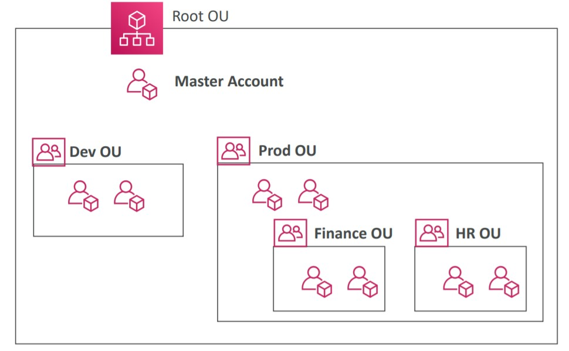
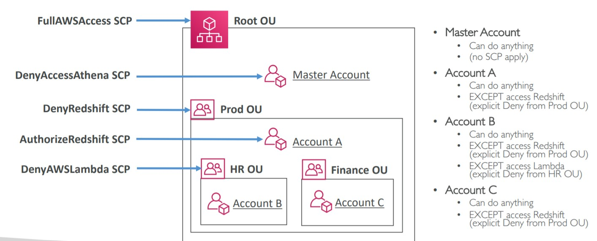
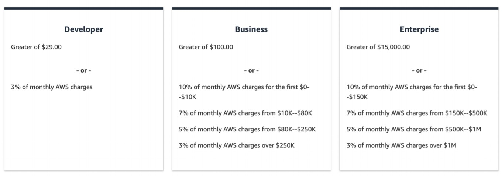

# Account Management and Support

- [AWS Organizations](#aws-organizations)
- [Multi Account Strategies](#multi-account-strategies)
- [Service Control Policy](#service-control-policy)
- [AWS ControlTower](#aws-controlTower)
- [AWS Support Plans](#aws-support-plans)
- [Account Best Practices Summary](#account-best-practices-summary)
- [Billing Summary](#billing-summary)

## AWS Organizations

It is a global service that allows to manage multiple AWS Accounts. The main account is the Master account and the other are the child accounts.

- It has an API to automate the creation of child accounts.
- Since we can have multiple accounts, we can restrict actions within them with SCP (Service Control Policies)

Cost Benefits of AWS Organizations:

- Consolidate Billing across all accounts - which generates a single payment method
- Benefits of aggregated usage (use massive volumes of services generates discounts)
- Shared (pooling) EC2 Reserved Instances for optimal savings.

> AWS Organizations helps you to centrally manage billing; control access, compliance, and security; and share resources across your AWS accounts. Using AWS Organizations, you can automate account creation, create groups of accounts to reflect your business needs, and apply policies for these groups for governance. You can also simplify billing by setting up a single payment method for all of your AWS accounts. AWS Organizations is available to all AWS customers at no additional charge.

## Multi Account Strategies

We have various modes to create accounts in AWS:

- per Department
- per Environment (DEVL, QUAL, PROD)
- based on regulatory restrictions (using Service Control Policy)
- for better isolation (using different VPC per account)
- to have separate per account service limits
- account for loggings
- use Organization Units (OU)

<p align="center" width="100%"></p>

Besides this strategies, we can also monitor all accounts by:

- using tags standards to billing purposes
- enable CloudTrail in all accounts to monitor all API Calls and send it to central S3 account
- enable cloudwatch logs to central account logging

## Service Control Policy

Service Control Policy (SCP) allows us to create Whitelist or Blacklist to IAM actions. We can apply it on Organization Unit (OU) or Account Level.

- **Does not apply to the root account**
- SCP is applied to all users and roles of the account (even the root user of the account)
  - Example: a rule saying that X account cannot create EC2 instances. Not even the root user of the account can create it.
- Must have EXPLICIT allow to any service, by default nothing is allowed.
- Deny in a higher level has precedence

The use cases for Service Control Policy (SPC):

- Restrict access to specific services
- Enforce PCI compliance by explicitly disabling services

Example of Service Control Policy:

<p align="center" width="100%"></p>

- Here we have our root Organizational Unit (OU) and the master account. The root OU allows all services, and there is a DenyAccessAthena SCP on master account. This deny will not work, because the master account is not affected by SCP.
- Inside our root OU we have a PROD OU that explicitly deny redshift access (DenyRedshiftAccess). It will make all accounts inside it to not have access to redshift, even the Account A that tries to access Redshift with a AuthorizeRedshift SCP. But the higher one is a deny and it has precedence in this case.
- HR OU has no access to redshift and has no access to Lambda (due DenyAWSLambda SCP)
- Finance OU has no access only to Deny

[Examples](https://docs.aws.amazon.com/organizations/latest/userguide/orgs_manage_policies_scps_examples.html) of SCP allowing access to all resources but not to DynamoDB in all accounts.

```JSON
{
  "Version": "2012-10-17",
  "Statement": [
    {
      "Sid": "AllowsAllActions",
      "Effect": "Allow",
      "Action": "*",
      "Resource": "*"
    },
    {
      "Sid": "DenyDynamoDB",
      "Effect": "Deny",
      "Action": "dynamodb:*",
      "Resource": "*"
    }
  ]
}
```

## AWS ControlTower

AWS ControlTower is a easy way to setup and govern a secure and compliant multi-account AWS environment based on best practices. Control Tower is an AWS native service providing a pre-defined set of blueprints and guardrails to help customers implement a landing zone for new AWS accounts.

With ControlTower we can:

- automate the setup of the environment with a few clicks
- automate ongoing policies applying guardrails
  - detect policy violations
- monitor compliance in a dashboard.
- automatically sets up AWS Organizations to organize accounts and implement SCPs (Service Control Policies)
- it creates three shared accounts: Master Account, Log Archive account and Audit account

## AWS Support Plans

AWS Has multiple types of customer support plans, the pricing of each one is variable as the use.

<p align="center" width="100%"></p>

**Basic Support:**

- Free for all customers
- Has Customer Services & Communities - 24x7 access to customer service, documentation, whitepapers and support forums.
- In **Trusted Advisor** we have access to the seven core checks and guidance to provision your resources following the best practices to increase performance and security.
- In **AWS Personal Health Dashboard** we have a personalized view of the health of AWS Services and we get alerts when something is going to impact our infrastructure.
- This plan **does not support any architectural guidance**.

**Developer Support:**
AWS recommends Developer Support if you are testing or doing early development on AWS and want the ability to get email-based technical support during business hours as well as general architectural guidance as you build and test. You do not get access to Infrastructure Event Management with this plan. This plan only supports general architectural guidance.

- All the basic plan +
- Business hours email access to Cloud Support Associates
- Unlimited cases and we have 1 primary contact in AWS
- Depending on Severity of the problem the response time may be variable:
  - General architectural guidance up to 24 business hours
  - Systems impaired up to 12 business hours

**Business Support:**
AWS recommends Business Support if you have production workloads on AWS and want 24x7 phone, email and chat access to technical support and architectural guidance in the context of your specific use-cases. You get full access to AWS Trusted Advisor Best Practice Checks. You also get access to Infrastructure Event Management for an additional fee.

- All the Basic + Support +
- 24/7 phone, email and chat access to Cloud Support Engineers
- Trusted Advisor - Full set of checks + API access
- Unlimited Cases / Unlimited contacts
- Infrastructure Event Management for an additional fee
- Depending on Severity of the problem the response time may be variable:
  - General architectural guidance up to 24 business hours
  - Systems impaired up to 12 business hours
  - Production system impaired up to 4 business hours
  - Production system down < 1 business hour

**Enterprise Support:**
AWS Enterprise Support provides customers with concierge-like service where the main focus is helping the customer achieve their outcomes and find success in the cloud. With Enterprise Support, you get 24x7 technical support from high-quality engineers, tools and technology to automatically manage the health of your environment, consultative review and guidance based on your applications, and a designated Technical Account Manager (TAM) to coordinate access to proactive/preventative programs and AWS subject matter experts. This plan supports architectural guidance contextual to your application.

- All the business support features +
- Access to a **Technical Account Manager (TAM)**
- **Concierge Support Team** for billing and account best practices
- **Infrastructure Event Management** included
- Well architected and Operations Reviews
- Depending on Severity of the problem the response time may be variable:
  - General architectural guidance up to 24 business hours
  - Systems impaired up to 12 business hours
  - Production system impaired up to 4 business hours
  - Production system down < 1 business hour
  - Business-Critical system down < 15 minutes to response

## Account Best Practices Summary

- Operating with multiple accounts use AWS Organizations
- Restricting power into the account use Service Control Policy
- Setup multiple accounts with best-practices with AWS ControlTower
- Use tags and Cost allocation tags for easy billing/management
- IAM guidelines: MFA, Password policies, Least privilege principle
- Use Config to record all the resources and configurations and do compliance over time
- Use CloudFormation to deploy the stack across the regions
- Use CloudTrail to track all the api calls in our account
- Trusted Advisor is great tool to get insight to get the best cost optimization and the support plan
- Send Services Logs and Access Logs to S3 or CloudWatch Logs (Maybe have an account just to logging)
- If anything compromises the account: change the root password, delete and rotate all passwords and keys, and get in touch to AWS Support.

[UP](#account-management-and-support)
