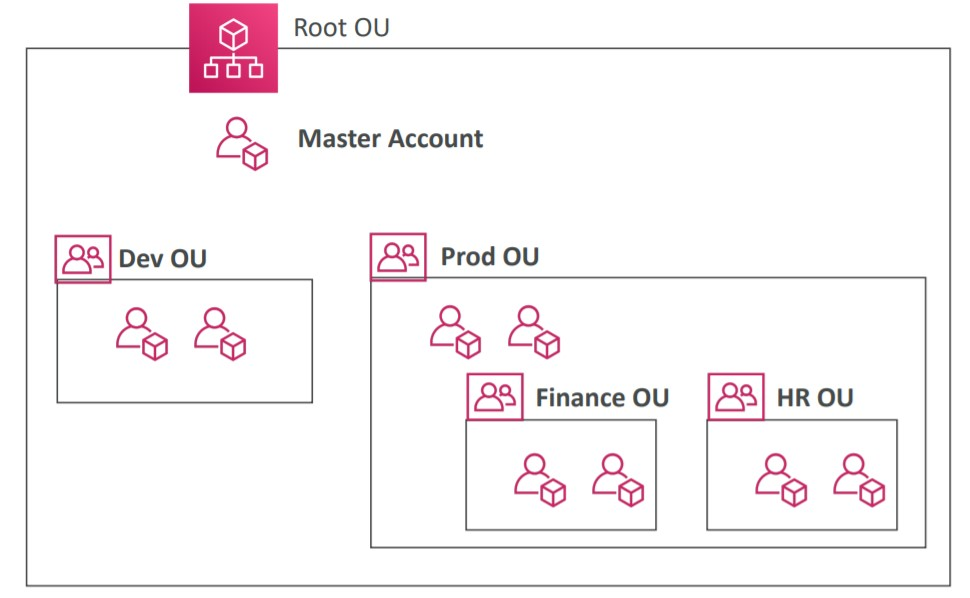
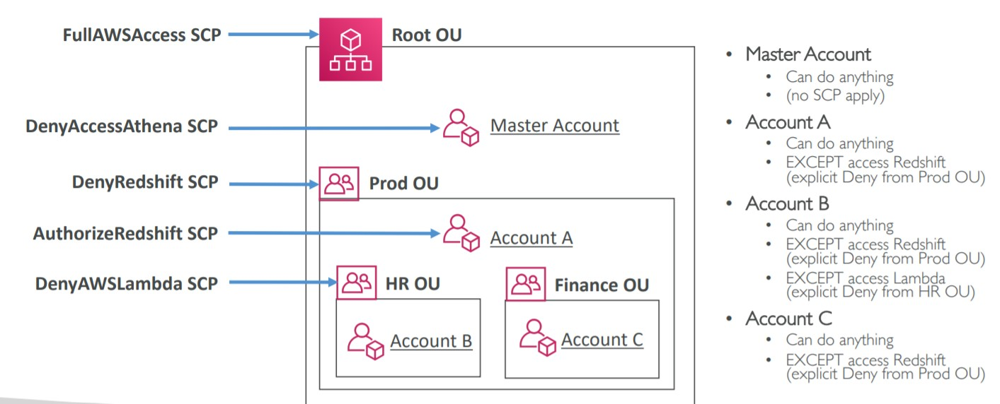
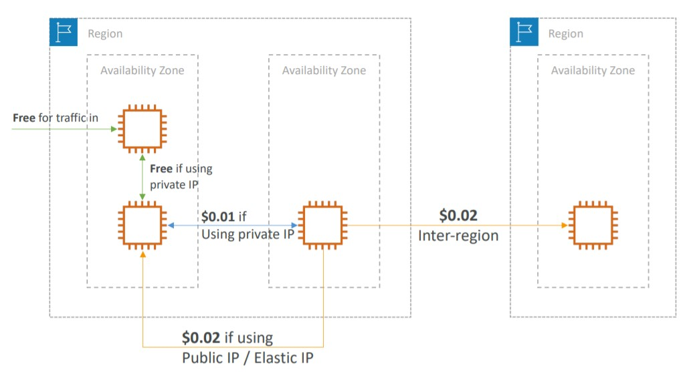
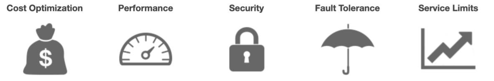
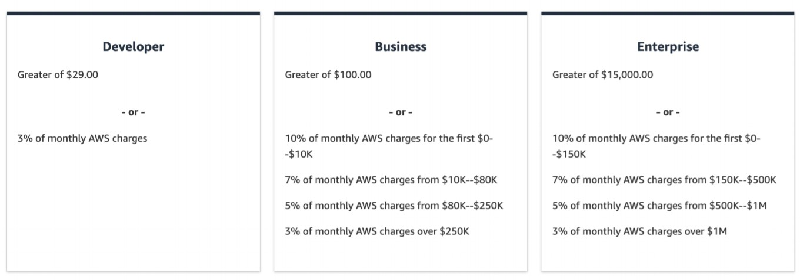

# Account Management, Billing and Support

- [AWS Organizations](#aws-organizations)
- [Multi Account Strategies](#multi-account-strategies)
- [Service Control Policy](#service-control-policy)
- [AWS ControlTower](#aws-controlTower)
- [AWS Pricing Models](#aws-pricing-models)
  - [Free Services and Free Tier](#free-services-and-free-tier)
  - [EC2 Pricing](#ec2-pricing)
  - [Lambda Pricing](#lambda-pricing)
  - [ECS Pricing](#ecs-pricing)
  - [Fargate Pricing](#fargate-pricing)
  - [S3 Pricing](#s3-pricing)
  - [EBS Pricing](#ebs-pricing)
  - [Database Pricing](#Database-pricing)
  - [CloudFront Pricing](#cloudfront-pricing)
  - [Network Pricing](#network-pricing)
- [AWS Savings Plan](#aws-savings-plan)
- [Billing and Costing Tools](#billing-and-costing-tools)
  - [Estimating costs in the cloud](#estimating-costs-in-the-cloud)
    - [TCO Calculator](#tco-calculator): On-prem to Cloud
    - [AWS Pricing Calculator](#aws-pricing-calculator): Cloud pricing
  - [Tracking costs in the cloud](#tracking-costs-in-the-cloud)
    - [AWS Billing Dashboard](#aws-billing-dashboard): Simple dashboard
    - [Cost Allocation Tags](#cost-allocation-tags): Track by tag
    - [Cost and Usage Reports](#cost-and-usage-reports): The most detailed report
    - [Cost Explorer](#cost-explorer): Visual tool
  - [Monitoring against costs plans](#monitoring-against-costs-plans)
    - [Billing Alarms on CloudWatch](#billing-alarms-on-cloudwatch)
    - [AWS Budgets](#aws-budgets)
- [AWS Trusted Advisor](#aws-trusted-advisor)
- [AWS Support Plans](#aws-support-plans)
- [Account Best Practices Summary](#account-best-practices-summary)
- [Billing Summary](#billing-summary)

## AWS Organizations

It is a global service that allows to manage multiple AWS Accounts. The main account is the Master account and the other are the child accounts.

- It has an API to automate the creation of child accounts.
- Since we can have multiple accounts, we can restrict actions within them with SCP (Service Control Policies)

Cost Benefits of AWS Organizations:

- Consolidate Billing across all accounts - which generates a single payment method
- Benefits of aggregated usage (use massive volumes of services generates discounts)
- Shared (pooling) EC2 Reserved Instances for optimal savings.

## Multi Account Strategies

We have various modes to create accounts in AWS:

- per Department
- per Environment (DEVL, QUAL, PROD)
- based on regulatory restrictions (using Service Control Policy)
- for better isolation (using different VPC per account)
- to have separate per account service limits
- account for loggings
- use Organization Units (OU)

<p align="center" width="100%"></p>

Besides this strategies, we can also monitor all accounts by:

- using tags standards to billing purposes
- enable CloudTrail in all accounts to monitor all API Calls and send it to central S3 account
- enable cloudwatch logs to central account logging

## Service Control Policy

Service Control Policy (SCP) allows us to create Whitelist or Blacklist to IAM actions. We can apply it on Organization Unit (OU) or Account Level.

- **Does not apply to the root account**
- SCP is applied to all users and roles of the account (even the root user of the account)
  - Example: a rule saying that X account cannot create EC2 instances. Not even the root user of the account can create it.
- Must have EXPLICIT allow to any service, by default nothing is allowed.
- Deny in a higher level has precedence

The use cases for Service Control Policy (SPC):

- Restrict access to specific services
- Enforce PCI compliance by explicitly disabling services

Example of Service Control Policy:

<p align="center" width="100%"></p>

- Here we have our root Organizational Unit (OU) and the master account. The root OU allows all services, and there is a DenyAccessAthena SCP on master account. This deny will not work, because the master account is not affected by SCP.
- Inside our root OU we have a PROD OU that explicitly deny redshift access (DenyRedshiftAccess). It will make all accounts inside it to not have access to redshift, even the Account A that tries to access Redshift with a AuthorizeRedshift SCP. But the higher one is a deny and it has precedence in this case.
- HR OU has no access to redshift and has no access to Lambda (due DenyAWSLambda SCP)
- Finance OU has no access only to Deny

[Examples](https://docs.aws.amazon.com/organizations/latest/userguide/orgs_manage_policies_scps_examples.html) of SCP allowing access to all resources but not to DynamoDB in all accounts.

```JSON
{
  "Version": "2012-10-17",
  "Statement": [
    {
      "Sid": "AllowsAllActions",
      "Effect": "Allow",
      "Action": "*",
      "Resource": "*"
    },
    {
      "Sid": "DenyDynamoDB",
      "Effect": "Deny",
      "Action": "dynamodb:*",
      "Resource": "*"
    }
  ]
}
```

## AWS ControlTower

AWS ControlTower is a easy way to setup and govern a secure and compliant multi-account AWS environment based on best practices.

With ControlTower we can:

- automate the setup of the environment with a few clicks
- automate ongoing policies applying guardrails
  - detect policy violations
- monitor compliance in a dashboard.
- automatically sets up AWS Organizations to organize accounts and implement SCPs (Service Control Policies)
- it creates three shared accounts: Master Account, Log Archive account and Audit account

## AWS Pricing Models

AWS has four pricing models:

- **Pay as you go:** You pay for what you use, remain agile, responsive, meet the scale demands
- **Save when you reserve:** for longer term requirements, you save more when you reserve (such as using databases, ec2 instances). This one minimize risks and we have a predictably manage budgets
- **Pay less by using more:** The more you use, more discount. Based on volume.
- **Pay less as AWS grows:** As AWS grows, they save costs and services gets cheaper, so we are affected by it.

### Free Services and Free Tier

- Free Services: IAM, VPC, Consolidated Billing, DynamoDB (25gb)
- Free Services But you per resources: Elastic Beanstalk, CloudFormation, AutoScaling Groups
- [Free Tier](https://aws.amazon.com/pt/free/): free for a period or volume of use (EC2 t2.micro, S3, EBS)

### EC2 Pricing

On EC2 we are only charged on what we use:

- Number of instances
- Instance configuration:
  - Physical capacity
  - Region
  - OS and software
  - Instance type
  - Instance size
- ELB running time and amount of data processed
- Detailed monitoring

We have multiple types of EC2 Purchasing Options. (more detailed in [EC2 section](../ec2/README.md/#EC2-Instances-Purchasing-Options))

**On-demand instances:**

- Minimum of 60s of use
- Pay per second (Linux) or per hour (Windows)

**Reserved instances:**

- Up to 75% discount compared to On-demand on hourly rate
- 1- or 3-years commitment
- All upfront, partial upfront, no upfront

**Spot instances:**

- Up to 90% discount compared to On-demand on hourly rate
- Bid for unused capacity

**Dedicated Host:**

- On-demand
- Reservation for 1 year or 3 years commitment

**Savings plans** as an alternative to save on sustained usage

### Lambda Pricing

- Pay per call
- Pay per duration

### ECS Pricing

- When we use ECS behind the scenes it will get an EC2 instance so, will only pay for the EC2 instance and the resources configured to run our application.

### Fargate Pricing

- When we use Fargate it does not runs for us an EC2 instance, so we don't have to manage nothing about server, it is serverless. We pay for Fargate Launch Type Model which means: CPU and Memory allocated to run the application into the containers.

### S3 Pricing

In S3 we have multiple types of [Storage classes](../s3/README.md/#s3-storage-classes): S3 Standard, S3 Infrequent Access, S3 One-Zone IA, S3, Intelligent Tiering, S3 Glacier and S3 Glacier Deep Archive

In S3 we pay for:

- Number and size of objects: Price can be tiered (based on volume, the more volume more discount)
- Number and type of requests (pay for requests in and out)
- Data transfer OUT of the S3 region (Inbound data transfer in the S3 region is free)
- S3 Transfer Acceleration
- Lifecycle transitions between storage classes
- Similar service: EFS (pay per use, has infrequent access & lifecycle rules)

### EBS Pricing

In Elastic Block Storage we pay for

- Volume type (based on performance)
- Storage volume in GB per month provisioned
- IOPS:
  - General Purpose SSD: Included
  - Provisioned IOPS SSD: Provisionned amount in IOPS
  - Magnetic: Number of requests
- Snapshots:
  - Added data cost per GB of snapshot per month
- Data transfer:
  - Outbound data transfer are tiered for volume discounts
  - Inbound is free

### Database Pricing

- Per hour billing
- Database characteristics:
  - Engine
  - Size
  - Memory class
- Purchase type:
  - On-demand
  - Reserved instances (1 or 3 years) with required up-front
- Backup Storage: There is no additional charge for backup storage up to 100% of your total database storage for a region.

**RDS Pricing:**

- Additional storage (per GB per month)
- Number of input and output requests per month
- Deployment type (storage and I/O are variable):
  - Single AZ
  - Multiple AZs
- Data transfer:
  - Outbound data transfer are tiered for volume discounts
  - Inbound is free

### CloudFront Pricing

- Pricing is different across different geographic regions
- Aggregated for each edge location, then applied to your bill (the more you use in a edge location, bigger the discount)
- Data Transfer Out (volume discount)
- Data in is always free
- Number of HTTP/HTTPS requests

### Network Pricing

- All the traffic in is free
- In same region and same AZ: if we have an EC2 instance that uses the free traffic and we have another instance that communicates with this one, the communication is free using the **private ip**.
- In different AZs communication via **private ip** is $0.01 (cheaper) and via **public ip** is $0.02 (expensive).
- In different regions: $0.02 because of the inter-region communication

<p align="center" width="100%"></p>

- Use Private IP instead of Public IP for good savings and better network performance
- Use same AZ for maximum savings (but you loose the high availability)

## AWS Savings Plan

AWS Savings Plans is a way to save more money by getting more discounts. And to do so, we need to commit with a amount of dollar per hour during 1 or 3 years. (With upfront, partial upfront and no upfront). This is the easiest way to setup long terms commitments in AWS.

There are two types of savings plans

**EC2 Savings Plan**

- Up to 72% discount compared to On-Demand and we commit to usage of individual instance families in a region (e.g. C5 or M5)
- Regardless of AZ, size (m5.xl to m5.4xl), OS (Linux/Windows) or tenancy

**Compute Savings Plan:**

- Up to 66% discount compared to On-Demand
- Regardless of Family, Region, size, OS, tenancy, compute options
- Compute Options: EC2, Fargate, Lambda

## Billing and Costing Tools

AWS Has multiple types of tools to Billing and Cost, and we can split in three types

- Estimating costs in the cloud:
- Tracking costs in the cloud
- Monitoring against costs plans

### Estimating costs in the cloud

First we can estimate the costs in the cloud with TCO Calculator and Pricing Calculator

#### TCO Calculator

TCO stands to Total Cost of Ownership and it is a tool to calculate the cost of moving ownership of on-premises server to the cloud.

- AWS Helps reduce CAPEX (capital expenditures) and providing a pay-as-you-go model
- The TCO calculators allow you to estimate the cost savings when using AWS and provide a detailed set of reports that can be used in executive presentations.
- It compares all the costs with having a on-premises server vs using AWS infrastructure (Server, Storage, Network, IT Labor)

**This tools is deprecated.**

#### AWS Pricing Calculator

AWS Pricing Calculator is a tool to calculate the pricing of Solutions Architecture on AWS.

Here we can select all the infra we want and understand the billing before start our architecture.

### Tracking costs in the cloud

Now we have tools to track our costs in the cloud: We have: AWS Billing Dashboard, Cost Allocation Tags, Cost and Usage Reports, Cost Explorer

#### AWS Billing Dashboard

AWS Billing Dashboard is a high level tool, but great for an overview of costs in AWS.

- It shows Month-to-Date costs
- Summaries
- Last month cost
- Forecast
- Free tier dashboard to understand the usage of the free tier services.

#### Cost Allocation Tags

Use Cost Allocation Tags to track costs on detailed level and categorize.

The tags are used to organize resources and group them together with these tags in AWS and we can give any name we want. The most common are: name, environment, team.

We can manage it with `Tag Editor`. We can also create Resources Groups in this Tag Editor tool.

- We can use auto generated tags by AWS (prefix `aws`)
- User defined tags (prefix `user`)

#### Cost and Usage Reports

Cost and Usage Reports is a tool to dive deeper into our AWS costs and usage of resources.

- This is **the most** detailed report in AWS with the most comprehensive data report available.
- The AWS Cost & Usage Report lists AWS usage for each service category used by an account and its IAM users in hourly or daily line items, as well as any tags that you have activated for cost allocation purposes.
- Can be integrated with Athena, Redshift and Quicksight

#### Cost Explorer

Cost Explorer is a visual tool to understand and manage the cost and usage overtime in AWS.

- We can create custom reports
- Analyze your data at a high level: total costs and usage across all accounts
- Or Monthly, hourly, resource level granularity
- It suggest savings plans based on the usage
- Forecast usage up to 12 months

### Monitoring against costs plans

On AWS we can monitor and trigger actions related to our budget.

#### Billing Alarms on CloudWatch

Billing Alarms on CloudWatch only available and stored in us-east-1, but we can consolidate all the costs of our account in all regions.

This one is for actual costs, not projected costs. And it sends an email notification if we pass a threshold.

#### AWS Budgets

AWS Budgets is a powerful tool about create and send alarms when costs exceeds the budgets

- We have three types of budgets: Based on Costs, Usage and Reservation
- Up to 5 SNS notifications per budget (can trigger events based on notification)
- Can filter by: Service, Linked Account, Tag, Purchase Option, Instance Type, Region, Availability Zone, API Operation, etc…
- Same options as AWS Cost Explorer!
- 2 budgets are free, then $0.02/day/budget

## AWS Trusted Advisor

Trusted Advisor is a assessment on AWS account with the purpose of advise possible savings, checks and cost optimizations within AWS account.

- For all customer it is free the core checks of AWS
- We can enable weekly reports/email notifications about the recommendations
- The full version of trusted-advisor requires a **Business and Enterprise Supports Plan**
  - You get access to advisor to all categories
  - Ability to use CloudWatch Alarms when reach limits
  - **Programmatic access using AWS Support API**

AWS Trusted Advisor provides multiple types of recommendations and after that a few examples:

<p align="center" width="100%"></p>

**Cost Optimization**:

- Low utilization of EC2 Instances, idle Load Balancers, under-utilized resources (EBS Volumes)
- Reserved instances and savings plans optimizations

**Performance**:

- High utilization of EC2 Instances, CloudFront CDN Optimizations
- EC2 to EBS throughput optimizations, Alias records recommendations

**Security**

- MFA enabled on Root Account, IAM key rotations, exposed access keys
- S3 Bucket permissions for public access, security groups with unrestricted access

**Fault Tolerance**

- Age of EBS snapshots
- AZ balance
- ASG multi-az, ELB Configurations

**Services Limits**:

- Helps to understand if we are reaching a limit of a service and advises if is needed to increase before we have problems.

## AWS Support Plans

AWS Has multiple types of customer support plans, the pricing of each one is variable as the use.

<p align="center" width="100%"></p>

**Basic Support:**

- Free for all customers
- Has Customer Services & Communities - 24x7 access to customer service, documentation, whitepapers and support forums.
- In **Trusted Advisor** we have access to the seven core checks and guidance to provision your resources following the best practices to increase performance and security.
- In **AWS Personal Health Dashboard** we have a personalized view of the health of AWS Services and we get alerts when something is going to impact our infrastructure.

**Developer Support:**
Good when we are developing in AWS

- All the basic plan +
- Business hours email access to Cloud Support Associates
- Unlimited cases and we have 1 primary contact in AWS
- Depending on Severity of the problem the response time may be variable:
  - General guidance up to 24 business hours
  - Systems impaired up to 12 business hours

**Business Support:**
When we have production workloads and this support our main business is better to use the Business Support Plan

- All the Basic + Support +
- 24/7 phone, email and chat access to Cloud Support Engineers
- Trusted Advisor - Full set of checks + API access
- Unlimited Cases / Unlimited contacts
- Depending on Severity of the problem the response time may be variable:

  - General guidance up to 24 business hours
  - Systems impaired up to 12 business hours
  - Production system impaired up to 4 business hours
  - Production system down < 1 business hour

**Enterprise Support:**
For Enterprise and mission critical systems running on AWS

- All the business support features +
- Access to a **Technical Account Manager (TAM)**
- **Concierge Support Team** for billing and account best practices
- **Infrastructure Event Management**
- Well architected and Operations Reviews
- Depending on Severity of the problem the response time may be variable:

  - General guidance up to 24 business hours
  - Systems impaired up to 12 business hours
  - Production system impaired up to 4 business hours
  - Production system down < 1 business hour
  - Business-Critical system down < 15 minutes to response

## Account Best Practices Summary

- Operating with multiple accounts use AWS Organizations
- Restricting power into the account use Service Control Policy
- Setup multiple accounts with best-practices with AWS ControlTower
- Use tags and Cost allocation tags for easy billing/management
- IAM guidelines: MFA, Password policies, Least privilege principle
- Use Config to record all the resources and configurations and do compliance over time
- Use CloudFormation to deploy the stack across the regions
- Use CloudTrail to track all the api calls in our account
- Trusted Advisor is great tool to get insight to get the best cost optimization and the support plan
- Send Services Logs and Access Logs to S3 or CloudWatch Logs (Maybe have an account just to logging)
- If anything compromises the account: change the root password, delete and rotate all passwords and keys, and get in touch to AWS Support.

## Billing Summary

- TCO Calculator: Calculate the price of moving from on premises to the cloud and get reports of the the moving
- Pricing Calculator: Calculate the price of the architecture on the cloud
- Billing Dashboard: Simple tool to overview the billings
- Cost Allocation Tags: Group tags together and get report by grouped tags
- Cost and Usage Reports: Most comprehensive report in AWS
- Cost Explorer: Visual Billing dashboard with detailed + forecast 12 usage up to 12 months
- Billing Alarms: use CloudWatch to run the billings alarms when some metric is passed (located in us-east-1)
- Budgets: more advanced alarm and notification regarding Budget. Integrated with SNS.
- Savings Plan: Easy-way to save money based on long term commitment with AWS.

[UP](#account-management-billing-and-support)
