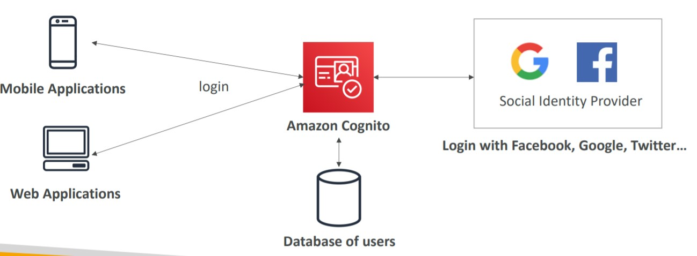
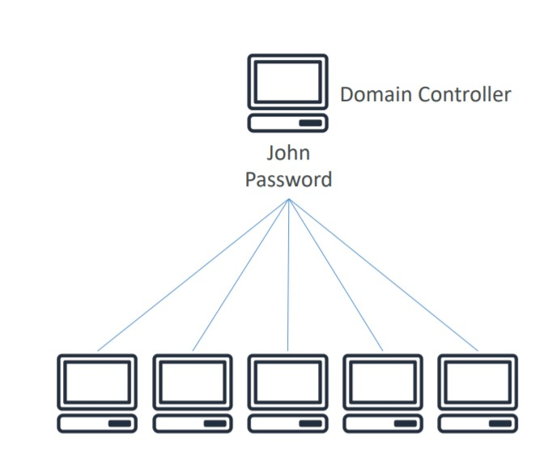
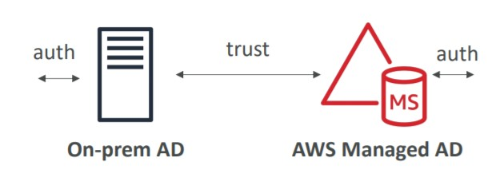
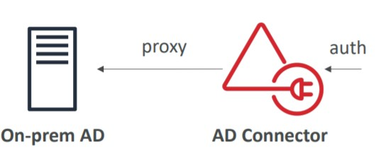
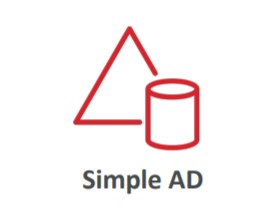
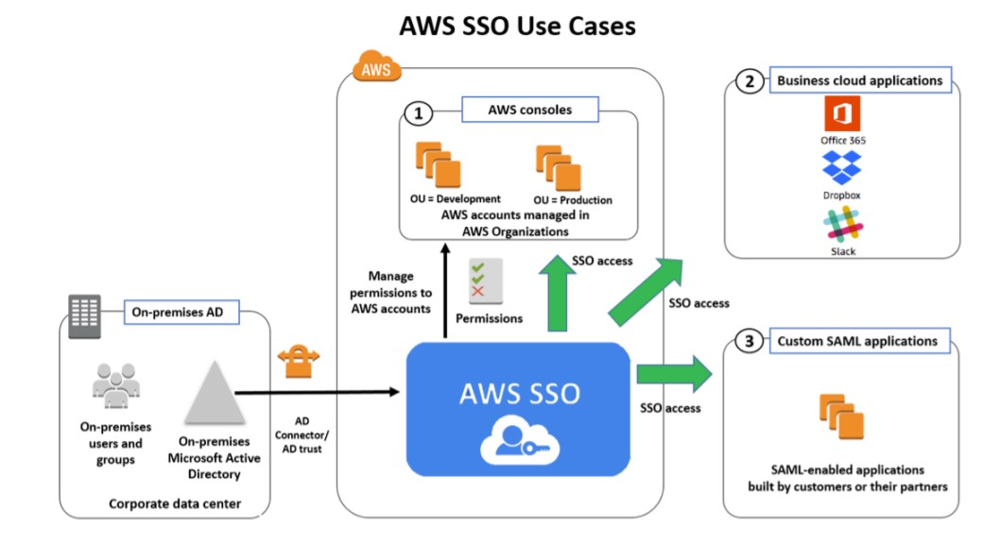

# 🔑 Advanced Identity

- [Amazon Cognito](#amazon-cognito)
- [Active Directory Services](#active-directory-services)
  - [AWS Managed Microsoft AD](#aws-managed-microsoft-ad)
  - [AD Connector](#ad-connector)
  - [Simple AD](#simple-ad)
- [Amazon Single Sign-On](#amazon-single-sign-on)

## Amazon Cognito

Provide identity for our Web/Mobile applications. Cognito will create the users for us and save on specific database of users.

## Active Directory Services

Microsoft Active Directory is found on any Windows Server with AD Domain Services and it is a Database of Objects. The main function of AD is to be a centralized service to manage users accounts, create users and assign permissions:

- With a central Domain Computer we have all the credentials stored, so any computer that belongs to that domain can have the user logged in.

AWS Also provides AD Services within AWS:

### AWS Managed AD

Create our own AD in AWS, manage user locally and support MFA authentication.

It works by establishing a "trust" connection with our on-premises server and they will trust each other in authentication.

### AD Connector

Is a proxy, it works by redirecting the requests from AWS windows services to our on premise to get the AD authentication.

### Simple AD

AD-Compatible managed Active Directory on AWS. This one is not connected with on-premises servers, it is a standalone service.

## Amazon Single Sign-On

One single point of access to multiple applications using SSO portal on AWS.

> AWS SSO is an AWS service that enables you to makes it easy to centrally manage access to multiple AWS accounts and business applications and provide users with single sign-on access to all their assigned accounts and applications from one place.

- Integrated with AWS organizations
- Supports SAML 2.0 markup
- Integration with on-premise Active Directory

## Summary

- IAM
  - Identity and Access Management inside your AWS account
  - For users that you trust and belong to your company
- Organizations: manage multiple AWS accounts
- Cognito: create a database of users for your mobile & web applications
- Directory Services: integrate Microsoft Active Directory in AWS
- Single Sign-On (SSO): one login for multiple AWS accounts & applications
