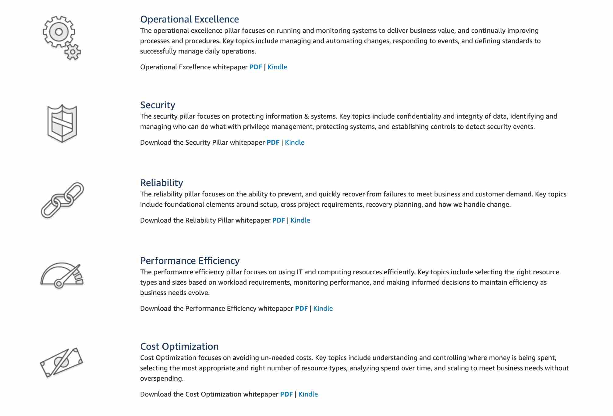
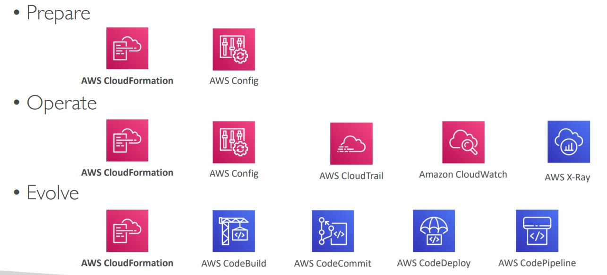
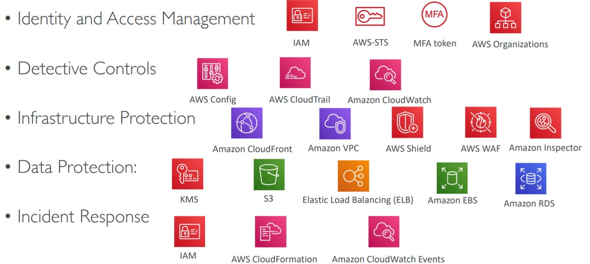
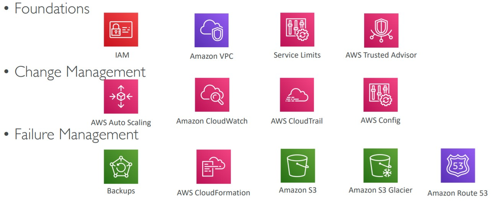
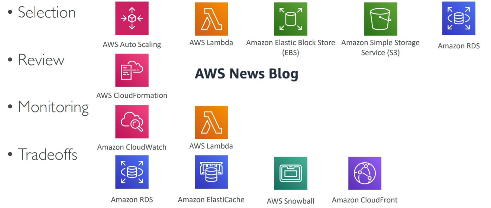
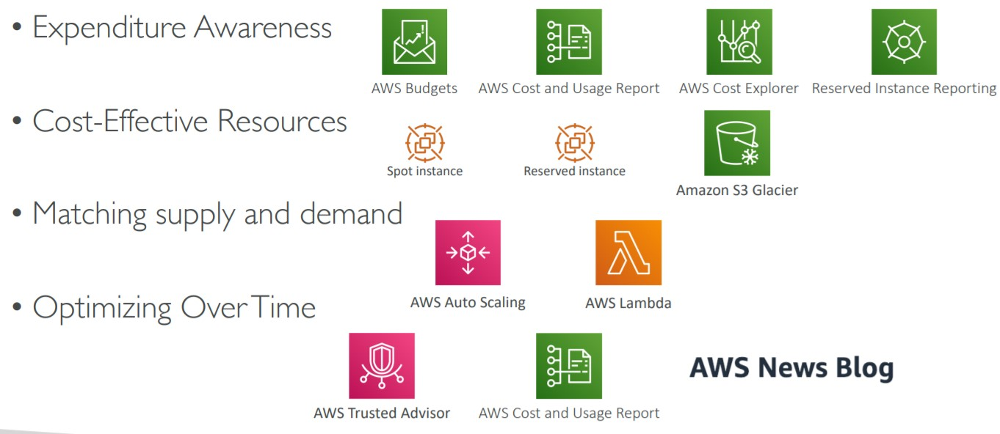

# AWS Architecting & Ecosystem

AWS Well Architected Framework has general guiding principles to be applied:

- Stop guessing capacity of our needs and start scaling our services
- Test our systems at scale
- Automate to make architectural experimentation easier (using cloudformation, beanstalk, or other for example)
- Allow for evolutionary architectures designing based on changing requirements (using IaaS)
- Drive architectures using data
- Improve through game days: Simulate applications for flash sale days

## AWS Cloud Best Practices – Design Principles

- Scalability: vertical & horizontal
- Disposable Resources: servers should be disposable & easily configured
- Automation: Serverless, Infrastructure as a Service, Auto Scaling…
- Loose Coupling: Monolith are applications that do more and more over time, become bigger. So we need to Break it down into smaller, loosely coupled components. So, a change or a failure in one component should not cascade to other components.
- Services, not Servers: Don’t use just EC2, use managed services, databases, serverless, etc.

# Well Architected Framework

The Well Architected Framework has five Pillar:

- [1st Pillar - Operational Excellence](#1st-pillar---operational-excellence)
- [2nd Pillar - Security](#2nd-pillar---security)
- [3rd Pillar - Reliability](#3rd-pillar---reliability)
- [4th Pillar - Performance Efficiency](#4th-pillar---performance-efficiency)
- [5th Pillar - Cost Optimization](#5th-pillar---cost-optimization)
- [Well Architected Tool](#well-architected-tool)
- [AWS Ecosystem - Free resources](#aws-ecosystem---free-resources)
- [Summary](#Summary)

## 1st Pillar - Operational Excellence

A well architected framework with Operational Excellence includes the ability to run and monitor the applications to deliver value to the business and continually improve supporting processes and procedures.

The design principles:

- Perform Infrastructure as a Code (IaaC) - CloudFormation
- Documentation - Automate the creation of annotated docs after every build
- Make frequent, small and reversible changes: this will avoid issues in case you need to rollback
- Refine operations procedures frequently
- Anticipate failures and learn from them all

AWS Services to Operational Excellence:

- Prepare phase: Use CloudFormation to have the IaaC, AWS Config to evaluate compliance
- Operate: CloudFormation and AWS Config to perform the resources configuration and AWS CloudTrail and CloudWatch to monitor how it is going and if anything is gone manually
- Evolve: AWS CloudFormation and CI/CD Tools allows to evolve quickly

## 2nd Pillar - Security

Security includes the ability to protect the information, applications and assets while delivering business value trough risk assessment and mitigation strategies. It will also save costs from avoidable disasters and failures.

> "Who did what" is nothing but traceability of action by any user on the system. It tells us which user performed what action on the system. Traceability is part of the Security design principle of AWS Cloud. So this is the correct option.

Design Principles:

- Implementing a Strong Identity Foundation: Centralized Privileges and Management. Rotate credentials often.
- Enable Traceability: integrate logs and metrics with systems to automatically respond and take actions.
- Apply security at all layers:
- Automate security best practices
- Protect data in transit and at rest - Encryption, tokenization, and access control
- Keep people away from data - eliminate or reduce the need of direct access to manual data processing
- Prepare for security events - Run incident response simulations and use tools with automation to increase your speed for detection, investigation, and recovery

## 3rd Pillar - Reliability

Ability of a system to recover from infrastructure or service disruptions, dynamically acquire computing resources to meet demand, and mitigate disruptions such as misconfigurations or transient network issues.

> Foundations are part of the Reliability pillar of the AWS Well-Architected Framework. AWS states that before architecting any system, foundational requirements that influence reliability should be in place. The services that are part of foundations are: Amazon VPC, AWS Trusted Advisor, AWS Service Quotas (earlier known as AWS Service Limits).

> AWS Trusted Advisor is an online tool that provides you real-time guidance to help you provision your resources following AWS best practices on cost optimization, security, fault tolerance, service limits, and performance improvement. Whether establishing new workflows, developing applications, or as part of ongoing improvement, recommendations provided by Trusted Advisor regularly help keep your solutions provisioned optimally.

> Service Quotas enables you to view and manage your quotas for AWS services from a central location. Quotas, also referred to as limits in AWS, are the maximum values for the resources, actions, and items in your AWS account. Each AWS service defines its quotas and establishes default values for those quotas.

**Design Principles**:

- Test recovery procedures: Use automation to simulate different failures or to recreate scenarios that led to failures before
- Automatically recover from failures: Anticipate and remediate failures before they occur
- Stop guessing capacity: Auto scaling whenever is possible (Horizontal scaling) Load Balancing (Distribute requests across multiple, smaller resources to ensure that they don't share a common point of failure)
- Management changes through automation: Use automation to make changes to infrastructure

## 4th Pillar - Performance Efficiency

Includes the ability to use computing resources efficiently to meet system requirements, and to maintain that efficiency as demand changes and technologies evolve.

Design Principles:

- Democratize advanced technologies - Advance technologies become services and hence you can focus more on product development
- Go global in minutes - Easy deployment in multiple regions
- Use serverless architectures - Avoid burden of managing servers
- Experiment more often - Easy to carry out comparative testing
- Mechanical sympathy - Be aware of all AWS services

## 5th Pillar - Cost Optimization

Includes the ability to run systems to deliver business value at the lowest price point.

Design Principles

- Adopt a consumption mode - Pay only for what you use
- Measure overall efficiency - Use CloudWatch
- Stop spending money on data center operations - AWS does the infrastructure part and enables customer to focus on organization projects
- Analyze and attribute expenditure - Accurate identification of system usage and costs, helps measure return on investment (ROI) - Make sure to use tags
- Use managed and application level services to reduce cost of ownership - As managed services operate at cloud scale, they can offer a lower cost per transaction or service

## Well Architected Tool

It is a Free tool to review your architectures against the 5 pillars Well-Architected Framework and adopt architectural best practices.

How does it work?

- Select your workload and answer questions
- Review your answers against the 5 pillars
- Obtain advice: get videos and documentations, generate a report, see the results in a dashboard

## AWS Ecosystem

Free Resources

- AWS Blogs: https://aws.amazon.com/blogs/aws/
- AWS Forums (community): https://forums.aws.amazon.com/index.jspa
  - AWS Forums is an AWS community platform where people can help each other. It is not used to deploy technologies on AWS.
- AWS Whitepapers & Guides: https://aws.amazon.com/whitepapers
  - AWS Whitepapers are technical content authored by AWS and the AWS community to expand your knowledge of the cloud. They include technical whitepapers, technical guides, reference material, and reference architectures diagrams. You can find useful content for your deployment, but it is not a service that will deploy technologies.
- AWS Quick Starts: https://aws.amazon.com/quickstart/

  - Quick Starts are built by AWS solutions architects and partners to help you deploy popular technologies on AWS, based on AWS best practices for security and high availability. These accelerators reduce hundreds of manual procedures into just a few steps, so you can build your production environment quickly and start using it immediately.
  - Each Quick Start includes AWS CloudFormation templates that automate the deployment and a guide that discusses the architecture and provides step-by-step deployment instructions.

- Automated, gold-standard deployments in the AWS Cloud
- Build your production environment quickly with templates
- Example: WordPress on AWS https://fwd.aws/P3yyv?did=qs_card&trk=qs_card
- Leverages CloudFormation
- AWS Solutions: https://aws.amazon.com/solutions/
- Vetted Technology Solutions for the AWS Cloud
- Example - AWS Landing Zone: secure, multi-account AWS environment
- https://aws.amazon.com/solutions/implementations/aws-landing-zone/
- “Replaced” by AWS Control Tower

Payed Resources

- AWS Support
- AWS Marketplace
- AWS Training
- AWS Professional Services & Partner Network (global team of experts APN [AWS Technology Partners])

## AWS Support

More in account, billing and support [section](../account-billing-support/README.md/#aws-support-plans)

- Basic
  - Free support
  - Has Customer Services & Communities - 24x7 access to customer service, documentation, whitepapers and support forums.
- Developer: Business Hours email access to Cloud Support Associates
  - General Guidance: <24 business hours
  - System impaired: <12 business hours
- Business: 24x7 Phone, Mail and chat support from Cloud Support Engineers
  - Production System impaired: <4 business hours
  - Production System down: <1 business hours
- Enterprise: Access to Technical Account Manager (TAM) and Concierge Support Team
  - Business Critical Systems down <15 minutes

## AWS Professional Services & Partner Network

- The AWS Professional Services organization is a global team of experts
- They work alongside your team and a chosen member of the APN
- APN = AWS Partner Network
- APN Technology Partners: providing hardware, connectivity, and software
- APN Consulting Partners: professional services firm to help build on AWS
- APN Training Partners: find who can help you learn AWS
- AWS Competency Program: AWS Competencies are granted to APN
  Partners who have demonstrated technical proficiency and proven
  customer success in specialized solution areas.
- AWS Navigate Program: help Partners become better Partners

## Summary

- **1st Pillar - Operational Excellence**: Ability to run and Monitor applications/systems while deliver business value + improvement through time. (Have great operations and deployment options)
- **2nd Pillar - Security**: Ability to protect the data, applications and assets + risk management. (Make secure environments)
- **3rd Pillar - Reliability**: Ability to recover from infrastructure issues and scale/get elastic to meet demand. (Ensure the application runs no matter what)
- **4th Pillar - Performance Efficiency**: Meet system requirements and maintain efficiency while adapting to technologies (Adapting and providing the best performance and look for new technologies)
- **5th Pillar - Cost Optimization**: Means cost reduction while delivering the best quality
- Well Architected Tool: Free AWS Tool
- AWS Ecosystem - Free resources
- AWS Support - Basic, Developer, Business and Enterprise

[UP](#aws-architecting--ecosystem)
