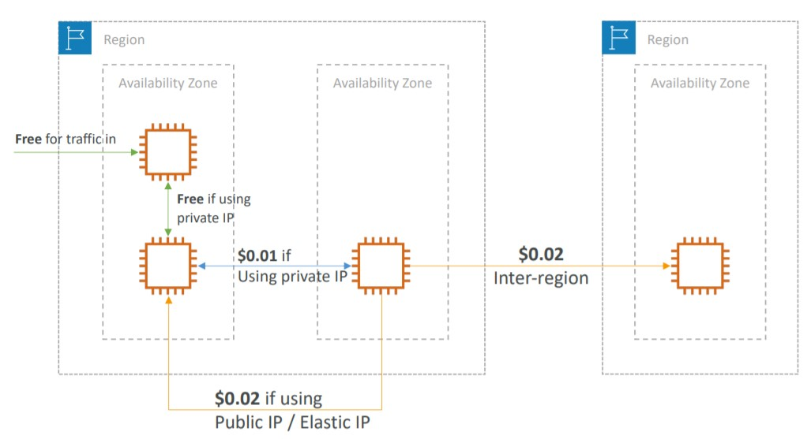

# AWS Billing

- [AWS Pricing Models](#aws-pricing-models)
  - [Free Services and Free Tier](#free-services-and-free-tier)
  - [EC2 Pricing](#ec2-pricing)
  - [Lambda Pricing](#lambda-pricing)
  - [ECS Pricing](#ecs-pricing)
  - [Fargate Pricing](#fargate-pricing)
  - [S3 Pricing](#s3-pricing)
  - [EBS Pricing](#ebs-pricing)
  - [Database Pricing](#Database-pricing)
  - [CloudFront Pricing](#cloudfront-pricing)
  - [Network Pricing](#network-pricing)
- [Reserved Instances to Cost Optimization](#reserved-instances-to-cost-optimization)
- [AWS Savings Plan](#aws-savings-plan)
- [AWS Compute Optimizer](#aws-compute-optimizer)
- [Billing and Costing Tools](#billing-and-costing-tools)
  - [Estimating costs in the cloud](#estimating-costs-in-the-cloud)
    - [TCO Calculator](#tco-calculator): On-prem to Cloud
    - [AWS Pricing Calculator](#aws-pricing-calculator): Cloud pricing
  - [Tracking costs in the cloud](#tracking-costs-in-the-cloud)
    - [AWS Billing Dashboard](#aws-billing-dashboard): Simple dashboard
    - [Cost Allocation Tags](#cost-allocation-tags): Track by tag
    - [Cost and Usage Reports](#cost-and-usage-reports): The most detailed report
    - [Cost Explorer](#cost-explorer): Visual tool
  - [Monitoring against costs plans](#monitoring-against-costs-plans)
    - [Billing Alarms on CloudWatch](#billing-alarms-on-cloudwatch)
    - [AWS Budgets](#aws-budgets)
- [AWS Trusted Advisor](#aws-trusted-advisor)
- [Summary](#summary)

## AWS Pricing Models

AWS has four pricing models:

- **Pay as you go:** You pay for what you use, remain agile, responsive, meet the scale demands
- **Save when you reserve:** for longer term requirements, you save more when you reserve (such as using databases, ec2 instances). This one minimize risks and we have a predictably manage budgets
- **Pay less by using more:** The more you use, more discount. Based on volume.
- **Pay less as AWS grows:** As AWS grows, they save costs and services gets cheaper, so we are affected by it.

### Free Services and Free Tier

- Free Services: IAM, VPC, Consolidated Billing, DynamoDB (25gb)
- Free Services But you per resources: Elastic Beanstalk, CloudFormation, AutoScaling Groups
- [Free Tier](https://aws.amazon.com/pt/free/): free for a period or volume of use (EC2 t2.micro, S3, EBS)

### EC2 Pricing

On EC2 we are only charged on what we use:

- Number of instances
- Instance configuration:
  - Physical capacity
  - Region
  - OS and software
  - Instance type
  - Instance size
- ELB running time and amount of data processed
- Detailed monitoring

We have multiple types of EC2 Purchasing Options. (more detailed in [EC2 section](../ec2/README.md/#EC2-Instances-Purchasing-Options))

**On-demand instances:**

- Minimum of 60s of use
- Pay per second (Linux) or per hour (Windows)

**Reserved instances:**

- Up to 75% discount compared to On-demand on hourly rate
- 1- or 3-years commitment
- All upfront, partial upfront, no upfront

**Spot instances:**

- Up to 90% discount compared to On-demand on hourly rate
- Bid for unused capacity

**Dedicated Host:**

- On-demand
- Reservation for 1 year or 3 years commitment

**Savings plans** as an alternative to save on sustained usage

### Lambda Pricing

- Pay per call
- Pay per duration (max duration 15 minutes)

### ECS Pricing

- When we use ECS behind the scenes it will get an EC2 instance so, will only pay for the EC2 instance and the resources configured to run our application.

### Fargate Pricing

- When we use Fargate it does not runs for us an EC2 instance, so we don't have to manage nothing about server, it is serverless. We pay for Fargate Launch Type Model which means: CPU and Memory allocated to run the application into the containers.

### S3 Pricing

In S3 we have multiple types of [Storage classes](../s3/README.md/#s3-storage-classes): S3 Standard, S3 Infrequent Access, S3 One-Zone IA, S3, Intelligent Tiering, S3 Glacier and S3 Glacier Deep Archive

In S3 we pay for:

- Number and size of objects: Price can be tiered (based on volume, the more volume more discount)
- Number and type of requests (pay for requests in and out)
- Data transfer OUT of the S3 region (Inbound data transfer in the S3 region is free)
- S3 Transfer Acceleration
- Lifecycle transitions between storage classes
- Similar service: EFS (pay per use, has infrequent access & lifecycle rules)
- Retrieval Fee
  - S3 Standard does not charge any data retrieval fee.
  - S3 Intelligent-Tiering does not charge any data retrieval fee.
  - All other storage classes have a retrieval fee.

### EBS Pricing

In Elastic Block Storage we pay for

- Volume type (based on performance)
- Storage volume in GB per month provisioned
- IOPS:
  - General Purpose SSD: Included
  - Provisioned IOPS SSD: Provisionned amount in IOPS
  - Magnetic: Number of requests
- Snapshots:
  - Added data cost per GB of snapshot per month (The added data storage by EBS Snapshots are added cost in GB per month to EBS pricing. Other EBS pricing factors are: Volume type, Provisioned storage volume, IOPS, etc.)
- Data transfer:
  - Outbound data transfer are tiered for volume discounts
  - Inbound is free

### Database Pricing

- Per hour billing
- Database characteristics:
  - Engine
  - Size
  - Memory class
- Purchase type:
  - On-demand
  - Reserved instances (1 or 3 years) with required up-front
- Backup Storage: There is no additional charge for backup storage up to 100% of your total database storage for a region.

**RDS Pricing:**

- Additional storage (per GB per month)
- Number of input and output requests per month
- Deployment type (storage and I/O are variable):
  - Single AZ
  - Multiple AZs
- Data transfer:
  - Outbound data transfer are tiered for volume discounts
  - Inbound is free
- Reserved Instances are good and more cost-effective (up to 69% discount compared to On-demand pricing, depending on the upfront) for long workloads. You can reserve instances for 1 or 3 years in RDS.

### CloudFront Pricing

- Pricing is different across different geographic regions
- Aggregated for each edge location, then applied to your bill (the more you use in a edge location, bigger the discount)
- Data Transfer Out (volume discount)
- Data in is always free
- Number of HTTP/HTTPS requests

### Network Pricing

- All the traffic inbound traffic is free.
- In same region and same AZ: if we have an EC2 instance that uses the free traffic and we have another instance that communicates with this one, the communication is free using the **private ip**.
- In different AZs communication via **private ip** is $0.01 (cheaper) and via **public ip** is $0.02 (expensive).
- In different regions: $0.02 because of the inter-region communication

- Use Private IP instead of Public IP for good savings and better network performance
- Use same AZ for maximum savings (but you loose the high availability)

There are three fundamental drivers of cost with AWS: compute, storage, and outbound data transfer. In most cases, there is no charge for inbound data transfer or data transfer between other AWS services within the same region. Outbound data transfer is aggregated across services and then charged at the outbound data transfer rate.

## Reserved Instances to Cost Optimization

The following AWS services support reservations to optimize costs:

- Amazon EC2 Reserved Instances: You can use Amazon EC2 Reserved Instances to reserve capacity and receive a discount on your instance usage compared to running On-Demand instances.
- Amazon DynamoDB Reserved Capacity: If you can predict your need for Amazon DynamoDB read-and-write throughput, Reserved Capacity offers significant savings over the normal price of DynamoDB provisioned throughput capacity.
- Amazon ElastiCache Reserved Nodes: Amazon ElastiCache Reserved Nodes give you the option to make a low, one-time payment for each cache node you want to reserve and, in turn, receive a significant discount on the hourly charge for that node.
- Amazon RDS RIs: Like Amazon EC2 RIs, Amazon RDS RIs can be purchased using No Upfront, Partial Upfront, or All Upfront terms. All Reserved Instance types are available for Aurora, MySQL, MariaDB, PostgreSQL, Oracle, and SQL Server database engines.
- Amazon Redshift Reserved Nodes: If you intend to keep an Amazon Redshift cluster running continuously for a prolonged period, you should consider purchasing reserved-node offerings. These offerings provide significant savings over on-demand pricing, but they require you to reserve compute nodes and commit to paying for those nodes for either a 1- or 3-year duration.

## AWS Savings Plan

AWS Savings Plans is a way to save more money by getting more discounts. And to do so, we need to commit with a amount of dollar per hour during 1 or 3 years. (With upfront, partial upfront and no upfront). This is the easiest way to setup long terms commitments in AWS.

There are two types of savings plans

**EC2 Savings Plan**

- Up to 72% discount compared to On-Demand and we commit to usage of individual instance families in a region (e.g. C5 or M5)
- Regardless of AZ, size (m5.xl to m5.4xl), OS (Linux/Windows) or tenancy

**Compute Savings Plan:**

- Up to 66% discount compared to On-Demand
- Regardless of Family, Region, size, OS, tenancy, compute options
- Compute Options: EC2, Fargate, Lambda

## AWS Compute Optimizer

AWS Compute Optimizer is a service to help save costs of compute services by analyzing the use of each one of them (using machine learning) and sending us recommendations of improvement.

> AWS Compute Optimizer helps you identify the optimal AWS resource configurations, such as Amazon EC2 instance types, Amazon EBS volume configurations, and AWS Lambda function memory sizes, using machine learning to analyze historical utilization metrics. AWS Compute Optimizer delivers recommendations for selected types of EC2 instances, EC2 Auto Scaling groups, EBS volumes, and Lambda functions.

- Helps you choose optimal configurations and right-size your workloads (over/under provisioned)
- Uses Machine Learning to analyze your resources’ configurations and their utilization CloudWatch metrics
- Supported resources: EC2 instances, EC2 Auto Scaling Groups, EBS volumes and Lambda functions
- Lower your costs by up to 25%
- Recommendations can be exported to S3

Compute Optimizer calculates an individual performance risk score for each resource dimension of the recommended instance, including CPU, memory, EBS throughput, EBS IOPS, disk throughput, disk throughput, network throughput, and network packets per second (PPS).

- AWS Compute Optimizer provides EC2 instance type and size recommendations for EC2 Auto Scaling groups with a fixed group size, meaning desired, minimum, and maximum are all set to the same value and have no scaling policy attached.
- AWS Compute Optimizer supports IOPS and throughput recommendations for General Purpose (SSD) (gp3) volumes and IOPS recommendations for Provisioned IOPS (io1 and io2) volumes.
- Compute Optimizer helps you optimize two categories of Lambda functions. The first category includes Lambda functions that may be over-provisioned in memory sizes. The second category includes compute-intensive Lambda functions that may benefit from additional CPU power.

## Billing and Costing Tools

AWS Has multiple types of tools to Billing and Cost, and we can split in three types

- Estimating costs in the cloud:
- Tracking costs in the cloud
- Monitoring against costs plans

### Estimating costs in the cloud

First we can estimate the costs in the cloud with TCO Calculator and Pricing Calculator

#### TCO Calculator

TCO stands to Total Cost of Ownership and it is a tool to calculate the cost of moving ownership of on-premises server to the cloud.

> TCO calculator helps to compare the cost of your applications in an on-premises or traditional hosting environment to AWS. AWS helps reduce Total Cost of Ownership (TCO) by reducing the need to invest in large capital expenditures and providing a pay-as-you-go model that empowers to invest in the capacity you need and use it only when the business requires it. Once you describe your on-premises or hosting environment configuration, it produces a detailed cost comparison with AWS. TCO calculator can be used from https://awstcocalculator.com/.

- AWS Helps reduce CAPEX (capital expenditures) and providing a pay-as-you-go model
- The TCO calculators allow you to estimate the cost savings when using AWS and provide a detailed set of reports that can be used in executive presentations.
- It compares all the costs with having a on-premises server vs using AWS infrastructure (Server, Storage, Network, IT Labor)

**This tools is deprecated.**

#### AWS Pricing Calculator

AWS Pricing Calculator is a tool to calculate the pricing of Solutions Architecture on AWS.

Here we can select all the infra we want and understand the billing before start our architecture.

### Tracking costs in the cloud

Now we have tools to track our costs in the cloud: We have: AWS Billing Dashboard, Cost Allocation Tags, Cost and Usage Reports, Cost Explorer

#### AWS Billing Dashboard

AWS Billing Dashboard is a high level tool, but great for an overview of costs in AWS.

- It shows Month-to-Date costs
- Summaries
- Last month cost
- Forecast
- Free tier dashboard to understand the usage of the free tier services.

#### Cost Allocation Tags

Use Cost Allocation Tags to track costs on detailed level and categorize.

The tags are used to organize resources and group them together with these tags in AWS and we can give any name we want. The most common are: name, environment, team.

We can manage it with `Tag Editor`. We can also create Resources Groups in this Tag Editor tool.

- We can use auto generated tags by AWS (prefix `aws`)
- User defined tags (prefix `user`)
- You must activate both AWS generated tags and user-defined tags separately before they can appear in Cost Explorer or on a cost allocation report
- For each resource, each tag key must be unique, and each tag key can have only one value

#### Cost and Usage Reports

Cost and Usage Reports is a tool to dive deeper into our AWS costs and usage of resources.

- This is **the most** detailed report in AWS with the most comprehensive data report available.
- The AWS Cost & Usage Report lists AWS usage for each service category used by an account and its IAM users in hourly or daily line items, as well as any tags that you have activated for cost allocation purposes.
- Can be integrated with Athena, Redshift and Quicksight
- You can use Cost and Usage Reports to publish your AWS billing reports to an Amazon Simple Storage Service (Amazon S3) bucket that you own.
- You can receive reports that break down your costs by the hour or month, by product or product resource, or by tags that you define yourself.
- AWS updates the report in your bucket once a day in comma-separated value (CSV) format.

#### Cost Explorer

Cost Explorer is a visual tool to understand and manage the cost and usage overtime in AWS.

> AWS Cost Explorer has an easy-to-use interface that lets you visualize, understand, and manage your AWS costs and usage over time. AWS Cost Explorer includes a default report that helps you visualize the costs and usage associated with your top five cost-accruing AWS services, and gives you a detailed breakdown of all services in the table view. The reports let you adjust the time range to view historical data going back up to twelve months to gain an understanding of your cost trends.

> The rightsizing recommendations feature in Cost Explorer helps you identify cost-saving opportunities by downsizing or terminating EC2 instances. You can see all of your underutilized EC2 instances across member accounts in a single view to immediately identify how much you can save.

- We can create custom reports
- Analyze your data at a high level: total costs and usage across all accounts
- Or Monthly, hourly, resource level granularity
- It suggest savings plans based on the usage
- Forecast usage up to 12 months
- Check underutilized EC2 Instances

The rightsizing recommendations feature in Cost Explorer helps you identify cost-saving opportunities by downsizing or terminating EC2 instances. You can see all of your underutilized EC2 instances across member accounts in a single view to immediately identify how much you can save.

### Simple Month Calculator

> The Simple Monthly Calculator helps customers and prospects estimate their monthly AWS bill more efficiently. The Simple Monthly Calculator cannot be used to compare the cost of running the IT infrastructure on-premises vs AWS Cloud.

### Monitoring against costs plans

On AWS we can monitor and trigger actions related to our budget.

#### Billing Alarms on CloudWatch

Billing Alarms on CloudWatch only available and stored in us-east-1, but we can consolidate all the costs of our account in all regions.

This one is for actual costs, not projected costs. And it sends an email notification if we pass a threshold.

#### AWS Budgets

AWS Budgets is a powerful tool about create and send alarms when costs exceeds the budgets

- We have three types of budgets: Based on Costs, Usage and Reservation
- Up to 5 SNS notifications per budget (can trigger events based on notification)
- Can filter by: Service, Linked Account, Tag, Purchase Option, Instance Type, Region, Availability Zone, API Operation, etc…
- Same options as AWS Cost Explorer!
- 2 budgets are free, then $0.02/day/budget

> AWS Budgets gives you the ability to set custom budgets that alert you when your costs or usage exceed (or are forecasted to exceed) your budgeted amount. Difference with CloudWatch Billing Alarms: CloudWatch Billing Alarms only send alerts when your costs and usage are exceeding your budget, not when it is forecasted to exceed your budget, while AWS Budgets does both.

Supported Types of Budget:

- Cost Budget - Helps you plan how much you want to spend on a service.
- Usage Budget - Helps you plan how much you want to use one or more services.
- Reservation Budget - This helps you track the usage of your Reserved Instances (RI). Two ways of doing it - RI utilization budgets (This lets you see if your RIs are unused or under-utilized), RI coverage budgets (This lets you see how much of your instance usage is covered by a reservation).
  - You can also use AWS Budgets to set reservation utilization or coverage targets and receive alerts when your utilization drops below the threshold you define. You can define a utilization threshold and receive alerts when your RI usage falls below that threshold. This lets you see if your RIs are unused or under-utilized.

## AWS Trusted Advisor

Trusted Advisor is a assessment on AWS account with the purpose of advise possible savings, checks and cost optimizations within AWS account.

- For all customer it is free the **core checks** of AWS
- We can enable weekly reports/email notifications about the recommendations
- The full version of trusted-advisor requires a **Business and Enterprise Supports Plan**
  - You get access to advisor to all categories
  - Ability to use CloudWatch Alarms when reach limits
  - **Programmatic access using AWS Support API**

AWS Trusted Advisor provides multiple types of recommendations and after that a few examples:

**Cost Optimization**:

- Low utilization of EC2 Instances, idle Load Balancers, under-utilized resources (EBS Volumes)
- Reserved instances and savings plans optimizations

**Performance**:

- High utilization of EC2 Instances, CloudFront CDN Optimizations
- EC2 to EBS throughput optimizations, Alias records recommendations

**Security**

- MFA enabled on Root Account, IAM key rotations, exposed access keys
- S3 Bucket permissions for public access, security groups with unrestricted access
- Send alerts when AWS CloudTrail is not activated (To get user activity logging)

**Fault Tolerance**

- Age of EBS snapshots
- AZ balance
- ASG multi-az, ELB Configurations

**Services Limits(Quotas)**:

- Helps to understand if we are reaching a limit of a service and advises if is needed to increase before we have problems.

## Summary

- TCO Calculator: Calculate the price of moving from on premises to the cloud and get reports of the the moving
- Pricing Calculator: Calculate the price of the architecture on the cloud
- Billing Dashboard: Simple tool to overview the billings
- Cost Allocation Tags: Group tags together and get report by grouped tags
- Cost and Usage Reports: Most comprehensive report in AWS
- Cost Explorer: Visual Billing dashboard with detailed + forecast 12 usage up to 12 months
- Billing Alarms: use CloudWatch to run the billings alarms when some metric is passed (located in us-east-1)
- Budgets: more advanced alarm and notification regarding Budget. Integrated with SNS.
- Savings Plan: Easy-way to save money based on long term commitment with AWS.
- Compute Optimizer: recommends resources’ configurations to reduce cost

[UP](#aws-billing)
