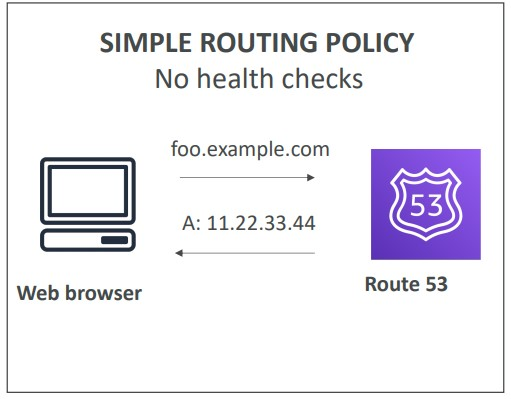
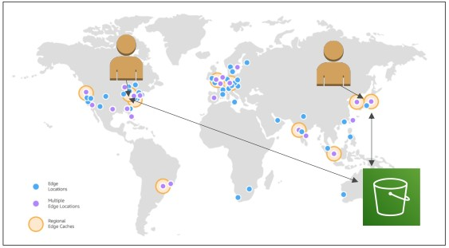
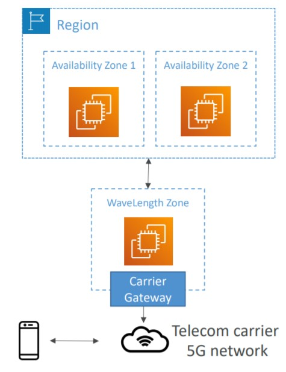

# 🌎 AWS Global Infrastructure

When we are talking about Global Infrastructure we can understand multiple geographic locations. On AWS This could be Regions and/or Edge Locations.

Benefits of Multiple Geographic Locations:

- Decreasing Latency: less latency between communications and packages transfers. (eg. From Brazil to Japan, it surely will have latency), deploy applications closer to the users (Edge Locations)
- Disaster Recovery (DR): Infrastructure is resilient to disasters, fail-over strategies (move to another region)
- Attack Protection: It is harder to attack a distributed infrastructure

AWS Infrastructure consists in:

- Regions: For deploying applications and infrastructure
- Availability Zones: Made of multiple data centers
- Edge Locations (Points of Presence): for content delivery as close as possible to users

Global Services to Decrease Latency and Improve Availability

- [Route53](#route53)
- [CloudFront](#cloudFront)
- [S3 Transfer Accelerator](#s3-transfer-accelerator)
- [AWS Global Accelerator](#aws-global-accelerator)
- [AWS Outposts](#aws-outposts)
- [AWS Wavelength](#aws-wavelength)
- [Summary](#summary)

## Route53

It is a Managed DNS (Domain Name System) of AWS.
Route 53 features are (non exhaustive list): Domain Registration, DNS, Health Checks, Routing Policy

DNS is a collection of rules and records which helps clients understand how to reach servers through URLs. DNS records examples:

```
• www.google.com => 12.34.56.78 == A record (IPv4)
• www.google.com => 2001:0db8:85a3:0000:0000:8a2e:0370:7334 == AAAA IPv6
• search.google.com => www.google.com == CNAME: hostname to hostname
• example.com => AWS resource == Alias (ex: ELB, CloudFront, S3, RDS, etc…)
```

<p align="center" width="100%"></p>

### Route 53 Routing Policies

Multiples strategies of Routing, expect by the simple route policy, all have health checks and each one different goals:

- **Simple Routing Policy**: A client (web browser) request through an URL and Route 53 resolves and responds an IP. This one does not have health checks.

> With simple routing, you typically route traffic to a single resource, for example, to a web server for your website.

    <p align="center" width="100%"></p>

- **Weighted Routing Policy**: It is to distribute the traffic across multiple instances: So, a client (web browser) request through an URL and Route 53 resolves and multiples IPs with a weight to each one. And since we have multiple instances, Route 53 perform health checks.

  - Example: 20% of the users will get response from server 1, 30% of the users will get response from server 2, 50% of the users will get response from server 3. It is like a Load Balancing
  <p align="center" width="100%"></p>

- **Latency Routing Policy**: This Latency Routing Policy is made to reduce latency by understanding WHERE is the request coming from, and it will make sure to send a response from the closest server to provide lower possible latency. This one also have health checks.

> This routing policy is used when you have resources in multiple AWS Regions and you want to route traffic to the region that provides the best latency.

- Example: We have an application global application published in South America (Brazil) and Europe (France). Our users are around the globe, so if we receive an request from Argentina it will get the response from the server in South America, the closest one.
<p align="center" width="100%"></p>

- **Failover Routing Policy**: We have two instances, main instance and failover instance, if the main one fails it will redirect automatically to the failover instance. It performs health checks on the main instance.
<p align="center" width="100%"></p>

This failover routing policy can be:

**Active-Active failover**

> Use this failover configuration when you want all of your resources to be available the majority of the time. When a resource becomes unavailable, Route 53 can detect that it's unhealthy and stop including it when responding to queries.

**Active-Passive failover**

> Use an active-passive failover configuration when you want a primary resource or group of resources to be available the majority of the time and you want a secondary resource or group of resources to be on standby in case all the primary resources become unavailable. When responding to queries, Route 53 includes only the healthy primary resources. If all the primary resources are unhealthy, Route 53 begins to include only the healthy secondary resources in response to DNS queries.

[AWS Failover types](https://docs.aws.amazon.com/Route53/latest/DeveloperGuide/dns-failover-types.html)

## CloudFront

CloudFront is a Content Delivery Network (CDN). It improves the read performance and cache the content into Amazon Edge Locations all around the world. It improves the user experience (less latency).

- Amazon contains 216+ Points of Presence (Edge Locations).
- CloudFront has DDoS protection, Shield and AWS Web Application Firewalls. (You can use AWS WAF web access control lists (web ACLs) to help minimize the effects of a distributed denial of service (DDoS) attack. For additional protection against DDoS attacks, AWS also provides AWS Shield Standard and AWS Shield Advanced.)
- The first call always goes to the Original Location, but after that, the content will cached in the edge location and next requests will be faster for all users.
  - A Static S3 Web Site deployed in Brazil (sa-east-1). A user from china tries to access. The first access on china will be slower because the response comes from the origin, but it will be cached into Edge Location, so next users will get faster responses.

<p align="center" width="100%"></p>

CloudFront can cache from:

**S3 Bucket**:

- For distributing files and caching them at the edge
- Enhanced security with CloudFront Origin Access Identity (OAI)
- CloudFront can be used as an ingress (to upload files to S3)

<p align="center" width="100%"></p>

**Custom Origin (HTTP)**

- Any kind of website
- Load Balancer, EC2, S3 Website (Bucket must be enabled as website)
- Any HTTP backend (even on premise)

<p align="center" width="100%"></p>

### CloudFront vs S3 Bucket Replication

- In CloudFront we work with all the Edge Locations around the world. The files are cached, but they have a Time To Live (TTL) and they are great for static content that must be available everywhere.

- In S3 Bucket Replication we need to choose a region to replicate the data, and files are updated in near real time. The files are Read Only as well and it is great for Dynamic content (but in a few regions, not all)

## S3 Transfer Accelerator

As we know an S3 Bucket is linked to one region and sometimes we need to transfer files all around the world into a specific Bucket.

With S3 Transfer Accelerator we can speed up the transfer of the file by transferring the file to an AWS Edge Location. This Edge Location will forward the file to the target bucket. This is only used when you need to download or upload files in buckets that are far away of the user.

Amazon S3 Transfer Acceleration enables fast, easy, and secure transfers of files over long distances between your client and an S3 bucket. Transfer Acceleration takes advantage of Amazon CloudFront’s globally distributed edge locations. As the data arrives at an edge location, data is routed to Amazon S3 over an optimized network path.

- Example: We have a bucket in Australia and our user will upload a file in USA. So it will upload into the Edge Location and internally the file will to your bucket using AWS internal network (faster and private)

<p align="center" width="100%"></p>

## AWS Global Accelerator

Improves global applications availability and performance by using AWS Global Network. Through the Edge Locations it uses the internal network of AWS and it is very faster.

- Leverage the AWS internal network to optimize the route to your application (60% improvement)
- 2 Anycast IP are created for your application and traffic is sent through Edge Locations
- The Edge locations send the traffic to your application

<p align="center" width="100%"></p>

### AWS Global Accelerator vs CloudFront

They both use the AWS global network and its edge locations around the world and Both services integrate with AWS Shield for DDoS protection.

**CloudFront** is a Content Delivery Network and it improves the performance of cacheable content (such as images, videos, static files) and the content is served at the edge.

- CloudFront uses Edge Locations to cache content
- CloudFront is designed to handle HTTP protocol
- CloudFront uses multiple sets of dynamically changing IP addresses to route traffic to your origin.
- CloudFront pricing is mainly based on data transfer out and HTTP requests

**AWS Global Accelerator** has no caching, it proxies the packets by using the edge location and the internal network to have more speed. Improves performance for a wide range of applications over TCP or UDP.

- Global Accelerator uses Edge Locations to find an optimal pathway to the nearest regional endpoint.
- Global Accelerator will provide you a set of static IP addresses as a fixed entry point to your applications.
- Global Accelerator Pricing: it charges a fixed hourly fee and an incremental charge over your standard Data Transfer rates, also called a Data Transfer-Premium fee (DT-Premium).
- Global Accelerator is best used for both HTTP and non-HTTP protocols such as TCP and UDP.
- Good for HTTP use cases that require static IP addresses and Good for HTTP use cases that required deterministic, fast regional failover.

## AWS Outposts

With Hybrid Cloud: businesses can keep an server on premises infrastructure alongside a cloud infrastructure, Therefore, in hybrid you usually have to deal two infra by managing them (Cloud and On-Premise). So you have different commands, different instances, etc.

Thinking about it, AWS has release AWS Outposts, which is a physical "Server Rack" that offers the same AWS Infrastructure, APIs and tools to build the applications on Premise the same way wou would do in the cloud.

- AWS will setup and manage “Outposts Racks” within your on-premises infrastructure and you can start leveraging AWS services on-premises
- You are responsible for the Outposts Rack physical security after the installation.

Benefits:

- Low-latency access to on-premises systems
- Local data processing
- Data residency
- Easier migration from on-premises to the cloud
- Fully managed service
- Some services that work on Outposts: EC2, S3, EBS, EKS, ECS, RDS, EMR

<p align="center" width="100%"></p>

## AWS Wavelength

- Wavelength Zones are infrastructure deployments, embedded within the telecommunications providers data centers at the edge of the 5G Networks.

This brings AWS services to the edge of the 5G Networks, allowing services such as EC2, EBS, VPC...

- Ultra-low latency applications through 5G networks
- Traffic doesn’t leave the Communication Service Provider’s (CSP) network
- High-bandwidth and secure connection to the parent AWS Region
- No additional charges or service agreements
- Use cases: Smart Cities, ML-assisted diagnostics, Connected Vehicles, Interactive Live Video Streams, AR/VR, Real-time Gaming, …

<p align="center" width="100%"></p>

## Summary

- Route 53: Great to route users to the closest deployment with least latency and good for disaster recovery strategies.
- CloudFront: Replicate part of your application to AWS Edge Locations and cache common requests (less latency)
- S3 Transfer Acceleration: Accelerate S3 Downloads and Uploads
- AWS Global Accelerator: Improve Global Availability and Performance of your apps by using internal AWS networking.
- AWS Outposts: Deploy Outposts Racks in your own Data Centers to extend AWS services
- AWS Wavelength: Ultra-low latency connection to the applications through 5g network. It brings AWS services to the edge by using the 5G.
