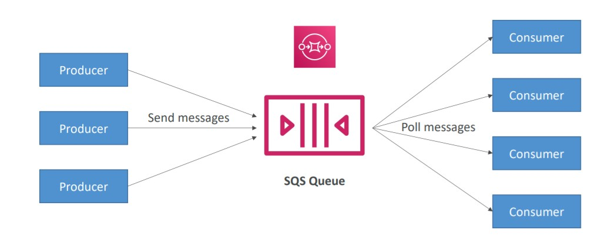

# 🚦 Cloud Integration

When we start deploying multiple applications, they will inevitably need to communicate with one another. There are two patterns of application communication:
**Synchronous Communications**: An application communicating directly to another application. (Synchronous between applications can be problematic if there are sudden spikes of traffic)

**Asynchronous Communications** It is event driven and an application puts events or notifications in queues/streams and the other systems communicates with the queues if there is anything in there. The applications keeps decoupled from each other. In AWS we use the following services to Cloud Integrations with Asynchronous Communications:

- [Simple Queue Service (SQS)](#simple-queue-service)
- [Simple Notification Service (SNS)](#simple-notification-service)
- [AWS Kinesis](#aws-kinesis)
- [Amazon MQ](#amazon-mq)
- [Summary](#summary)

## Simple Queue Service

First we need to understand how does a queue work: We have producers that generates message and stores it in a queue. Once this message is stored in a queue it can be read by consumers, who will be polling the message and process it, and after finish the processing it will delete the message from the queue.

Simple Queue Service (SQS) is one of the most old AWS Services and it is used to decouple between application tiers.

- Fully Managed and Serverless services + Auto scalable
- By default it keeps the message from 4 to 14 days and there is no limit of messages into the queue.
- Messages are delete after read by consumers
- A System must pool the message
- Messages in a Queue are typically processed by a single consumer
- Consumers share the work to to read messages & scale horizontally.
- The consumer has to poll and pull messages from SQS

In AWS we have two types of Queues:

- Standard: At-least one delivery, no ordering
- FIFO: First In First Out delivery and Exactly-Once processing
  Keywords: Producer and Consumer

  

## Simple Notification Service

For this service need to understand PUB/SUB: It has a topic and this topic notify multiple consumers at once (fan out) of different types (such as Lambda, SQS, Email).

In Simple Notification Service (SNS) the publisher only need to send one notification to a Topic and the consumers are subscribed to this topic, you can have as many as you want.

- The “event publishers” only sends message to one SNS topic
- As many “event subscribers” as we want to listen to the SNS topic notifications
- Each subscriber to the topic will get all the messages
- Keywords: Publisher and Subscriber

 

Difference between SNS and SQS:

**SQS**:

- SQS is distributed queuing service.
- With SQS all the consumers share the messages
- Messages are not pushed to receivers. Receivers have to poll SQS to receive messages. Messages can’t be received by multiple receivers at the same time. Any one receiver can receive a message, process and delete it. Other receivers do not receive the same message later.
- Consumers poll and pull messages from SQS
- Do your system care about an event?

**SNS**:

- SNS is a distributed publish-subscribe system. Messages are pushed to subscribers as and when they are sent by publishers to SNS.
- With SNS each subscriber get ALL the messages
- Processing the same message in multiple ways.
- Do multiple services care about the same event?

## AWS Kinesis

Amazon Kinesis it is Real Time big data streaming.

- It is a Managed service to collect, process and analyze real-time streaming data at any scale.

Kinesis has some known features:

- Kinesis Data Streams: low latency streaming to ingest data at scale from multiple sources at the same time.
- Kinesis Data Firehose: loads streams into another AWS services (such as S3, Elasticache, redshift, etc.)
- Kinesis Data Analytics: perform real-time data analytics using SQL
- Kinesis Video Streams: monitor real-time video streams for analytics or Machine Learning

## Amazon MQ

It is a managed Apache ActiveMQ and RabbitMQ which are services to work with Queue and Notification Topics. The use case is when you are migrating to the cloud, instead of re-engineering the application to use SQS and SNS, we can use Amazon MQ.

- SQS, SNS are “cloud-native” services, and they’re using proprietary protocols from AWS.
- Traditional applications running from on-premise may use open protocols such as: MQTT, AMQP, STOMP, OpenWire, WSS
- Amazon MQ doesn’t “scale” as much as SQS / SNS
- Amazon MQ runs on a dedicated machine (not serverless)
- Amazon MQ has both queue feature (SQS - Queue) and topic features (SNS - Topic)

## Summary

- SQS:
  - Queue service in AWS
  - Multiple Producers, messages are kept up to 14 days
  - Multiple Consumers share the read and delete messages when done
  - Used to decouple applications in AWS
- SNS:
  - Notification service in AWS (Pub/Sub)
  - Subscribers: Email, Lambda, SQS, HTTP, Mobile…
  - Multiple Subscribers, send all messages to all of them
  - No message retention
- Kinesis: real-time data streaming, persistence and analysis
- Amazon MQ: managed Apache MQ in the cloud (MQTT, AMQP.. protocols)

All these services can scale independently from our application!
