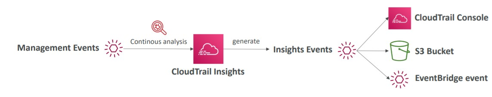
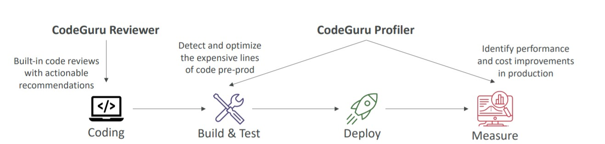

# 🕐 Cloud Monitoring

- [CloudWatch Metrics](#cloudwatch-metrics)
- [CloudWatch Alarms](#cloudwatch-alarms)
- [CloudWatch Logs](#cloudwatch-logs)
- [CloudWatch Events - EventBridge](#cloudwatch-events---eventbridge)
- [CloudTrail](#cloudtrail)
- [Amazon X-Ray](#amazon-x-ray)
- [Amazon CodeGuru](#amazon-CodeGuru)
- [Service Health Dashboard](#service-health-dashboard)
- [Personal Health Dashboard](#personal-health-dashboard)
- [Cloudwatch vs. CloudTrail vs. Config](#cloudwatch-vs-cloudtrail-vs-config)
- [Summary](#summary)

## CloudWatch Metrics

CloudWatch provides metrics for every services in AWS. A Metric is a variable to monitor (CPU Utilization, NetworkIn…)

- Metrics have timestamps
- Can create CloudWatch dashboards of metrics
- Important Metrics:
  - EC2 instances: CPU Utilization (understanding the need of scale), Status Checks, Network (not RAM)
  - Default metrics every 5 minutes
  - Option for Detailed Monitoring ($$$): metrics every 1 minute
  - EBS volumes: Disk Read/Writes
  - S3 buckets: BucketSizeBytes, NumberOfObjects, AllRequests
  - Billing:Total Estimated Charge (only in us-east-1)
  - Service Limits: how much you’ve been using a service API
  - Custom metrics: we can create our own metrics

## CloudWatch Alarms

Alarms are use to trigger notifications for any metric. The alarms are customizable and we have multiple options (min, max, average, etc.). Alarms have three states: `OK` (green), `INSUFFICIENT_DATA` (yellow), `ALARM` (red).

With CloudWatch Alarms we can:

- Auto Scaling: Scale In/Up or Scale Out/Down EC2 instances to a desired count
- EC2 Actions: stop, terminate, reboot or recover an EC2 instance
- SNS Notifications: send notifications into SNS topics
- Billing Alarms
- Choose a schedule to check metrics and evaluate alarms.

## CloudWatch Logs

With CloudWatch Logs (customizable data of running applications). We can also enables real-time monitoring of logs and adjustable CloudWatch Logs retention (keep the logs for a week, a month, a year)

So, We can collect logs from applications within:

- Elastic Beanstalk: collection of logs from application
- ECS: collection from containers
- AWS Lambda: collection from function logs
- CloudTrail based on filter
- CloudWatch log agents: on EC2 machines or on-premises servers
- Route53: Log DNS queries

By default CloudWatch Logs does not work with EC2 instances, to do so, we need to

- Install CloudWatch Agent into EC2 Instance.
- Create the correct IAM Permissions.
- The agent also works with on-premise (Hybrid agent) so we can collect logs from it as well.
- The cloudwatch agent will communicate and send the logs to our CloudWatch Logs.

## CloudWatch Events - EventBridge

Is a service to do a serverless cron job and work with events within AWS Services.

- **Schedule**: we can create a scheduled script to run every X define period.
- **Event Pattern**: Event rules to react to a service doing an specific action such as:
  - Trigger Lambdas
  - Register notifications into SNS topics

### Amazon EventBridge

Amazon EventBridge is the next evolution of CloudWatch events. Received this new name and replaces CloudWatch Events name. (In the exam it is called EventBridge)

- Has a default event bus, which are Events generated by AWS Services
- Partner Event Bus: Can receive events from SaaS services or applications (Zendesk, DataDog, Segment, Auth0)
- Custom Event Bus:Can create custom event buses
- Schema Models: it a model event schema

> The main difference between CloudWatch Events and EventBus is that EventBus has new features and it a evolutions, so we have the default event bus (aws service) + partner and custom events and schema models.

## CloudTrail

CloudTrail Provides governance, compliance and audit for your AWS Account by storing every single event that happens in AWS Account. CloudTrail is enabled by default!

- Get an history of events / API calls made within your AWS Account by:
  - Console
  - SDK
  - CLI
  - AWS Services
- We Can put logs from CloudTrail into CloudWatch Logs or S3 to preserve logs to more time.
- A trail can be applied to All Regions (default) or a single Region.

If we need to check any action performed into our account, the best place to check first/investigate is CloudTrail.

In CloudTrail we have three types of events:

- **Management Events**: Operations performed on Resources in our AWS Account. By default, trails are configured to log management events and they can be split into two categories (Read Events, don't modify resources and Write Events, may modify resources). Examples:
  - Configuring security (IAM AttachRolePolicy) - Write Event
  - Configuring rules for routing data (Amazon EC2 CreateSubnet) - Write Event
  - Setting up logging (AWS CloudTrail CreateTrail) - Write Event
  - Delete DynamoDB Table (Write Event)
  - Check Policies (IAM Read) - Read Event
- **Data Events**: By default this type of event is not logged because of the high volume, since it works on object level/data level. Examples:
  - Amazon S3 object-level activities (GetObject, DeleteObject) [Read and Write Events]
  - AWS Lambda Function executions (Invoke API) [Read Event]
- **Insight Events**: This type of event is to detect unusual activities in our AWS Account. It works by analyzing the normal management events and creates a base line of what is normal into our account, so it keeps analyzing the WRITE events to detect unusual patterns such as:
  - inaccurate resource provisioning
  - hitting service limits
  - Bursts of AWS IAM actions
  - Gaps in periodic maintenance activity

With Insight Events we can check the anomalies in CloudTrail Console, Store events into S3 and Integrate with EventBridge to perform actions.

**CloudTrail Retention**: By default the events are store for 90 days. To keep the events for longer times, we can log them to S3 Bucket and use Amazon Athena to Query the events. (we can store all events types: Management Events, Data Events and Insights Events)

## Amazon X-Ray

Usually it is more easy to debug monolith applications, because it is almost everything connected and into the same application. When we have distributed systems, microservices, etc, it is more difficult to debug and trace events as a big picture. For this, we have Amazon X-Ray.

With Amazon X-Ray we can have a big picture and a visual analysis of our apps. The advantages of X-Ray are:

- Troubleshooting Performance (bottlenecks)
- Understand Dependencies in microservices architectures
- Pinpoint services issues and review requests behaviors
- Find errors, exceptions and understand throttles
- Measure SLA

## Amazon CodeGuru

A Machine Learning service to Automated Code Reviews and for Application Performance Recommendations.

**CodeGuru Reviewer**: Automated Code Reviews for static code analysis. (development).

- It analysis the code in our repository (code commit, or github).
- Identity critical issues, security vulnerabilities, and hard-to-find bugs.
- Enforce code practices, common coding best practices, resource leaks, security detection, input validation
- Uses machine learning and automated reasoning
- Hard-learned lessons across multiple AWS open-sources repositories
- Supports Java and Python (more incoming)
- Integration with GitHub, CodeCommit and BitBucket

**CodeGuru Profiler**: Visibility/recommendations of application performance during runtime (production).

- It detects the expensive lines of code in pre-prod and once it is deployed it starts measuring and analyzing performance.
- Helps to understand the runtime behavior of application
- Identify and remove code inefficiencies
- Improve application performance (e.g., reduce CPU utilization)
- Decrease compute costs
- Provides heap summary (identify which objects using up memory)
- Anomaly Detection
- Support applications running on AWS or on- premise
- Minimal overhead on application

## Service Health Dashboard

It an AWS Website to show the status of all services in all regions of AWS.
https://status.aws.amazon.com/

- Shows all regions, all services health.
- Shows historical information for each day
- Subscribable RSS feed

## Personal Health Dashboard

Amazon PHD (Personal Health Dashboard) is service that provides alerts and remediation guidances to you when AWS has impacting events to a service or part of infrastructure that may impact our resources.

While the Service Health Dashboard displays the general status of AWS services, **Personal Health Dashboard gives you a personalized view into the performance and availability of the AWS services underlying your AWS resources**. It provides proactive notification to help you plan for scheduled activities.

- Keywords: Alert, remediation, proactive, scheduled activities
- https://phd.aws.amazon.com/

## Cloudwatch vs. CloudTrail vs. Config

- Cloudwatch: Think resource **performance** monitoring, events, and alerts.
- CloudTrail: Think **account-specific activity** and audit.
- Config: Think **resource-specific** change history, audit, and compliance.
- Trusted Advisor: real-time guidance to help you provision your resources following AWS best practices on cost optimization, security, fault tolerance, service limits and performance improvement.

## Summary

- CloudWatch: Cloudwatch has multiple features for monitoring our apps
  - Metrics: Are the performance indicators of AWS services and billing metrics
  - Alarms: We can create notifications and actions based on metrics
  - Logs: collect log files from services and store/analyse it
  - Events (EventBridge): create schedule jobs and react to events into our account
- CloudTrail: Governance, Compliance and Audit tools with every events that happens into our account
- CloudTrail Insights: Automated analysis of CloudTrail Events
- X-Ray: trace requests and get a big picture/debugging of distributed systems/microservices.
- CodeGuru: automated code reviews and application performance recommendations
- Service Health Dashboard: Dashboard with all AWS services status across all regions.
- Personal Health Dashboard: Status of AWS Services that impact OUR infrastructure and we can create a plan to deal with it.

[UP](#🕐-Cloud-Monitoring)
