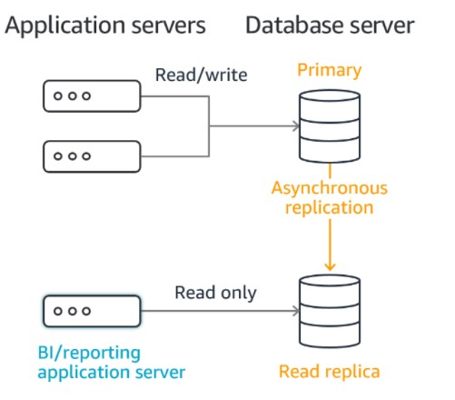

# 🎲 Database and Analytics

Storing data on disk (EFS, EBS, S3, EC2 Instance Store) can have limits, so if we need to store data with some structure or definition, we may want to use database.
What is a database:

- Can structure the data
- Can build indexes to perform queries/search through the data
- Can define relationship between datasets.

Databases are optimized for a purpose and come with different features, shapes and constraints, thats why exists multiple types of databases:

- [Relational Databases](#relational-databases)
  - [Relational Database Service - RDS](#rds---relational-database-service)
  - [Amazon Aurora](#amazon-aurora)
- [NoSQL Databases](#noSql-databases)
  - [Amazon Elasticache](#amazon-elasticache)
  - [Amazon DynamoDB](#amazon-dynamodb)
  - [Amazon DynamoDB Accelerator - DAX](#amazon-dynamodb-accelerator---dax)
  - [Amazon DocumentDB](#amazon-documentDb)
- [Databases and Shared Responsibility on AWS](#Databases-and-Shared-Responsibility-on-AWS)
- [Amazon Redshift](#Amazon-Redshift)
- [Amazon Elastic MapReduce - EMR](#amazon-elastic-mapReduce---emr)
- [Amazon Athena](#amazon-athena)
- [Amazon Quicksight](#amazon-quicksight)
- [Amazon Neptune](#amazon-neptune)
- [Amazon QLDB](#amazon-qldb)
- [Amazon Managed Blockchain](#amazon-managed-blockchain)
- [Summary](#summary)

## Relational Databases

- Use table to each Entity, the tables have attributes
- We can create a relationship between the tables by using keys (Primary Key/Foreign Key/Indexes)
- Looks like an excel spreadsheet, with link (relationship) between them.
- We can use the SQL (Structured Query Language) to perform queries

Basically we have two ways to create Relational Databases in AWS: RDS and Aurora. They are both managed by AWS, but Aurora is a cloud native and more cloud friendly while RDS will be running known technologies directly in a managed service.

## NoSQL Databases

- NoSQL means non relational databases. They are built for a specific purpose and specific data models. They have flexible schemas for building modern applications.
- Types: Key-Value, Document, Graph, in-memory, search databases
- We can have the data in JSON (Javascript Object Notation) format (we can add new fields, nest data, support arrays, etc.)
- Benefits:
  - Flexibility: easy to evolve data model
  - Scalability: designed to scale-out by using distributed clusters
  - High-performance: optimized for a specific data model
  - Highly functional: types optimized for the data model

Example of JSON data

```json
{
  "name": "John",
  "age": 30,
  "cars": ["Ford", "BMW", "Fiat"],
  "address": {
    "type": "house",
    "number": 23,
    "street": "Dream Road"
  }
}
```

Amazon provides multiple services of NoSQL databases: Elasticache, DynamoDB, DynamoDB Accelerator

## Databases and Shared Responsibility on AWS

AWS Manages the databases, it has multiple benefits:

- Quick Provisioning, High Availability, Vertical and Horizontal Scaling
- Automated Backup & Restore, Operations, Upgrades
- Operating System Patching is handled by AWS
- Monitoring, alerting

We can have our own database (and others technologies) in EC2 Instances, but we must handle and manage it (the resiliency, backup, patching, high availability, fault
tolerance, scaling)

## RDS - Relational Database Service

RDS Stands to Relational Database Service and it is a managed DB by AWS for databases that uses SQL as query language. RDS databases are used for OLTP (Online Transaction Processing).

The performance of AWS managed RDS instance is better than a customer-managed database instance

We can create multiple relational databases types in the cloud, fully managed by AWS:

- Postgres
- MySQL
- MariaDB
- Oracle
- Microsoft SQL Server
- Aurora (AWS Proprietary database)

Advantages of using RDS instead of using a EC2 deployed database:

RDS is a managed service:

- Automated provisioning, OS Patching
- Continuos backup options and restore to specific timestamp (Point in time to restore)
- Monitoring dashboards
- We can create scale to read data from replicas for improved read performance
- Setup Multi AZ setup (Disaster Recovery and Highly Available)
- Setup Maintenance windows for upgrades
- Scaling capability (vertical and horizontal)
- Storage in a EBS (Elastic Block Store GP2 or io1) inside an EC2 instance

**Important**: We cannot use SSH into our database instances.

 <p align="center" width="100%"></p>

- The ELB will receive the web requests
- The EC2 instances doing/hosting the application logic
- RDS doing Reads and Writes

**RDS Deployment Options:**

- **RDS Read Replicas**: Here we can scale the workload of our DB, we can create up to 15 replicas. The data is written only to main DB and we can read the data from the replicas. **Read Replica improves database scalability and are used for improved read performance**.
  > Read Replicas allow you to create read-only copies that are synchronized with your master database. Read Replicas are used for improved read performance. You can also place your read replica in a different AWS Region closer to your users for better performance. Read Replicas are an example of horizontal scaling of resources.

<p align="center" width="100%"></p>

- **RDS Multi-AZ**: Failover in case of AZ outage (high availability), data is read/written to main database. Can have only one other AZ as failover (the data will be replicated to failover db, that will be used only if the main db has any kind of issue).
  **The main purpose of RDS Multi-AZ is High Availability**.
  > Amazon RDS Multi-AZ deployments provide enhanced availability and durability for RDS database (DB) instances, making them a natural fit for production database workloads. When you provision a Multi-AZ DB Instance, Amazon RDS automatically creates a primary DB Instance and synchronously replicates the data to a standby instance in a different Availability Zone (AZ).

<p align="center" width="100%"></p>

- **RDS Multi-Region** (read replicas): Disaster recovery strategy in case of Region issue, local performance for global reads (Example: so if we have the main db in us-east-1 and replica in sa-east-1, we can read locally from region sa-east-1 with less latency, but if we need to write, it goes to main db, in us-east-1) replications costs.
  **The main purpose of RDS Multi-Region is Disaster Recovery**

<p align="center" width="100%"></p>

## Amazon Aurora

It is an AWS proprietary technology (not open-source) of a Relational database. Aurora is Cloud Optimized, so it have much more performance compared Relational Database Service (RDS).

- Amazon Aurora supports Postgres and MySQL
  - Compared to RDS running a MySQL database, Aurora MySQL has 5x more performance
  - Compared to RDS running a Postgres database, Aurora Postgres has 3x more performance
- Aurora storage automatically grows in increments of 10GB, up to 64 TB.
- Aurora costs more than RDS (20% more) – but is more efficient
- Not included into Free Tier

Aurora databases are used for OLTP (Online Transaction Processing)

<p align="center" width="100%"></p>

## Amazon Elasticache

Is used to get a Redis or Memcached managed database.

- Caches are in-memory databases with high performance, low latency
- Cache databases Helps reduce load off databases for read intensive workloads, instead of use the repetitive query hitting the database, we can get common responses from our cache.
- Very readily available, easy accessible and they can relieve the pressure on main database by returning common results.
- AWS takes care of OS maintenance / patching, optimizations, setup, configuration, monitoring, failure recovery and backups.
- Keywords: In-memory database
- Architecture example:

<p align="center" width="100%"></p>

## Amazon DynamoDB

DynamoDB is a fully managed and High Available NoSQL Key/Value Database with replications across 3 AZs.

> Amazon DynamoDB is a key-value and document database that delivers single-digit millisecond performance at any scale. It's a fully managed, multi-Region, multi-master, durable database with built-in security, backup and restore, and in-memory caching for internet-scale applications. DynamoDB offers flexible schema and can easily handle unstructured data.

- Scales to massive workloads, distributed “serverless” database (We don't need to manage any server related to this database)
- Millions of requests per seconds, trillions of row, 100s of TB of storage
- Fast and consistent in performance
- Single-digit millisecond latency – low latency retrieval
- Integrated with IAM for security, authorization and administration
- Low cost and auto scaling capabilities
- Keywords: Serverless, low-latency and single digit millisecond.
- High Available by default (EFS is high available as well)

<p align="center" width="100%"></p>

### Amazon DynamoDB Accelerator - DAX

Amazon DynamoDB Accelerator is a in-memory cache for DynamoDB and it is fully managed by AWS.
It has 10x performance improvement

- single digit millisecond latency to `microseconds` latency when accessing tables.
- Secure, highly available and high scalable

Main difference between DAX and Elasticache: DAX is used only with DynamoDB while Elasticache is used with another databases.

- Architecture example:

```
Application <-R/W-> DynamoDB Accelerator (DAX) <-R/W-> DynamoDB
```

## Amazon Redshift

Based on Postgres database, but this one is not used to `OLTP - Online Transaction Processing`, this one is used to `OLAP - Online Analytical Processing`, this type of database is for analytics and data warehousing.

Usually the exam ask what kind of database is used for analytics and data warehousing, so Amazon Redshift is the answer.

- Load data once every hour, not every second.
- 10x performance compared to others data warehouses, scale to PBs of data.
- The data is stored in Columns (columnar storage of data)
- Massive Parallel Query Execution (MPP)
- High Availability
- Pay as you go, based on the launched instances
- Has SQL interface to perform queries.
- Integrated with BI tools such as Amazon Quicksight and Tableau.
- Redshift does not support storing unstructured data.

## Amazon Elastic MapReduce - EMR

EMR stands to Elastic MapReduce and it is a tool to perform big data processing and analysis by provisioning Hadoop Clusters.

- EMR helps us to create Hadoop Clusters (it can be hundreds of EC2 instances) to do big data processing and analysis
- Supports Apache Spark, HBase, Presto, Flink and others.
- EMR takes care of provisioning EC2 Instances and the configurations
- Autoscaling Groups integration
- Spot instances integration

Use Cases: data processing, big data, machine learning, web indexing...

## Amazon Athena

Amazon Athena is a serverless database to perform SQL queries on S3.

- It does not need a server to run, and for this, we don't need manage any infrastructure, so we pay only per executed query.
- Pay per query, not for database
- Used to query data in S3
- Outputs are stored in S3
- Secured by IAM

Use cases: One-time SQL queries, serverless queries on S3, log analytics.

## Amazon Quicksight

It is a serverless learning-powered Business Intelligence (B.I) service to create interactive dashboards.

Fast, auto scalable, embeddable, with per-session pricing;

Use cases: Business Analytics, Building Visualizations, Perform ad-hoc analysis, get insights using data

Fully integrated with AWS DBs: RDS, Aurora, Athena, S3, DynamoDB, Redshift

## Amazon DocumentDB

Amazon DocumentDB is the AWS implementation of MongoDB. It is a NoSQL database and optimized to run in cloud.

- It is used to store, query and index JSON data.
- Fully managed database, highly available with replication across 3 AZs.
- Storage grows automatically from 10gb to 64TB.
- Automatically scales to workloads with millions of requests per second.

## Amazon Neptune

Amazon Neptune is a fully managed Graph Database.

- Neptune is highly available with replication across 3 AZs and it can have upp to 15 read replicas.
- Build and run applications working with highly connected
  datasets
- Optimized to run complex and hard queries
- Can store up to billions of relationships and query graphs with milliseconds of latency

Use cases for Amazon Neptune:

- Social network (users interactions and connections)
- Knowledge Database (such as wikipedia)
- Fraud detection
- Recommendations Engines (users who bought product X also bought this other Y product)

## Amazon QLDB

QLDB stands to Quantum Ledger Database, so Amazon QLDB is a database service for Ledger and Store securely financial data and transactions.

- It is completely immutable system, so no entry can be removed or modified, it is all encrypted and all entries have logs and data to audit.
- Provides a centrally verifiable history of all changes made to data residing in it
- Used to review history of all the changes made to your application data over time.
- QLDB is a fully managed database and is highly available with replication across 3 AZs.
- 2-3x better performance than common ledger blockchain frameworks.
- In QLDB there is no concept of decentralization. So QLDB has a central and unique point of control while `Amazon Managed Blockchain` use this kind of concept.

Ledgers are typically used to record a history of economic and financial activity in an organization. Many organizations build applications with ledger-like functionality because they want to maintain an accurate history of their applications' data, for example, tracking the history of credits and debits in banking transactions, verifying the data lineage of an insurance claim, or tracing the movement of an item in a supply chain network. Ledger applications are often implemented using custom audit tables or audit trails created in relational databases.

## Amazon Managed Blockchain

Blockchain makes it possible to execute financial transactions between multiple parties, without the need of a central authority. With Amazon Managed Blockchain is possible to join public blockchain networks or create your own private network.

> Amazon Managed Blockchain is a fully managed service that allows you to join public networks or set up and manage scalable private networks using popular open-source frameworks. Amazon Managed Blockchain eliminates the overhead required to create the network or join a public network and automatically scales to meet the demands of thousands of applications running millions of transactions.

- It is compatible with Ethereum and HyperLedger Fabric.
- While QLDB is a ledger database purpose-built for customers who need to maintain a complete and verifiable history of data changes in an application that they own and manage in a centralized way, QLDB is not a blockchain technology. Instead, blockchain technologies focus on enabling multiple parties to transact and share data securely in a decentralized way; without a trusted, central authority. Every member in a network has an independently verifiable copy of an immutable ledger, and members can create and endorse transactions in the network.

## Amazon DMS

Amazon Data Migration Service is a service to migrate data from one database to another. As we could see, exists multiple types of databases, so if we need to migrate data from other types we use DMS.

- DMS Runs into an EC2 instance, and this kind of resource only runs while the migration is running.
- With DMS we can quickly and securely migrate databases to AWS

it supports Homogeneous Migrations and Heterogeneous Migrations.

- The homogeneous migrations are to same type of database: Ex. Oracle to Oracle.
- The heterogenous migrations are to different types of database: SQL Server to Oracle
- We can also migrate to Kinesis Stream Data.

<p align="center" width="100%"></p>

## Amazon Glue

Amazon Glue is a serverless and fully managed service to perform ETL (Extract Transform and Load). With ETL we can connect to multiple databases to extract data, transform according our needs and load into another database to add the analysis part.

- Example of usage

<p align="center" width="100%"></p>

Glue also has a another service called `Glue Data Catalog`. This service catalogs all the datasets in AWS Infrastructure and it keeps available with all the information about the dataset, such as table names, columns names, types, etc.

## Summary

- Relational Databases - OLTP: RDS & Aurora (SQL)
- Differences between Multi-AZ, Read Replicas, Multi-Region
- In-memory Database: ElastiCache
- Key/Value Database: DynamoDB (serverless) & DAX (cache for DynamoDB)
- Warehouse - OLAP: Redshift (SQL)
- Hadoop Cluster: EMR
- Athena: query data on Amazon S3 (serverless & SQL)
- QuickSight: dashboards on your data (serverless)
- DocumentDB: “Aurora for MongoDB” (JSON – NoSQL database)
- Amazon QLDB: Financial Transactions Ledger (immutable journal, cryptographically verifiable)
- Amazon Managed Blockchain: managed HyperLedger Fabric & Ethereum blockchain
- Glue: Managed ETL (Extract Transform Load) and Data Catalog service
- Database Migration: DMS
- Neptune: graph database
