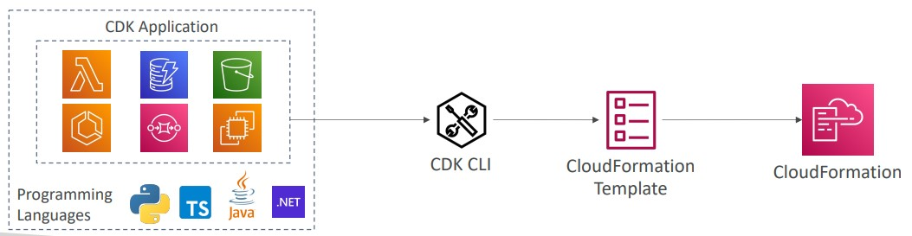

# Deploy and Managing Infrastructure at Scale

In this section we are going to understand how to deploy our workload into AWS

- [Cloud Formation](#cloud-formation)
- [Elastic Beanstalk](#elastic-beanstalk)
- [AWS Cloud Development Kit](#aws-cloud-development-kit)
- [AWS CodeDeploy](#aws-codedeploy)
- [AWS CodeCommit](#aws-codecommit)
- [AWS CodeBuild](#aws-codecommit)
- [AWS CodePipeline](#aws-CodePipeline)
- [AWS CodeArtifact](#aws-CodeArtifact)
- [AWS CodeStar](#aws-CodeStar)
- [AWS Cloud9](#aws-Cloud9)
- [AWS Systems Manager](#aws-systems-manager)
- [AWS OpsWorks](#aws-opsWorks)

## Cloud Formation

Cloud Formation is a Declarative way to deploy our resources into AWS. It is used when you need to create and repeat an architecture in different environments, regions or AWS accounts

With cloud formation you can "say": I want a S3 Bucket, I want an EC2 instance, i want a EBS as storage to that instance and so on. Cloud formation creates everything in the right order and with the exact configuration;

Infrastructure as a Service (IaaS):

- Nothing is created by the console, it is code
- Changes can be reviewed as code review and storage in repositories

Costs:

- Each deploy resource is tagged (easy to identify and understand costs)
- You can estimate costs of resources by using a template
- Savings strategies: example: In DEVL environment destroy everything at midnight and build it up again at 7am

Productivity:

- Ability to destroy and re-create an infrastructure on the cloud on the fly
- Automated generation of Diagram for your templates!
- Declarative programming (no need to figure out ordering and orchestration)
- Leverage existing templates on the web!
- Leverage the documentation
- Supports (almost) all AWS resources

We can also use the CloudFormation Stack Designer: here we can see all the resources as a Diagram and we can see the relations between the components.

## Elastic Beanstalk

Elastic Beanstalk (EB) is a developer centric view of deploying an application on AWS. It is a Platform as a Service (PaaS). There is no additional charge for Elastic Beanstalk. You pay only for the underlying AWS resources that your application consumes and you can quickly deploy and manage applications in the AWS Cloud without having to learn about the infrastructure that runs those applications.

> AWS Elastic Beanstalk is an easy-to-use service for deploying and scaling web applications and services developed with Java, .NET, PHP, Node.js, Python, Ruby, Go, and Docker on familiar servers such as Apache, Nginx, Passenger, and IIS. Simply upload your code and Elastic Beanstalk automatically handles the deployment, from capacity provisioning, load balancing, auto-scaling to application health monitoring. At the same time, you retain full control over the AWS resources powering your application and can access the underlying resources at any time. There is no additional charge for Elastic Beanstalk - you pay only for the AWS resources needed to store and run your applications.

Usually developers face a few problems dealing with AWS, but they just want to deploy the code

- Managing Infrastructure
- Configuration of databases, load balancers
- Scaling concerns

Most of the web apps have a similar architecture (ELB + ASG). With Beanstalk we can deploy using all these features but in one view, with full control of the application. You worry about the code, only.

It is a Managed Service

- Instances Configuration are made by beanstalk
- Deployment strategies are configured and made into beanstalk (Internally Beanstalk create a deployment into CloudFormation)
- Capacity Provisioning
- Load Balancing and Auto Scaling
- Application Monitoring and health monitoring (Health agent pushes metrics to cloudwatch, check the app health and publishes health events)

It Support many languages and platforms: Java, Go, NodeJS, Docker or your own platform.

Three Architecture Models:

- Single Instance deployment (good for devl environment)
- LB + ASG: Great for production and pre-production web applications
- ASG only: Great for non-web apps in production (workers)

Difference between CloudFormation and Beanstalk

- CloudFormation is IaaC and you can deploy any AWS Services and integrations
- Beanstalk is PaaS and it uses CloudFormation to deploy the Web Applications and you just need to worry about your code.

## AWS Cloud Development Kit

Define our infrastructure by using a preferred programming language. The code is compiled into a CloudFormation template (JSON/YAML).

- You can therefore deploy infrastructure and application runtime code together
  - Great for Lambdas, Docker containers (ECS/EKS)

In this example we build our CDK Application using our language defining resources, and the CDK CLI will transform to a CloudFormation template to be deployed by cloudformation.

## AWS CodeDeploy

AWS Code Deploy is a tool to deploy code automatically.

- AWS CodeDeploy is a Hybrid service and can be used in Amazon EC2, AWS Fargate, AWS Lambda, and your on-premises servers.
- It does not use Beanstalk or CloudFormation behind the scenes. It is a different service.
- You must first create the servers/instances (configured) to CodeDeploy run
- By deploy code we can understand upgrade versions of our software automatically.

## AWS CodeCommit

Is a way to store the code into a Git AWS Repository. It is a competitor to GitHub.
With AWS CodeCommit we can create multiple repositories, we can easily share code into our organization and keep the versions.

- The code is automatically versioned
- It is fully managed
- Scalable & Highly Available
- Private, Secured, Integrated with AWS

## AWS CodeBuild

You can build you code into AWS. It means it can compiles the source code, run tests, and produce the final package.

- The package that is produced can be deployed (for CodeDeploy for example)
- Fully Managed and Serverless
- Scalable and Highly Available
- You pay only for the time the package is being built

## AWS CodePipeline

With AWS Code Pipeline we can orchestrate our deployment steps
Usually in our pipelines we Get our code, test, build, provisioning servers and deploy. With CodePipeline we can do it. It is a CI/CD tool.

- It is fully managed
- Compatible with CodeCommit, CodeBuild, CodeDeploy, Elastic Beanstalk, Cloud Formation, GitHub and others providers + have custom plugins.
- CodePipeline uses Amazon CloudWatch Events to detect changes in CodeCommit repositories used as a source for a pipeline.

Example of usage

## AWS CodeArtifact

AWS CodeArtifact is a Artifact Management service to store, publish and share software packages used in development processes.

- secure, scalable and fully managed
- It is a place to store the code dependencies
- Integrated with multiple Artifacts (Maven, Gradle, npm, yarn, twine, pip, and NuGet)
- Developers and CodeBuild can then retrieve dependencies straight from CodeArtifact

## AWS CodeStar

It is a unified UI to manage software development activities in one place. It is a central service to development that allows a quick start using AWS Tools.
It gives you a dashboards with integration with CodeCommit, CodeBuild, CodePipeline, CodeBuild, etc.

- Each CodeStar project includes development tools, including AWS CodePipeline, AWS CodeCommit, AWS CodeBuild, and AWS CodeDeploy, that can be used on their own and with existing AWS applications
- You can use AWS CodeStar and AWS Cloud9 to develop, build, and deploy a serverless web application

# AWS Cloud9

It is a Cloud IDE into AWS, it is a code editor running directly in the browser.

- Classic IDEs (such as IntelliJ, VSCode) you need to install in your computer
- With Cloud IDE you don't need to install, just need internet connection and access the IDE
- Cloud9 allows work collaboration (pair programming) in real-time

## AWS Systems Manager

AWS System Manager (SSM) is a Hybrid service to manage EC2 Instances and On-Premise systems at scale. Works with Linux and Windows. With Systems Manager we can get operational insights of its resources to quickly identify any issues that might impact applications using those resources

> AWS Systems Manager allows you to centralize operational data from multiple AWS services and automate tasks across your AWS resources. You can create logical groups of resources such as applications, different layers of an application stack, or production versus development environments.
> With Systems Manager, you can select a resource group and view its recent API activity, resource configuration changes, related notifications, operational alerts, software inventory, and patch compliance status. You can also take action on each resource group depending on your operational needs. Systems Manager provides a central place to view and manage your AWS resources, so you can have complete visibility and control over your operations.

AWS SSM is basically a service to patch our fleet of instances/servers or even run commands in all of them.

- We can understand the status get insights of our infrastructure
- has multiple products inside this service
- Most popular features:
  - Patching automation for enhanced compliance
  - Run commands across an entire fleet of servers
  - Store parameter configuration with the SSM Parameter Store

How SSM Works:

- We need to install the SSM agent onto the systems we control (Each EC2 Instance or On-Prem Servers)
  - Installed by default on Amazon Linux AMI & some Ubuntu AMI
  - SSM Agent installed report to SSM Service
- If an instance can’t be controlled with SSM, it’s probably an issue with the SSM agent!
- Thanks to the SSM agent, we can run commands, patch & configure our servers

## AWS OpsWorks

It is another Hybrid Service to manage repetitive actions in our servers. it is a managed Chef & Puppet of AWS.

To understand it, we need to understand two tolls before: `Chef & Puppet`: Chef & Puppet help you perform server configuration automatically by code, or repetitive actions related to your servers.

- AWS OpsWorks is an alternative to AWS SSM, but this one, you only provision standard AWS Resources (EC2, Databases, ELB)
- How it works: Based on a `cookbook` it will provision an architecture to your service, by provisioning ELB, ASG, EC2, Databases and your Application

## Summary

- CloudFormation: (AWS only)
  - Infrastructure as Code, works with almost all of AWS resources
  - Repeat across Regions & Accounts
- Beanstalk: (AWS only)
  - Platform as a Service (PaaS), limited to certain programming languages or Docker
  - Deploy code consistently with a known architecture: ex, ALB + EC2 + RDS
- Cloud Development Kit (CDK): Define your cloud infrastructure using a programming language
- CodeDeploy (hybrid): deploy & upgrade any application onto servers
- Systems Manager (hybrid): patch, configure and run commands at scale
- OpsWorks (hybrid): managed Chef and Puppet in AWS
- CodeCommit: Store code in private git repository (version controlled)
- CodeBuild: Build & test code in AWS
- CodeDeploy: Deploy code onto servers
- CodePipeline: Orchestration of pipeline (from code to build to deploy)
- CodeArtifact: Store software packages / dependencies on AWS
- CodeStar: Unified view for allowing developers to do CI/CD and code
- Cloud9: Cloud IDE (Integrated Development Environment) with collab
