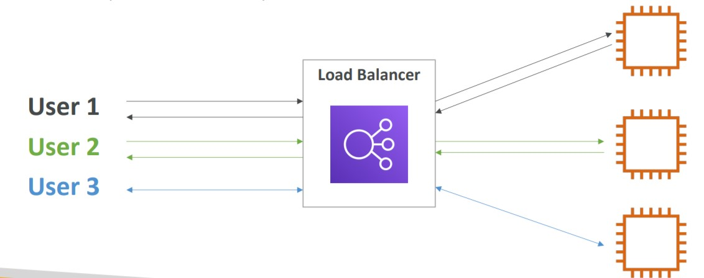
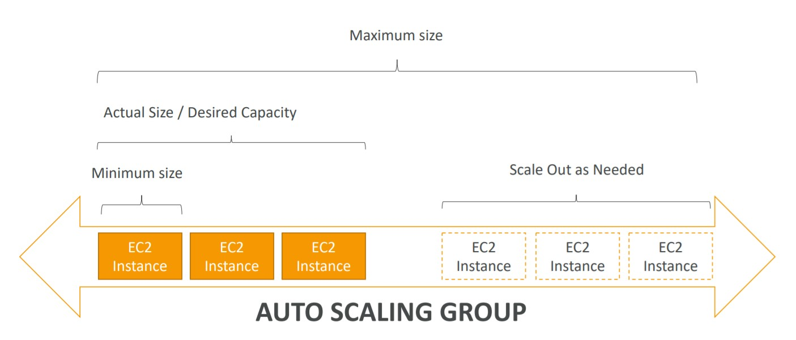
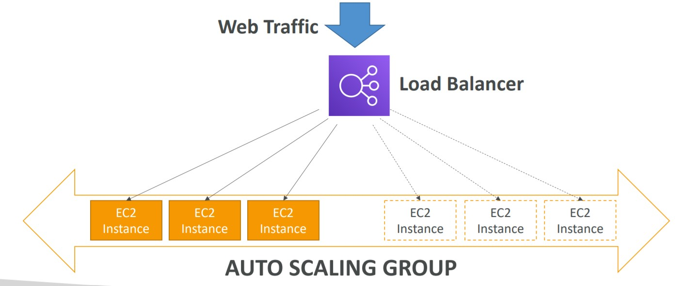

# 💻 Elastic Load Balancing and Auto Scaling Groups

This is where we can see the power of cloud computing, because of the automatically scaling and distribution of loads with low configurations.

- [Scalability & High Availability](#scalability--high-availability)
- [Scalability vs Elasticity (vs Agility)](#scalability-vs-elasticity-vs-agility)
- [Elastic Load Balancer (ELB)](#elastic-load-balancer-elb)
- [Auto Scaling Groups (ASG)](#auto-scaling-groups-asg)
- [Scaling Strategies](#scaling-strategies)
- [Summary](#summary)

## Scalability & High Availability

**Scalability**: Scalability is linked but is different from High Availability, Scalability means that the application or system can handle different amounts of load by adapting. There are two different kinds of scalability:

- **Vertical Scalability**: Means increasing the size of the instance:

  - Add more resources (like CPU power, RAM, Storage, etc...).
  - It is limited due the hardware limitations.
  - It is recommended to non-distributed systems as Databases.
  - Scale Up (increasing) or Scale Down (decreasing)
  - A few analogies:
    1. Instead of using a t2.micro, use a t2.large (increasing)
    2. Instead of have a Junior employee, we hire a Senior employee because him can handle more workloads and solve it faster.

- **Horizontal Scalability (elasticity)**: Means increasing the number of instances or systems to our application.
  - Have no limitations, we can always add more instances
  - Implies to distributed systems and web apps/modern apps
  - In AWS **Scale Out** means increasing the number of instances and **Scale In** means decreasing the number of instances.
  - On AWS is easy to scale because of the [**Auto Scaling Groups**](#auto-scaling-groups-asg) and [**Load Balancer**](#elastic-load-balancer-elb)
  - A few analogies:
    1. Add more instances to our application run (Scale out)
    2. Hire multiple temporary employees to handle with workload. As soon the load is lower you can dismiss them and keep your default number of employees.

**High Availability**: Means that your application is available in multiple locations, in this case that our service running in multi availability zones.

- High Availability means to run our app/system in at least two different AZs
  - This means more Security, Disaster Recover, Keep the work running.
- A few analogies:
  1. To do it in AWS we have ASG and ELB that are multi-az.
  2. This company has employees in three different cities in the country. So if anything stops one branch, the other two still are working and can handle the workload.

## Scalability vs Elasticity (vs Agility)

- **Scalability**: is the ability for a system to accommodate a larger load by making the hardware stronger (vertical scale, scale-up) or by add nodes (horizontal scale, scale-out).

- **Elasticity**: Once the system is scalable, elasticity means that there will be some "auto-scaling" so that system can scale based on the load. This is "cloud-friendly": pay-per-use, match demand, optimize costs.

- **Agility**: (not related to scale - distractor), new IT resources available very quickly. (one click away, what used to happen in weeks)

## Elastic Load Balancer (ELB)

Elastic Load Balancer are managed by AWS and they are servers that forward the internet traffic to multiple servers (EC2 Instances). `They are the backend of EC2 Instances`. The ELB is what will be exposed to the users and when receive the connection/access it will redirect traffic to instances.

**Why use a Load Balancer?**

- Spread the load across multiple downstream instances.
- Expose a single point of access (DNS) to our application.
- Handle with failures of instances (Regular health checks to the instances), don't redirect to unhealthy instances.
- Provide SSL termination (HTTPS) for our websites
- High Availability across zones

**Why use an Elastic Load Balancer?**

- AWS maintains and guarantees that it will be working
  - AWS takes care of upgrades, maintenance, high availability
  - AWS provides only a few configuration knobs
  - We only have to configure some behaviors of our ELB

**Four Types of ELB**

- Application Load Balancer: (HTTP/HTTPS only) - Layer 7
- Network Load Balancer: (Ultra-high performance, allows TCP) - Layer 4 (handle with millions of request per second, like gaming situation).
- Gateway Load Balancer: New AWS ELB used when you need to deploy and manage a fleet of third-party virtual appliances that support GENEVE
- Classic Load Balancer: (slowly retiring) - Layer 4 and 7

When configuring the ELB we need to create a `Target Group`, this target group contains the instances that are going to handle the multiple access.

## Auto Scaling Groups (ASG)

The loads and access of websites can change overtime, so we need to add or remove resources. We can do it automatically by using the Auto Scaling Groups. To do so, we need to have an Elastic Load Balancer configured, which means that our application can manage the loads.

- The main goal of ASG:
  - Scale Out (add EC2 instances) to match an increased load.
  - Scale In (remove EC2 instances) to match a decreased load.
  - Ensure that we have a minimum, desired and maximum number of machines running.
  - Automatically register new instances to our Load Balancer.
  - Replace unhealthy instances (If a instance fails, it register a new one automatically)
- The Auto Scaling Groups leaverage to **costs savings**, since we can adjust the capacity automatically and scale in the right moments (imagine a peak of access in our website, we are going to have machines available to deal with the load and after that we don't need them anymore. In this case we pay more, but just on the peak and after that we dont have to pay the any additional machines).

## Scaling Strategies

**Manual Scaling**: We change manually in the console/cli the desired capacity of our ASG.

**Dynamic Scaling**: Respond to changing demand. We have four types of dynamic scaling strategies.

- Simple/Step Scaling:
  - When a CloudWatch alarm is triggered (example CPU over 70%), then add 2 Instances
  - When a CloudWatch alarm is triggered (example CPU less then 30%), then remove 1 Instance
- Target Tracking:
  - Based on metrics of the target. (no cloudwatch, just tracking the resource), example: I want the average ASG CPU to be around 40% of capacity. So it will add or remove instances to reach this goal.
- Scheduled Scaling: Anticipating known events to handle better with the loads.
  - Example: On lunch time (starting 11am) i want my min capacity to be 15 instances. After 14h i want 7 instances.
- Predictive Scaling: Uses machine learning to predict future traffic and scale based on past identified patterns.
  - This is useful when our load has predictable time-based patterns.

### Tips, to Create an ASG:

- When creating an ASG Group, we need to create a template, so the new instances will be inherited from it. Whenever we need to register a new instance, ASG will get this template and launch it for us.
- We can also attach our Load Balancer to our ASG and select our `target group`, so the new instances will be created and attached to the target group.
- Create Health Checks to Replace unhealthy instances
- Create the group size: Minimum of Instances, Desired Number of Instances and the Maximum Number of Instances.
- When create this groups sizes, we can create the Scaling policies to Target tracking scaling policy, this means that we can scale based on CPU usage, network in or out, count of requests per target, etc.

Summary to Create an Auto Scaling Group with Load Balancing:

- Create the Load Balancing (Application Load Balancer) give it a name, select the AZs to be available and the Security Groups.
- Create the Target Groups (attach instances if needed)
- Create the ASG Group configurations (select subnets, template instance, select the target groups, select health checks, select the group sizes [min, desired, max] + scaling polices).
- Finally, the server i'll be ready to scale and is totally elastic. 👌✔

## Summary

- High Availability (application available in multi-az) vs Scalability (vertical means add size/cpu to instance and horizontal means add more instances) vs Elasticity (capacity of scale up and down when needed) vs Agility (work faster) in the cloud.
- Elastic Load Balancer:
  - Distribute traffic across backend EC2 instances, can be Multi-A
  - Supports health check
  - 3 types: Application LB (HTTP – L7), Network LB (TCP – L4), Classic LB (old)
- Auto Scaling Groups (ASG):
  - Implement Elasticity for your application, across multiple AZ
  - Scale EC2 instances based on the demand on your system, replace unhealthy
  - Integrated with the ELB
- Scaling Strategies:
  - Manual
  - Dynamic: Simple/Step (cloudwatch alarms), Target Tracking, Scheduled Scaling and Predictive Scaling.
