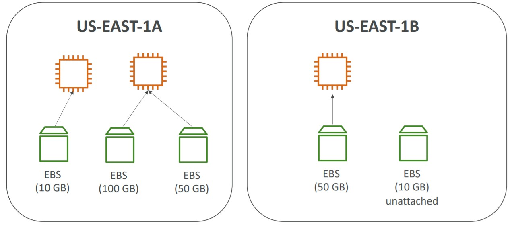
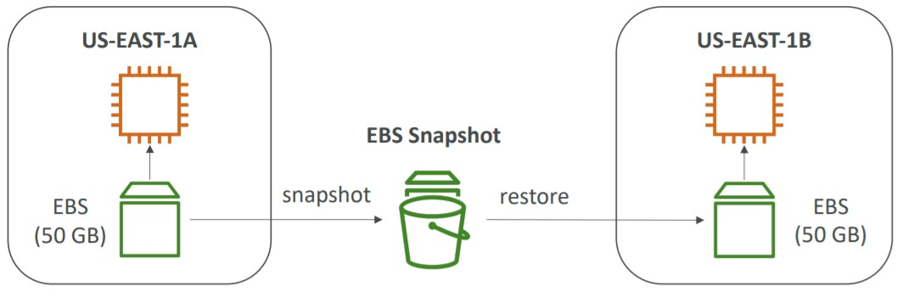
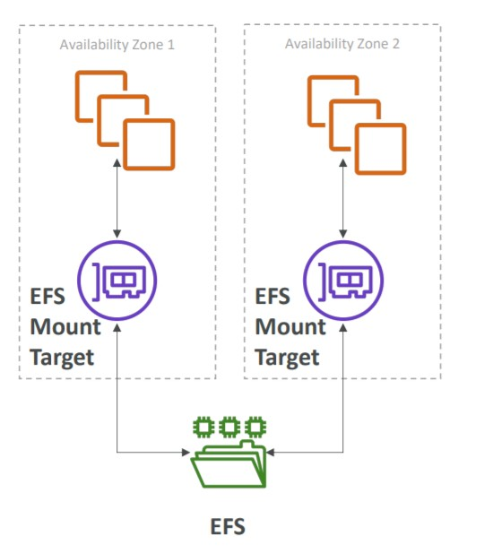
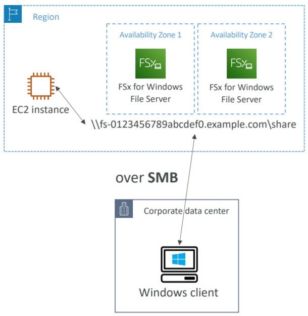
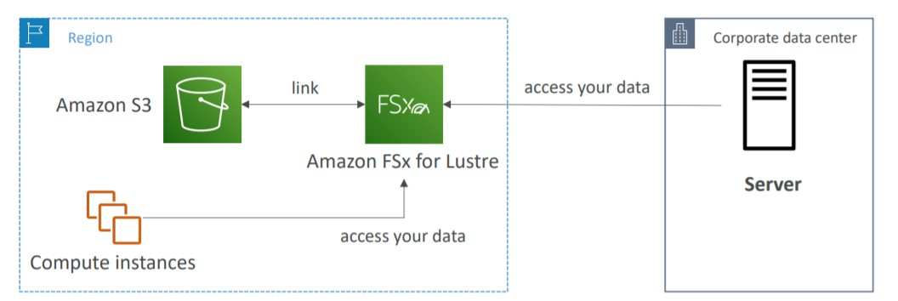

# 💾 EC2 Instance Storage

- [EBS Elastic Block Store - Volumes](#ebs-elastic-block-store---volumes)
- [EBS Snapshots](#EBS-Snapshots)
- [EC2 Instance Store](#EC2-Instance-Store)
- [EFS Elastic File System](#EFS---Elastic-File-System)
- [EVS vs. EFS](#EBS-vs-EFS)
- [Amazon FSx](#amazon-fsx)
- [EC2 Storage Shared Responsibility Model](#EC2-Storage-Shared-Responsibility-Model)
- [Summary](#Summary)

## EBS Elastic Block Store - Volumes

**Main Information about Elastic Block Store**:

- An EBS Volume is a **network drive** that you can attach to your instance while they run. It uses the network to communicate with the instance, so it might have a little bit of latency.
- It can be detached from an instance and attached to other quickly (benefit of network driver)
- It Can persist data even if the instance is terminated.
- Can be mounted to one instance at a time (On CCP level exam). One instance can have more than one EBS at a time.
- They are bound to a specific availability zone, this means if your instance is in us-east1-a and your EBS is in us-east1-b, they cannot be bound to each other. To do it across AZs, we need **Snapshots** or create an EBS Volume to the same AZ.
- It have a provisioned capacity in GBs or IOPs (inputs and outputs per second). The billing is based on this capacity, and this capacity can be increased/decreased over time.

**Good to know about EBS**:

- Free tier: 30 GB of EBS on General Purpose (SSD) or Magnetic per Month.
- Analogy to a "network USB stick" that you can plug in other computers.
- We can have existing EBS volumes that keeps unattached.
- EBS Volumes are network drives with good but 'limited' performance: EC2 Instance Store have the best performance, because they are the hard disk, physical, on the data-center attached on the machine that runs the server.

## EBS Snapshots

Snapshot is a backup of our EBS Volumes at a point in time. It keeps available in one Region. But to use it in a volume, we need to create the volume inside an AZ.

- To Create this snapshot you don't have to detach the volume from an instance (besides it is recommended)
- With the Snapshot we can Copy to other regions or AZ's or Create a brand new EBS Volume.
- This snapshot will be a "start" to the new EBS Volume. So the new volume will start with the data starting from the snapshot. The new volume will be a Restore from a snapshot.

## EC2 Instance Store

This is the **physical HARD DRIVE** attached to the server. Limited space, but higher performance. It is called by **ephemeral**

- Better I/O performance. It is good to buffer/cache/scratch data/temp files. Always with short workloads.
- EC2 Instance Store lose their storage and data if they are stopped.
- Risk of losing data (because it is a physical hardware)
- Backups and Replications are our responsibility.

## EFS - Elastic File System

EFS stands to Elastic File System and it is a Network File System (NFS). This NFS can be attached to hundreds of EC2 instances at a time.

- It is a shared NFS.
- Works in Linux EC2 Instances and works across multiple AZs. It makes EFS High Available and Scalable. But, this also makes the EFS more expensive (3x gp2) and you pay what you use not capacity. If you use only 20gb, that's your usage and you'll pay for this.

### EBS vs EFS

- EBS are bound to one AZ and can be attached to one instance at a time. To move across regions we can use the snapshots (it is just a copy).
- EFS works across multiple regions and can be attached to multiple instances. The same data is available to all instances. It makes the EFS a shared file system.

## Amazon FSx

We have two types of FSx in AWS:

**Amazon FSx for Windows File Server**:

- Fully managed, highly reliable and scalable windows native shared file systems.
- Built on windows file server and supports SMB Protocol (Server Message Block) and Windows NTFS (New Technology File System - windows file system)
- Integrated with Microsoft Active Directory
- Can be accessed from AWS or On-premise

**Amazon FSx for Lustre**:

- A fully managed, high-performance, scalable file storage for High Performance Computing (HPC)
- Works for Linux and Clusters (Lusters)
- Machine Learning, Analytics, Video Processing, Financial Modeling
- Scales up to 100s GB/s, millions of IOPS, sub-ms latencies

### EC2 Storage Shared Responsibility Model

**AWS Responsibility**

- Infrastructure
- Replication for Data through the Drivers and Volumes (ensure disasters recover or in case a Hardware stop working)
- Replace Faulty Hardwares
- Ensure that their employees cannot access our data.

**User Responsibility**

- Setup backup and snapshots procedures
- Data encryption
- Responsibility about the data content on drivers
- Understand the risk of using [EC2 Instance Store](#EC2-Instance-Store)

## Summary

- EBS volumes:
  - Network drives attached to one EC2 instance at a time
  - Mapped to an Availability Zones
  - Can use EBS Snapshots for backups / transferring EBS volumes across AZ
- AMI: create ready-to-use EC2 instances with our customizations
  - EC2 Image Builder: automatically build, test and distribute AMIs
- EC2 Instance Store:
  - High performance hardware disk attached to our EC2 instance
  - Lost if our instance is stopped / terminated
- EFS: network file system, can be attached to 100s of instances in a region
- EFS-IA: cost-optimized storage class for infrequent accessed files
- FSx for Windows: Network File System for Windows servers
- FSx for Lustre: High Performance Computing (HPC) Linux file system
