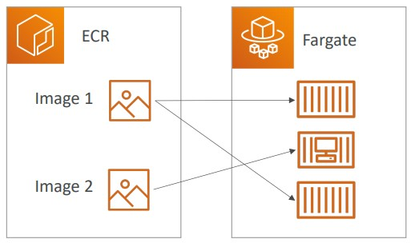

# ECS, Fargate and ECR

In AWS we have services to run and manage our applications into containers. In order to understand how these services works, we must first understand what is Docker.

## Docker

Docker is a software development platform to deploy apps. With docker we pack our app into a container and can be run in any OS.

Another definition of Docker would be `Docker is a software development platform that allows you to run applications the same way, regardless of where they are run. It can scale containers up and down within seconds.`

Docker can run in any machine, and it brings some benefits:

- Any Machine and OS
- No compatibilities issues
- Predictable behaviors
- Less work
- Easy to maintain and deploy
- Easy to scale up and down

Inside an EC2 instance we can have multiple docker containers running: An image with node, another with java, another with mysql, etc. When our application is packed into a container it is easy to run inside the EC2.

Docker images can be stored privately or publicly: **Private** are stored into ECR (Elastic Container Registry from Amazon) and the **Public** ones are stored into Docker Hub

## Elastic Container Service

Elastic Container Service (ECS) is a service to Launch docker containers on AWS.

- When we are talking about ECS we must understand that we need to provision and maintain the infrastructure (EC2 Instances).
- AWS takes care of starting and stopping the containers and choose the most available container to place the container.
- It has full integration with the Application Load Balancer

## Fargate

Fargate is also used to launch docker containers on AWS, but Fargate does not require us to provision the infrastructure.

- So more simple service and is serverless, since we don't need to to manage any server or EC2 instances.
- AWS just run the container based on the CPU/RAM our container needs.

## Elastic Container Register

Elastic Container Register (ECR) is the AWS service to store the containers.

- It is a private docker registry.
- This is where the containers are stored, so they can be run by ECS or Fargate.

---

On (CCP) practitioner level is required to understand what is the main differences between ECS Fargate and ECR.
ECS: Run containers with need of provisioning the infrastructure.
Fargate: Run containers without provisioning the infrastructure.
ECR: Where the Containers are stored.

## Summary

- Docker: container technology to run applications
- ECS: run Docker containers on EC2 instances
- Fargate: Run Docker containers without provisioning the infrastructure it is a Serverless offering (no EC2 instances)
- ECR: Private Docker Images Repository
