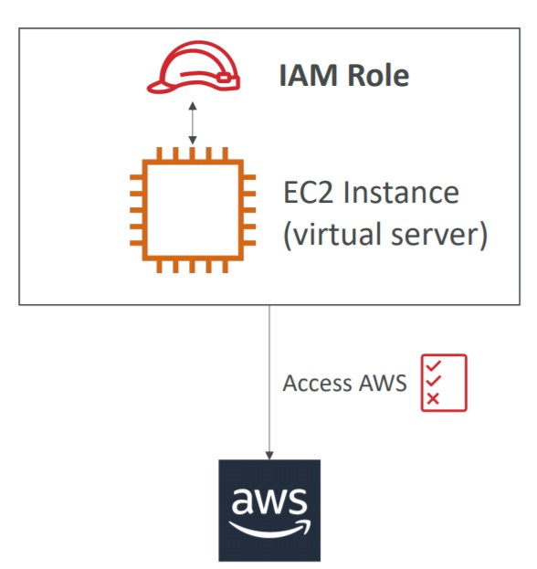

# 📝IAM - Identity Access Management

- [IAM Permissions](#iam-permissions)
- [IAM Account Security](#iam-account-security)
- [How a user can access AWS](#how-a-user-can-access-aws)
- [IAM Security Tools](#iam-security-tools)
- [IAM Best Practices](#iam-best-practices)
- [IAM Shared Responsibility Model](#iam-shared-responsibility-model)

Identity Access Management is a Global Service.

- First we have our Root Account. This account should not be shared or even used. We must use only to Create another users, called IAM Users.
- Users are people in our organization and they can be grouped.
- The Groups only contain users. (Not allowed Group Chain).
- Groups and Users are needed, because AWS Services needs Permissions, and we create these permissions for each group or user.

### IAM Permissions

**Policies**

- Users and Groups can be assigned to JSON Documents that contains the permissions (allowing or denying).
- Policies define the permissions to users/groups.
- Apply the "Least Privilege Principle". Only give the needed permissions.

Policy content:

```
A JSON policy document includes these elements:

Optional policy-wide information at the top of the document
One or more individual statements
Each statement includes information about a single permission. The information in a statement is contained within a series of elements.

Version – Specify the version of the policy language that you want to use. As a best practice, use the latest 2012-10-17 version.

Statement – Use this main policy element as a container for the following elements. You can include more than one statement in a policy.

Sid (Optional) – Include an optional statement ID to differentiate between your statements.

Effect – Use Allow or Deny to indicate whether the policy allows or denies access.

Principal (Required in only some circumstances) – If you create a resource-based policy, you must indicate the account, user, role, or federated user to which you would like to allow or deny access. If you are creating an IAM permissions policy to attach to a user or role, you cannot include this element. The principal is implied as that user or role.

Action – Include a list of actions that the policy allows or denies.

Resource (Required in only some circumstances) – If you create an IAM permissions policy, you must specify a list of resources to which the actions apply. If you create a resource-based policy, this element is optional. If you do not include this element, then the resource to which the action applies is the resource to which the policy is attached.

Condition (Optional) – Specify the circumstances under which the policy grants permission.
```

[AWS Docs Reference](https://docs.aws.amazon.com/IAM/latest/UserGuide/access_policies.html#access_policies-json)

**Roles**

- Are created for another Services, so they can access or execute a process inside another service.
- Some AWS service will need to perform actions on your behalf. To do so, we will assign permissions to AWS services with IAM Roles.
- We need to create or attach policies to this Role to grant the permissions.
- Then we attach the role to the service, and the service will be able to perform actions in out behalf.
- CamelCaseNamed
- The most common roles: [EC2 Instance Roles, Lambda Function Roles, Roles for CloudFormation]

<p align="center" width="100%"></p>

### IAM Account Security

AWS Provides more security allowing us to add protection mechanisms to our account.

**MFA (Multi Factor Authentication)**

- Password that you know + security device you own.
- Main benefit of MFA: if a password is stolen or hacked, the account is not compromised.
- MFA Devices: Virtual Devices (Authy, Google Authenticator), Universal 2nd Factor (U2F) Security Key, Hardware Key Fob MFA Device, Hardware Key Fob MFA Device for AWS GovCloud (US)

**Password Policy**

- Set a minimum password length.
- Require specific characters in the password: Upper/Lower, numbers, non-alphanumeric.
- Allow IAM users to change their passwords.
- Require password change each X days.
- Prevent password reuse.

### How a user can access AWS?

A user can access AWS by:

**AWS Management Console**

- Root or IAM user + password (+ MFA optional)

**AWS CLI**

- Command Line Interface, protected by Access Key and Secrets. If wants to use the CLI in the own computer, so the user needs to install the AWS CLI.

**AWS CloudShell (CLI)**

- is a CLI inside the AWS Console, the user don't need to install this one.

**AWS SDK**

- Software Development Kit, for coding, also protected by Access Key and Secrets.

The access keys and secrets are generated through the AWS Console and must be kept in secret. The users manages their own keys.
Access Keys is similar to the username.
Secret Keys is similar to the password.

### IAM Security Tools

**IAM Credentials Report** [root-account level]

- The Credentials Report lists all your account's users and the status of their credentials.

**IAM Access Advisor** [iam-user level]

- The access advisor shows the services permissions granted to a user and when those services were last accessed.

### IAM Best Practices

- Don’t use the root account except for AWS account setup
- One physical user = One AWS user
- Assign users to groups and assign permissions to groups
- Create a strong password policy
- Use and enforce the use of Multi Factor Authentication (MFA)
- Create and use Roles for giving permissions to AWS services
- Use Access Keys for Programmatic Access (CLI / SDK)
- Audit permissions of your account with the IAM Credentials Report
- Never share IAM users & Access Keys

### IAM Shared Responsibility Model

AWS Is response for the infrastructure and the user is responsible for how he use this infrastructure.

**AWS Responsibility**

- Infrastructure (global network security)
- Configuration and vulnerability analysis
- Compliance validation

**User Responsibility**

- Users, Groups, Roles, Policies management and monitoring
- Enable MFA on all accounts
- Rotate all your keys often
- Use IAM tools to apply appropriate permissions
- Analyze access patterns & review permissions
