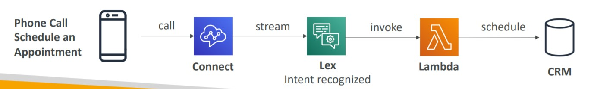
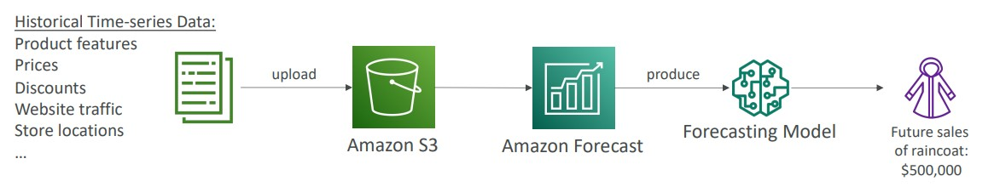
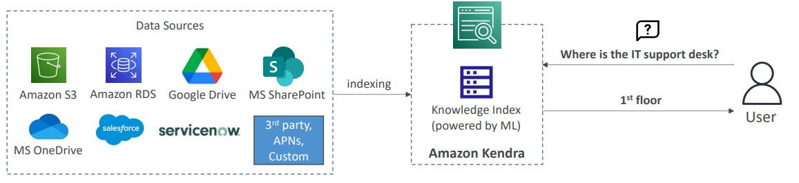
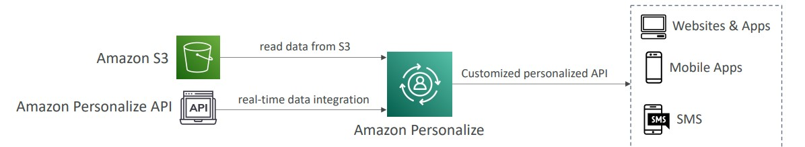

# 🤖 Machine Learning

Amazon provide multiple services on Machine Learning

- [Amazon Rekognition](#amazon-rekognition): Automate images and videos analysis with ML.
- [Amazon Transcribe](#amazon-transcribe): Transcribe audio to text with deep learning (subtitles)
- [Amazon Polly](#amazon-polly): Text to Voice
- [Amazon Translate](#amazon-translate): translations of languages
- [Amazon Lex](#amazon-lex): Get intent of voice and create bots
- [Amazon Connect](#amazon-connect): Cloud contact center
- [Amazon Comprehend](#amazon-comprehend): Natural Language Processing to understand and interpret texts
- [Amazon SageMaker](#amazon-sageMaker): Environment to developers and data scientists build models
- [Amazon Forecast](#amazon-forecast): Create forecast using machine learning
- [Amazon Kendra](#amazon-kendra): document search service
- [Amazon Personalize](#amazon-personalize): personalized recommendations
- [Summary](#summary)

## Amazon Rekognition

Amazon Rekognition is a fully managed service to work with image and video analysis with deep learning.

With Amazon Rekognition we can fund objects, people, text, scenes, animals in images and videos, using machine learning.

Use cases:

- Facial Analysis and facial search to do user verification and people counting
- Create a database of familiar faces or compare against celebrities
- Labeling
- Content moderation, text detection
- Face detection, search, verification and analysis (gender, age, emotions)
- Pathing (real time analysis is sports games)

## Amazon Transcribe

Amazon Transcribe is a service to automatically convert speech to text using deep learning process called Automatic Speech Recognition (ASR) to covert the text with precision.

Use cases:

- transcribe customer service calls
- automate closed captioning (subtitles)
- generate metadata for media assets to create a fully searchable archive

## Amazon Polly

Amazon Polly is a service to create voice based on a text. Turn text into lifelike speech using deep learning allowing you to create applications that talk

## Amazon Translate

Amazon Translate is a Natural and accurate language translation service.

Amazon Translate allows you to localize content - such as websites and applications - for international users, and to easily translate large volumes of text efficiently.

## Amazon Lex

Same technology of Alexa and it is a Automatic Speech Recognition (ASR) to convert speech to text and it helps to build chatbot and call center bots. We can integrate with any application.

- Natural Language Understanding to recognize the intent of text

## Amazon Connect

It is a omnichannel cloud contact center.

- Receive calls, create contact flows
- Can integrate with other CRM systems or AWS
- No upfront payments, 80% cheaper than traditional contact center solutions

## Amazon Comprehend

It is a Natural Language Processing (NLP) service. It is fully managed and serverless. Uses machine learning to do understand of text:

- Language of the text
- Extracts key phrases, places, people, brands, or events
- Understands how positive or negative the text is
- Analyzes text using tokenization and parts of speech
- Automatically organizes a collection of text files by topic

Sample use cases:

- Analyze customer interactions (emails) to find what leads to a positive or negative experience
- Create and groups articles by topics that Comprehend will uncover

## Amazon SageMaker

Amazon SageMaker is a fully managed service to developers and data scientists to build ML models. Normally it is a difficult process, we have to provision multiple servers and configurations, with SageMaker it is easier.

- Helps with all the steps of Machine Learning
  - Label data
  - Build models
  - Train and Tune
  - Apply Model and do Predictions

## Amazon Forecast

Amazon forecast is a fully managed service that uses Machine Learning to create forecasts based on data.

Use cases: Product Demand Planning, Financial Planning, Resource Planning...

## Amazon Kendra

It is a Fully Managed **document search service** that uses machine learning. It is used to extract answers from documents (text, pdf, word, etc.)

It indexes the documents and kendra get answers within them.

## Amazon Personalize

It is a full-managed machine learning service to build real time and personalized recommendations. This is the same technology used by Amazon.com

- Integrates into existing websites, applications, SMS, email marketing systems, …
- Implement in days, not months (you don’t need to build, train, and deploy ML solutions)
- Use cases: retail stores, media and entertainment…

## Summary

- Amazon Rekognition: Image and Video analysis with ML
- Amazon Transcribe: Audio to Text
- Amazon Polly: Text to Audio
- Amazon Translate: Translate text from a language to another
- Amazon Lex: Chatbots based on speech to text, build conversational bots
- Amazon Connect: Cloud contact center
- Amazon Comprehend: natural language processing
- Amazon SageMaker: machine learning for every developer and data scientist
- Amazon Forecast: Create forecast using machine learning
- Amazon Kendra: document search service
- Amazon Personalize: A Machine Learning service to build personalized recommendations

[UP](#-machine-learning)
