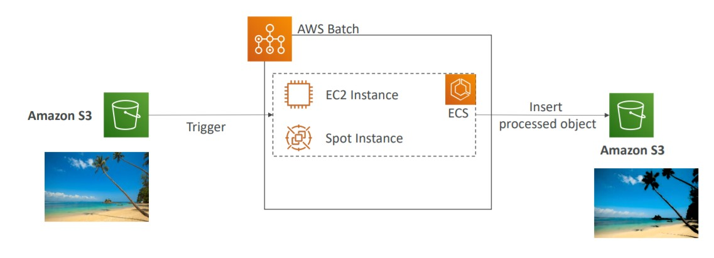

# Other Compute Services

## AWS Batch

AWS Batch is fully managed service to batch processing at any scale. With this service we can run 100.000s of batch jobs on AWS.

- Batch Jobs are jobs with an start and a end pre-determined, it is the opposite of streaming jobs that has no end. (e.g. from 13pm to 15pm)
- Batch Jobs are defined as Docker Images and Run on ECS
- AWS Batch will dynamically launch EC2 Instances or Spot Instances to accommodate the batch jobs.
- AWS Provision the right amount of memory and compute processing to each job.
- Cost optimization and no worry about create the infra.

## AWS Batch vs Lambda

**Lambda:**

- Lambda is limited by time
- Has limited runtime (programming languages)
- Limited disk space
- Serverless

**AWS Batch**:

- No time limit
- Any runtime as long it is packed as a docker image (any container with any programming language)
- Storage of the Instance (EC2 EBS Volume or Instance Store)
- Is a managed service (not serverless because it need EC2 instances)

## Amazon Lightsail

Amazon Lightsail is a standalone service for Virtual servers, storage, databases, and networking for users that are not used to cloud services/no cloud experience.

- Low and predictable prices
- Simple alternative to EC2, RDS, ELB, EBS, Route 53.
- Great for beginners with cloud
- Setup monitoring and notifications
- Use cases:

  - Simple web apps (has templates for nodejs, LAMP, nginx, MEAN)
  - Websites (Wordpress, Magento, Plesk)
  - Dev and Test environment

- Has high availability but not have any auto-scaling
- It has limited integrations with AWS Services

---

• Batch: run batch jobs on AWS across managed EC2 instances or it can be Serverless if running with Fargate
• Lightsail: predictable & low pricing for simple application & DB stacks
