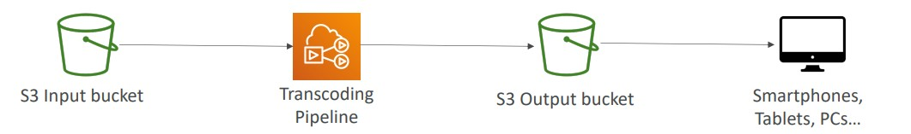

# Other AWS Services

Services worth to know about

- [Amazon Workspaces](#amazon-workspaces)
- [Amazon AppStream 2.0](#amazon-appstream-20)
- [Amazon Sumerian](#amazon-sumerian)
- [AWS IoT Core](#aws-ioT-core)
- [AWS Elastic Transcoder](#aws-elastic-transcoder)
- [AWS Device Farm](#aws-device-farm)
- [AWS Backup](#aws-backup)
- [CloudEndure Disaster Recovery](#cloudEndure-disaster-recovery)
- [Summary](#summary)

## Amazon Workspaces

Is a managed Desktop as a Service (DaaS). It is a solution to easily provision Windows/Linux desktops.

Amazon WorkSpaces is a fully managed, secure cloud desktop service. You can use Amazon WorkSpaces to provision either Windows or Linux desktops in just a few minutes and quickly scale to provide thousands of desktops to workers across the globe.

- It is great to eliminate the management of on-premises VDI (Virtual Desktop Infrastructure)
- Fast and Scalable
- Secure data (KMS integration)
- Pay-as-you-go service with monthly or hourly rates

## Amazon AppStream 2.0

This is a Desktop Application Stream service, delivery to any computer (no need of acquiring or provision infrastructure). The application is delivered within a browser on the web.

**Amazon AppStream 2.0 vs WorkSpaces**

- Fully managed VDI and desktop available
- The users connect to the VDI and open native or WAM applications
- Workspaces are on-demand or always on

**AppStream 2.0**

Amazon AppStream 2.0 is a fully managed non-persistent application and desktop streaming service that provides users instant access to their desktop applications from anywhere.

- Stream a desktop application to web browsers (no need to connect to a VDI)
- Works with any device (that has a web browser)
- Allow to configure an instance type per application type (CPU, RAM, GPU)

## Amazon Sumerian

Amazon Sumerian is a set of browser-based tools for creating high-quality virtual reality (VR), augmented reality (AR), and 3D applications easily without requiring any programming or 3D graphics expertise. With Sumerian, you can construct an interactive 3D scene without any programming experience, test it in the browser, and publish it as a website that is immediately available to users.

- Ready-to-use templates and assets - no programming or 3D expertise required
- Accessible via a web-browser URLs or on popular hardware for AR/VR

## AWS IoT Core

IoT stands for “Internet of Things” – the network of internet-connected devices that are able to collect and transfer data. AWS IoT Core allows you to easily connect devices with AWS Cloud services.

AWS IoT Core lets you securely connect IoT devices to the AWS Cloud and other devices without the need to provision or manage servers.

- Serverless, secure and scalable to billions of devices and trillions of messages
- Your applications can communicate with your devices even when they aren’t connected
- Integrates with a lot of AWS services (Lambda, S3, SageMaker, etc.)
- Build IoT applications that gather, process, analyze, and act on data

## AWS Elastic Transcoder

Amazon Elastic Transcoder is media transcoding in the cloud. It is used to convert media files from their source format into versions that will play back on devices like smartphones, tablets, and PCs.

Converts S3 files within a bucket and convert to many formats and save into a target bucket.

- Benefits:
  - Easy to use
  - Highly scalable – can handle large volumes of media files and large file sizes
  - Cost effective – duration-based pricing model
  - Fully managed & secure, pay for what you use

## AWS Device Farm

Fully managed service that tests our application (web and mobile) in multiple desktop browsers and real mobile devices and tablets.

- Run tests concurrently on multiple devices
- Can configure any settings we want (bluetooth, gps, etc.)
- We can interact with all devices
- We receive reports and logs of all tests

## AWS Backup

It is a Fully managed service to centrally manage and automate backups across AWS services.

- Supports On demand and scheduled backups
- Supports Point-In-Recovery (PITR)
- It allows creation of Retention Policies, Lifecycle Management, Backup Policies and more...
- Supports Cross-Region and Cross-Account backups

## CloudEndure Disaster Recovery

CloudEndure is a company acquired by AWS and AWS has its services now.

CloudEndure Disaster Recovery Quickly and easily recover your physical, virtual and cloud-based servers in AWS.

- Continuos block level replication for the servers.
- Example: You have a data center with CLoudEndure agent. It will continuously replicate the data to AWS Cloud in a Staging area with low-cost EC2 instances and EBS Volumes. In case of failovers, in minutes, it starts run more powerful EC2 instances with the most recent data until the datacenter is recovered. Since it is recovered it does a failback process and release the Production EC2 instance (just keep the staging to keep replicating data).
- Use cases: Protect most critical databases, enterprise apps and protect data from Ransomware attacks.

## Summary

- Amazon Workspaces: Desktop as a Service and provides a windows or linux desktop
- Amazon AppStream 2.0: Access any application within a browser
- Amazon Sumerian: Create 3D/VR applications (browser app)
- AWS IoT Core: Connect billions of IoT devices with AWS
- AWS Elastic Transcoder: Convert media to multiple formats (s3 stored media)
- AWS Device Farm: Service to test our applications in multiple devices (it is a farm of devices on AWS)
- AWS Backup: centrally manage and automate backups across AWS services
- CloudEndure Disaster Recovery:
