# 📝S3 - Simple Storage Service

S3 stands to Simple Storage Service and it is one of the main services of AWS. This service is basically "Infinity Scaling" storage.
Amazon S3 Console is a global console, that means that we can see all buckets in all regions, but the buckets itself, needs to be bound to a region. S3 is a key value based object storage service. S3 stores data in a flat non-hierarchical structure.

- [S3 Use cases](#s3-use-cases)
- [S3 Buckets](#s3-buckets)
- [S3 Objects](#s3-objects)
- [S3 Create a Bucket and Add Objects](#s3-create-a-bucket-and-add-objects)
- [S3 Security](#s3-security)
  - [S3 Bucket Policy](#s3-bucket-policy)
- [S3 Static Website](#s3-static-website)
- [S3 Versioning](#s3-versioning)
- [S3 Server Access Logging](#s3-server-access-logging)
- [S3 Replication](#s3-replication)
- [S3 Storage Classes](#s3-storage-classes)
- [S3 Glacier Vault Lock and Object Lock](#s3-glacier-vault-lock-and-object-lock)
- [S3 Snow Family](#s3-snow-family)
- [S3 Storage Gateway](#s3-storage-gateway)
- [S3 Shared Responsibility Model](#s3-shared-responsibility-model)
- [Summary](#summary)

## S3 Use cases

- Backup and Storage
- Disaster Recovery (copying data in multiple regions)
- Archive data
- Application Hosting / Web site hosting (static websites uses Amazon S3 as backbone)
- Media Hosting
- Data Lakes & Big Data Analytics
- Software delivery
- Many AWS services uses Amazon S3 as integration/storage as well, such as [EBS Snapshots](../ec2-instance-storage/README.md/#EBS-Snapshots).

## S3 Buckets

Amazon S3 allows people to store `objects` (think as files) in `buckets` (think as directories).

- Buckets must have a unique name (across all regions and accounts)
- Buckets must be created inside a specific Region.
- Naming Convention: To give a name to the bucket must follow this naming convention
  - No uppercase, No underscore, 3-63 characters long, Not an IP, Must start with lowercase letter or number"

## S3 Objects

The `objects` are the files to be stored in S3 Bucket.

- Objects (files) must have a Key, the key is the full path to the object:
  - The key is composed of prefix + object name
    - s3://my-bucket/**my_file.txt**
    - s3://my-bucket/**my_folder1/another_folder/my_file.txt**
  - In this first example the file has only the name, so it has not prefix. It is just 'my_file.txt'
  - In this second example, the prefix is 'my_folder1/another_folder/' and the object name is 'my_file.txt'
- There is no concept of "directories” within buckets. Just keys that contains slashes ('/').
- The objects values are the content of the body.
- Max Object size is 5TB (but can be spitted "multi-part upload" and have multiple files of 5 TB)
- The object contains Metadata: list of key/value pairs, Track data, Security and lifecycle goals
- The Object contains Tags to identify better
- Version ID (S3 Allows Versioning)

## S3 Create a Bucket and Add Objects

- Creating the bucket
  - In AWS Console we can create the bucket, and choose the name (Globally unique name) and the Region. We can also copy the settings from an existing bucket.
  - Choose if we are blocking Global Access (on the internet)
  - Enable versioning
  - Add Tags and Encryption
  - Click in create
- Adding Objects
  - Inside the bucket, just click in Upload (or drag and drop) and select the file.
  - We can also create folder and objects to it.

## S3 Security

**User Based:**

- IAM Policies - attach IAM policies to users or groups and them you be allowed to access the bucket from console/cli/sdk

**Resource Based:**

- [Bucket Policies](#s3-bucket-policy): Rules attached directly to S3 Buckets where we can allow or deny access/actions in our bucket.
- Object Access Control List (ACL) - Object level. Grant or Deny access, but this rule is attached directly to the object. More common ACL.
- Bucket Access Control List (ACL) - Bucket level. Less common, normally use Bucket Policies.

**Encryption:** We can encrypt objects in S3 using encryption keys.

An IAM Principal can access S3 objects if:

- The IAM Permissions allows it **OR** if the Resource Policy allows. (an user that does not contain the IAM Policy to access the bucket, can access a bucket where the Resource Policy allows IAM Users)
- There is not Deny

A few examples of usage of S3 Security:

- Your site exposed to web, by default nobody can access it, to allow it we need to create to attach the **S3 Bucket Policy** to allow the public access.
<p align="center" width="100%">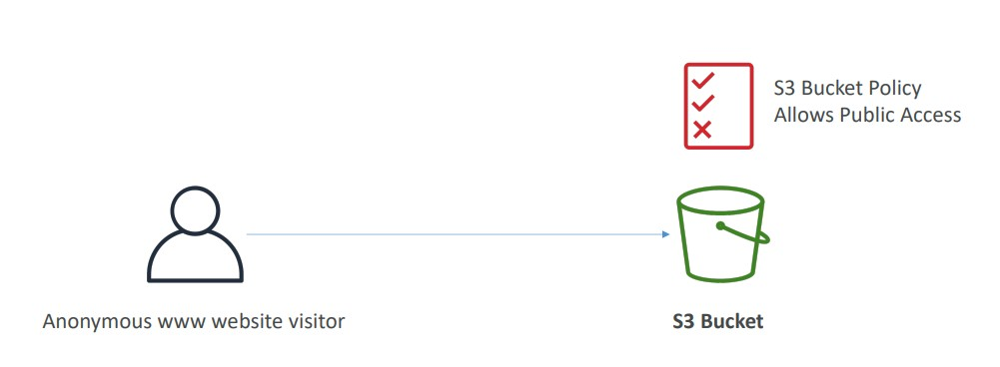</p>

- An IAM User that already has a policy attached to the account allowing S3 access. In this case there is no need to create the S3 Bucket Policy.
<p align="center" width="100%">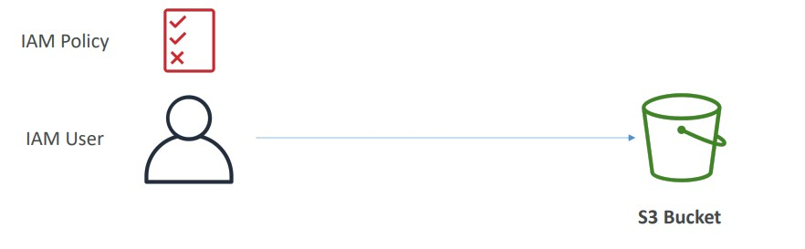</p>

- An EC2 instance wants to access our S3, so we need to create a Role to EC2 and attach the permissions (policies) to it and attach the role in our EC2. Now the instance will be able to access the bucket.
<p align="center" width="100%">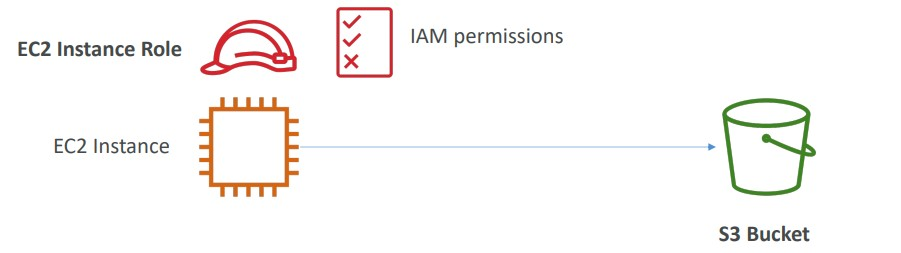</p>

- Cross-Account-Access: For this case we may use the S3 Bucket Policy, which will allow the cross-account access.
<p align="center" width="100%">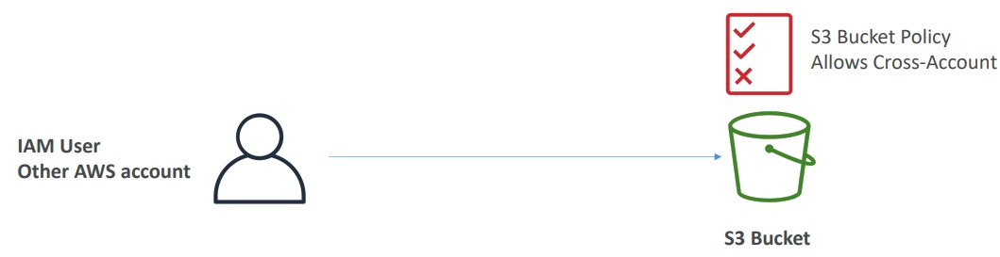</p>

### S3 Bucket Policy

Bucket policies are JSON based policies, looks like the IAM Policy; In this document we need to define:

- Resources: The AWS S3 Resource. We can use, for example, the ARN like `arn:aws:s3:::jlimadev-demo-april-2021/*` to allow everything inside the resources. In this case read all objects from my bucket. (Example policy bellow)
- Action: Set of API to allow or deny (e.g. S3:GetObject)
- Effect: Allow or Deny
- Principal: Who can access?

Usually we use S3 Bucket to:

1. Grant Public Access to the bucket; (for this we must remove the public access settings on the bucket on `Block all public access` settings on bucket permissions tab)
2. To force objects to be encrypted at the upload
3. Grant access to another account (cross-account)

Public access policy example, generated by AWS Policy Generator:

```json
{
  "Id": "Policy1617654569293",
  "Version": "2012-10-17",
  "Statement": [
    {
      "Sid": "Stmt1617654567141",
      "Action": ["s3:GetObject"],
      "Effect": "Allow",
      "Resource": "arn:aws:s3:::jlimadev-demo-april-2021/*",
      "Principal": "*"
    }
  ]
}
```

## S3 Static Website

S3 Can host static websites and have them accessible on the www.
S3 website has an URL an this URL can be public or not.

- URL structure:
  - `bucket-name`.s3-website-`AWS-region`.amazonaws.com (inside the region)
  - `bucket-name`.s3-website.`AWS-region`.amazonaws.com (outside the region)

To create an Static Web site we can upload a `index.html` in our bucket and, in Bucket Properties, activate the `static websites hosting` option.

- We cannot forget to allow all the public access to our website and create the Bucket Policy to allow internet access.
- If try to access a not public S3 Bucket, a 403 error will show up.

## S3 Versioning

Keep versions of the objects in S3 Bucket. Anytime we update a file, it will get a new version. Versioning is activated in bucket level. To enable it in AWS Console, we need to go in our Bucket and enable `Bucket Versioning`.

Advantages by activating the versioning feature:

- Protection to file deletion (intended or unintended).
- Restore versions of the file.
- Easy rollback to previous versions.

The file when is versioned, it keeps the same key, but Increment the key by 1.

Important to understand about versioning:

- By default, versioning is not enabled, but we can enable whenever we want.
- File only start to get versions when we enable this feature to the bucket.
- Files prior the versioning will get the first version as null.
- Suspending versioning will not suspend versioned files.

About deleting versioned objects:

- To delete permanently an object, we need to select the specific version to delete.
- When we delete without choosing the version, it will add a `Delete Mark` to the object. To delete permanently we need to do it in each version.
- If we want to restore an object with delete mark, we need to perform the delete action again, but in this case, it will delete the delete mark, making the the object be available.

## S3 Server Access Logging

It is for audit purposes, enables log access to S3Bucket. Any access (allowed, denied) will be logged into another S3 bucket.

- The logs are written in a specific bucket for logs.
- This data can be analyzed: Get errors, issues, audit, suspicious patterns.

We can enable it in our bucket properties and change the `Server access logging` and select the target bucket. So, we cannot forget to create the target bucket, where the logs will be stored.

<p align="center" width="100%">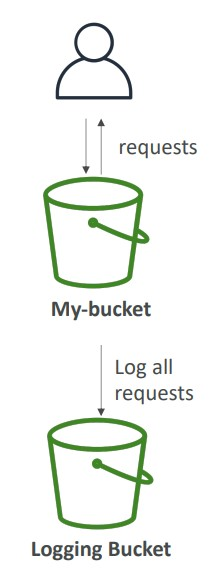</p>

## S3 Replication

We have two types of data replication: `Cross-Region-Replication (CRR)` and `Same-Region-Replication (SRR)`.

- Replicate all the content continuously to another bucket, it happens asynchronously.
- For this we must enable versioning in **Source** and **Destination** Bucket.
- The buckets can be in different accounts. (Need the proper IAM permissions)
- The replication rule needs a IAM Role to perform the replication. It creates one automatically or we can create our own role.

Cross-Region-Replication (CRR) use cases: Compliance, lower latency access, replication cross-account.

Same-Region-Replication (SRR) use cases: log aggregation, live replication between test and prod environments.

- It does not replicate files before the replication setting be set, only new files. To replicate existing files we must re-upload or use s3 sync tool.
- If we need to deletions we also need to set this option.

<p align="center" width="100%">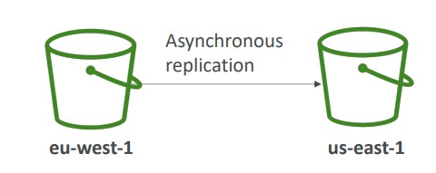</p>

## S3 Storage Classes

Amazon S3 has multiple classes of storage, and the type of storage can save some costs. A single bucket can have objects in different classes. They are defined in Object Level, we can set it when we are uploading the file.

To understand better the classes we need to understand the concepts of Durability and Availability.

**Durability**: Means how long your file will keep stored or How often you will lose your file. AWS by default have the High Durability (99,99 | 11 9's) of objects across multiple AZ in all storage classes.

**Availability**:
How readily available a service is. S3 standard has 99.99% availability. S3 may not be available per 53 minutes in a year.

**Pricing**:

- S3 Standard does not charge any data retrieval fee.
- S3 Intelligent-Tiering does not charge any data retrieval fee.
- All other storage classes have a retrieval fee.

The S3 storage classes are:

**Amazon S3 Standard - General Purpose:**

- This is the most common. Used for frequently accessed data
- 99,99% of Availability
- Low latency and high throughput
- Sustain 2 concurrent facility failures
- Use cases: Big Data analytics, mobile & gaming applications, content distribution

**Amazon S3 Standard - Infrequent Access (IA):**

- When you don't access the file often, but requires rapid access when needed.
- 99,99% of Availability
- Lower cost compared to Amazon S3 Standard, but retrieval fee
- Sustain 2 concurrent facility failures
- Use Cases: As a data store for disaster recovery, backups…

**Amazon S3 One Zone - Infrequent Access:**

- It is very similar to S3 Standard IA, but his one only saves the file in one AZ.
- 99.5% Availability
- Lower cost compared to S3-IA (by 20%)
- Use cases: Store secondary backups copies of non-premise data, or store data you can easily recreate or to save replicas from another regions in S3.

**Amazon S3 Intelligent Tiering**

- Auto select the type (Frequent or Infrequent)
- 99,99% of Availability
- Same Low latency and high throughput of S3 Standard
- _Cost optimization_ by auto move the objects between tiers based on the use patterns of the object (If used often goes to S3 Standard, otherwise it goes to S3 IA).
- It is also very resilient with events that impact an entire AZ.
- Use cases: when you don't know exactly the tiering or want optimize costs.

**Amazon Glacier**

- Low cost object storage (in GB/month) meant for archiving/backup
- Data is retained for the longer term (years)
- Retrieval options (each one has the fees for retrieval):
  - Expedited (1 to 5 minutes)
  - Standard (3 to 5 hours)
  - Bulk (5 to 12 hours)
- Use cases for: for Backups and Archiving

> Amazon S3 Glacier (S3 Glacier), is a storage service optimized for infrequently used data, or "cold data. Data at rest stored in S3 Glacier is automatically server-side encrypted using 256-bit Advanced Encryption Standard (AES-256) with keys maintained by AWS.

**Amazon Glacier Deep Archive**

- Store data for years in AWS.
- Cheapest option for Backup and Archive
- All the data is replicated in at minimum of 3 AZs
- Retrieval options (each one has the fees for retrieval):
  - Standard (12 hours)
  - Bulk (48 hours)
- For backups and archiving that will take a long time to be retrieved, store regulatory data that demands history, like medical data, financial data, etc. Not very often requested, but if need this data we can have it in up to 12 hours.

**Amazon S3 Reduced Redundancy Storage**: (deprecated - omitted)

In AWS we can create the lifecycle rules, and can se the transition Rules: The transition rules are used to move the objects between the classes by the following rules:

<p align="center" width="100%">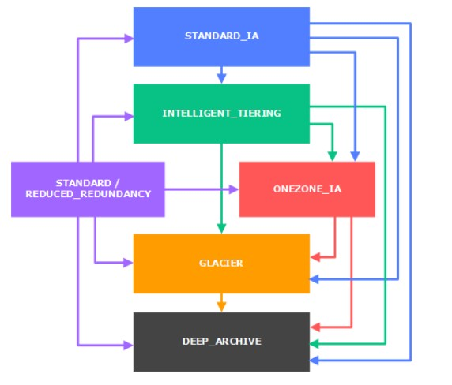</p>

## S3 Glacier Vault Lock and Object Lock

Lock objects to specified amount of time.

**S3 Object lock**:

- This one adopts the WORM (Write Once, Read Many) class.
- It blocks an object version from being deleted during a specified amount of time.
- You can use S3 Object Lock to meet regulatory requirements that require WORM storage, or add an extra layer of protection against object changes and deletion.
- Users with special permissions can make changes to the Lock policy and delete the data.

**Glacier Vault Lock**:

- This one adopts the WORM (Write Once, Read Many) class.
- We create a Lock Policy to the files, and the files will be locked to modifications.
- Once the policy is set, **no one** can delete or modify the policy (even admins).
- Really good to use when we have compliance data retention rules and policies.

  > S3 Glacier Vault Lock allows you to easily deploy and enforce compliance controls for individual S3 Glacier vaults with a vault lock policy. You can specify controls such as “write once read many” (WORM) in a vault lock policy and lock the policy from future edits. Once locked, the policy can no longer be changed.

  <p align="center" width="100%">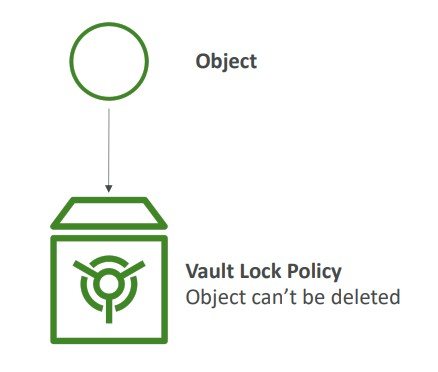</p>

## S3 Snow Family

Highly-secure, portable devices and offline devices, to collect and process data at the edge, and migrate data into and out of AWS.

The Snow Family: Offline devices to perform data migrations. If takes more than a week to transfer all the data, use the snowball devices.

 <p align="center" width="100%">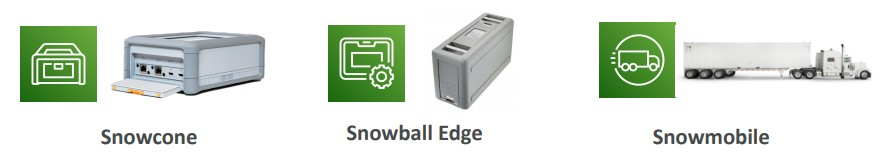</p>

### Data Migration

- Snow devices types: Snowcone, Snowball Edge and Snowmobile
- Use to migrate data through devices instead of using network. Network is so much more limited to data transfer, so the migration can be much more faster when using this kind f device.
- Reasons why network transfer is limited: Limited connectivity, Limited bandwidth, High network costs, Shared bandwidth, Connection stability.
- Example of usage with S3 use case
  - Normal method: direct upload files to S3 using network.
  - With snow family: AWS send the device and you transfer the data to the device and send it back to AWS. Internally they will upload the data to S3 very fast.

**AWS Snowball Edge**:

- Physical data transport solution to move TBs or PBs of data in or out of AWS.
- Alternative to move data over the network
- Pay per data transfer job
- Provide block storage and Amazon S3 Object storage
- Use case: large data cloud migration, DC decommission, disaster recovery

We have a few types of snowball edge:

- **Snowball Edge Storage Optimized**:
- 80 TB of HDD Capacity for block volume and S3 Compatible Storage
- **Snowball Edge Compute Optimized**:
- 42 TB of HDD Capacity for block volume and S3 Compatible Storage

**AWS Snowcone**:

Small and portable computing device, rugged and secure that resist a multiple natural environments.

- Device used for edge computing, storage, and data transfer.
- 8TBs of usable storage
- Used where snowball does not fit: Drone, Space environments, deserts, missions where does not have connectivity.
- We must provide our own cables and batteries.
- Can be sent back to AWS offline, or connect it to internet and use AWS DataSync to send the data.

**AWS Snowmobile**:
It is a truck to get all the data.

- Each snowmobile has 100 PB of capacity (we can use multiple in parallel)
- Transfer exabytes of data (1EB = 1000PBs = 1000000 TBs)
- To transfer 1EB we need 10 snowmobiles.
- High security: temperature controlled, GPS 24/7 and video surveillance.
- Better use snowball if transfer more than 10PB

**Snowball Process**

1. Request snowball devices from the AWS console for delivery
2. Install the snowball client on your servers
3. Connect the snowball to your servers and copy files using the client
4. Ship back the device when you’re done (goes to the right AWS facility)
5. Data will be loaded into an S3 bucket
6. Snowball is completely wiped

 <p align="center" width="100%">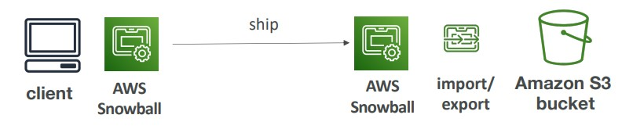</p>

### Edge Computing

- Process data while it is being created on an Edge Location (Anything that does not have internet or cannot access the cloud. For example: A truck on a road, a ship on sea, underground)
- Usually to locations with limited/no internet access and limited/no easy access to computing power.
- we setup a Snowcone or Snowball Edge to Edge computing
  - Preprocess data
  - Machine learning at the edge
  - Transcoding media streams
- We can usually ship it back over time to upload the data.
- All the devices can run EC2 Instances and AWS Lambda Functions (using AWS IoT Greengrass)
- Long-term deployment options: 1 and 3 years of discounted pricing
  **AWS Snowcone (smaller)**:

**AWS Snowball Edge (Compute optimized)**:

- 52 vCPUs, 208 GiB of RAM
- Optional GPU (useful for video processing or machine learning)
- 42 TB usable storage

**AWS Snowball Edge (Storage optimized)**:

- Up to 40 vCPUs, 80 GiB of RAM
- Object storage clustering available

### AWS OpsHub

Historically, to use Snow Family devices, you needed a CLI (Command Line Interface tool). Today, you can use AWS OpsHub (a software you install on your computer / laptop) to
manage your Snow Family Device.

- It is a desktop application to manage Snow Family devices
- Unlocking and configuring single or clustered devices
- Transferring files
- Launching and managing instances running on Snow
  Family Devices
- Monitor device metrics (storage capacity, active
  instances on your device)
- Launch compatible AWS services on your devices
  (ex: Amazon EC2 instances, AWS DataSync, Network File System (NFS))

## S3 Storage Gateway

AWS Storage Gateway is a hybrid solution to extend on-premises storage to S3.

It is a hybrid cloud cloud storage service that gives you on-premises access to virtually unlimited cloud storage. It Allows us to bridge all that happens into on-premisses server directly to the cloud.

- Part of your infrastructure is on-premises
- Part of your infrastructure is on the cloud

Use cases of Hybrid Cloud for Storage:

- Long cloud migrations
- Security requirements
- Compliance requirements
- IT strategy

S3 is a proprietary storage technology (unlike EFS / NFS), so how do you expose the S3 data on-premise? AWS Storage Gateway!

AWS Storage Cloud Native Options:

- Block Storage: Elastic Block Store (EBS) and EC2 Instance Store
- File Storage: Elastic File System (EFS)
- Object Storage: S3 and Glacier

The Storage Gateway is bridge between on-premise data and cloud data in S3.

The gateways will be using one of theses behind the scenes: Amazon EBS, S3 or Glacier.

- So the Hybrid storage service is used to allow on-premises to seamlessly use the AWS Cloud.
- Use cases: disaster recovery, backup & restore, tiered storage

Types of Storage Gateway:

- File Gateway
- Volume Gateway
- Tape Gateway

> All data transferred between the gateway and AWS storage is encrypted using SSL (for all three types of gateways - File, Volume and Tape Gateways).

 <p align="center" width="100%">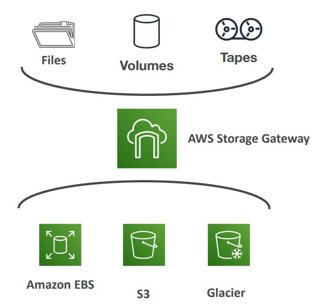</p>

## S3 Shared Responsibility Model

**AWS**:

- Infrastructure (global security, durability, availability, sustain concurrent loss of data in two facilities)
- Configuration and Vulnerability analysis
- Compliance Validation

**Customer**:

- S3 Versioning, Bucket Policies, Replication Setup, Logging and Monitoring
- S3 Storage Classes
- Data encryption

## Summary

- Buckets vs Objects: global unique name, tied to a region
- S3 security: IAM policy, S3 Bucket Policy (public access), S3 Encryption
- S3 Websites: host a static website on Amazon S3
- S3 Versioning: multiple versions for files, prevent accidental deletes
- S3 Access Logs: log requests made within your S3 bucket
- S3 Replication: same-region or cross-region, must enable versioning
- S3 Storage Classes: Standard, IA, 1Z-IA, Intelligent, Glacier, Glacier Deep Archive
- S3 Lifecycle Rules: transition objects between classes
- S3 Glacier Vault Lock / S3 Object Lock: WORM (Write Once Read Many)
- Snow Family: import data onto S3 through a physical device, edge computing
- OpsHub: desktop application to manage Snow Family devices
- Storage Gateway: hybrid solution to extend on-premises storage to S3
