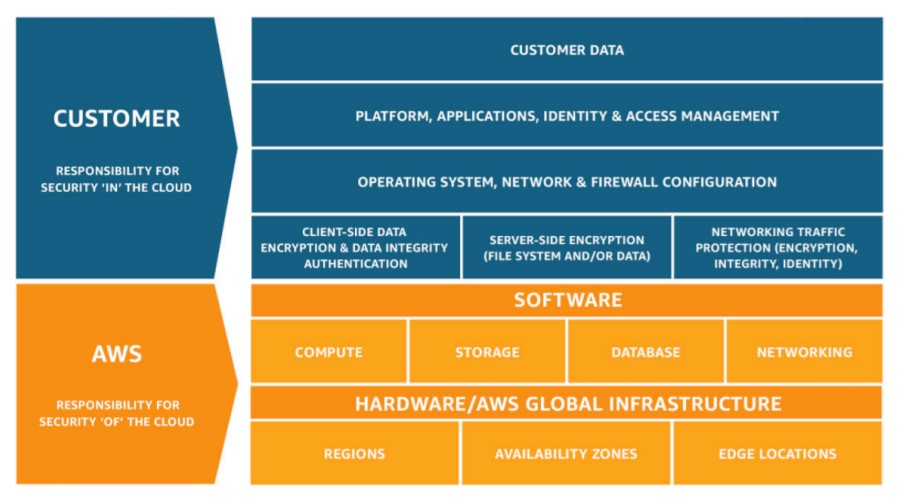

# 📝Security and Compliance

- [AWS Shared Responsibility Model](#aws-shared-responsibility-model)
- [AWS Security Token Service](#aws-security-token-service)
- [AWS Shield](#aws-shield) [Standard and Advanced, layer 3 and 4]
- [AWS Web Application Firewall](#aws-web-application-firewall) [WAF, layer 7]
- [AWS Penetration Testing](#aws-penetration-testing)
- [AWS Key Management Service](#aws-key-management-service) [Encryption]
- [AWS CloudHSM](#aws-cloudhsm) [Encryption]
- [Types of Customer Master Keys](#types-of-customer-master-keys) [CMK Encryption]
- [AWS Certificate Manager](#aws-certificate-manager) [Encryption and Certificate]
- [AWS Secrets Manager](#aws-secrets-manager)
- [AWS Artifact](#aws-artifact)
- [Amazon GuardDuty](#amazon-guardduty) [Threat Discovery into account]
- [Amazon Inspector](#aws-inspector) [EC2 Security Assessments]
- [AWS Config](#aws-config) [Record Configuration for resources on AWS]
- [Amazon Macie](#amazon-macie) [protect sensitive data in S3 Bucket]
- [CloudTrail](#CloudTrail) [Audit and compliance tool regarding api calls]
- [AWS Security Hub](#aws-security-hub)
- [Amazon Detective](#amazon-detective) [Root cause]
- [AWS Abuse](#aws-abuse)
- [Root user privileges](#root-user-privileges)
- [Summary](#summary)

## AWS Shared Responsibility Model

AWS responsibility - Security **of the Cloud**:

- Infrastructure (hardware, software, facilities and network)
- Managed Services like S3, DynamoDB, RDS

Customer Responsibility - Security **in the Cloud**:

- For EC2 instance, customer is responsible for management of the guest OS
  (including security patches and updates), firewall & network configuration, IAM
- Encrypting application data

Shared controls:

- Patch Management, Configuration Management, Awareness & Training

### Shared Responsibility Examples:

**AWS Responsibility Examples:**

- Cloud infrastructure management is the responsibility of AWS.
- Ensuring AWS employees cannot access customer data.
- Compliance validation of Cloud infrastructure

**Customer Responsibility Examples:**

- Operating system patches and updates of an EC2 instance
- Enabling data encryption of data stored in S3 buckets

**Shared Responsibility Examples:**

- For abstracted services, such as Amazon S3 and Amazon DynamoDB, AWS operates the infrastructure layer, the operating system, and platforms, and customers access the endpoints to store and retrieve data.

RDS examples of shared responsibility

- AWS responsibility:
  - Manage the underlying EC2 instance, disable SSH access
  - Automated DB patching
  - Automated OS patching
  - Audit the underlying instance and disks & guarantee it functions
- Your responsibility:
  - Check the ports / IP / security group inbound rules in DB’s SG
  - In-database user creation and permissions
  - Creating a database with or without public access
  - Ensure parameter groups or DB is configured to only allow SSL connections
  - Database encryption setting

S3 examples of shared responsibility

- AWS responsibility:
  - Guarantee you get unlimited storage
  - Guarantee you get encryption
  - Ensure separation of the data between different customers
  - Ensure AWS employees can’t access your data
- Your responsibility:

  - Bucket configuration
  - Bucket policy / public setting
  - IAM user and roles
  - Enabling encryption

## AWS Security Token Service

AWS Security Token Service (STS) is one of the most important services of AWS. It enables you to create temporary, limited-privileges credentials to access your AWS resources.
Short-term credentials: you configure expiration period.

**Use cases**

- Identity federation: manage user identities in external systems, and provide them with STS tokens to access AWS resources
- Assume Roles
  - IAM Roles for cross/same account access
  - IAM Roles for Amazon EC2: provide temporary credentials for EC2 instances to access AWS resources

## AWS against DDoS Attack

In a Distributed Denial of Service (DDoS) attack, an attacker uses multiple sources—such as distributed groups of malware infected computers, routers, IoT devices, and other endpoints—to orchestrate an attack against a target. This is a example of how we can get protected into AWS using firewall and other security services.

  

- AWS Shield Standard: protects against DDOS attack for your website and applications, for all customers at no additional costs
- AWS Shield Advanced: 24/7 premium DDoS protection
- AWS WAF: Filter specific requests based on rules
- CloudFront and Route 53:
  - Availability protection using global edge network
  - Combined with AWS Shield, provides attack mitigation at the edge

## AWS Shield

> AWS Shield Standard is activated for all AWS customers, by default. For higher levels of protection against attacks, you can subscribe to AWS Shield Advanced. With Shield Advanced, you also have exclusive access to advanced, real-time metrics and reports for extensive visibility into attacks on your AWS resources. With the assistance of the DRT (DDoS response team), AWS Shield Advanced includes intelligent DDoS attack detection and mitigation for not only for network layer (layer 3) and transport layer (layer 4) attacks but also for application layer (layer 7) attacks.

AWS Shield Standard:

- It is a free service available for every AWS Customer and it provides a protection from common attacks such as SYN/UDP floods, reflection attacks and other layer 3 and 4 attacks (tcp/ip). It can be deployed on HTTP friendly services (ALB, API Gateway, CloudFront)

AWS Shield Advanced:

- It is a option DDoS mitigation ($3000 month/organization) and it protects against the most sophisticated attacks on EC2, ELB, CloudFront, Global Accelerator and Route53. It is a high level defense.
- 24/7 access to AWS DDoS response team (DRP)
- Protect against higher fees during spikes of DDoS
- AWS Shield Advanced provides expanded DDoS attack protection for web applications running on the following resources: Amazon Elastic Compute Cloud, Elastic Load Balancing (ELB), Amazon CloudFront, Amazon Route 53, AWS Global Accelerator.

## AWS Web Application Firewall

AWS WAF is a web application firewall that helps protect your web applications or APIs against common web exploits that may affect availability, compromise security, or consume excessive resources. AWS WAF gives you control over how traffic reaches your applications by enabling you to create security rules that block common attack patterns, such as SQL injection or cross-site scripting, and rules that filter out specific traffic patterns you define.

- WAF protects our web apps from common web exploit attacks (layer 7, http).
- Define a Web Access Control List (Web ACL):
  - Rules can include IP addresses, HTTP headers, HTTP body or strings
  - protection from common attacks (SQL Injection and Cross-Site Scripting)
  - Size constraints, geo-match (block a few countries)
  - Rate-based rules (count occurrence of events) - this one is against DDoS attacks
- WAF Can be deployed on services that AWS customers commonly use to deliver content for their websites and applications:

  - CloudFront (Global)
  - Application Load Balancer (ALB) (Regional)
  - API Gateway (Regional)
  - AWS AppSync (Regional)

  When we deploy on Global Services such CDN/CloudFront, it will run the rules in all edge locations, this means the unintended traffic will be blocked before reaching the server. And when we deploy on regional services such as ALB, it will run the rules in the region where the traffic is coming from and protects the internet facing resources.

## Penetration Testing

AWS customers are welcome to carry out security assessments or penetration tests against their AWS infrastructure without prior approval for 8 services. For any other simulated events, contact aws-security-simulatedevent@amazon.com.

This kind of testing can be done for 8 services:

- Amazon EC2 instances, NAT Gateways, and Elastic Load Balancers
- Amazon RDS
- Amazon CloudFront
- Amazon Aurora
- Amazon API Gateways
- AWS Lambda and Lambda Edge functions
- Amazon Lightsail resources
- Amazon Elastic Beanstalk environments

And we have some Prohibited Activities such as:

- DNS zone walking via Amazon Route 53 Hosted Zones
- Denial of Service (DoS), Distributed Denial of Service (DDoS), Simulated DoS, Simulated DDoS
- Port flooding
- Protocol flooding
- Request flooding (login request flooding, API request flooding)

[Read more](https://aws.amazon.com/security/penetration-testing/)

## AWS Key Management Service

We have two types of encryptions:

- Encryption at Rest: data stored or archived on a device somewhere (On Hard Disk, S3, RDS, Deep Archive)

- Encryption in Transit (in motion): incoming data, while upload data, while the data are in the network. (Transfer from on-premises to AWS, EC2 to DynamoDB, etc)

Anytime we hear about encryption in AWS it is possible to be most likely KMS (Key Management Service). KMS manages the encryption keys for us.

**Encryption Opt-in**: we can enable encryption for the bellow services. it is optional.

- EBS volumes: encrypt volumes
- S3 buckets: Server-side encryption of objects
- Redshift database: encryption of data
- RDS database: encryption of data
- EFS drives: encryption of data

**Encryption automatically enabled**: theses services has encryption by default, due security requirements:

- CloudTrail logs
- S3 Glacier
- Storage Gateway

## AWS CloudHSM

CloudHSM is a dedicated hardware provisioned by AWS. Compared to KMS which provide a software who manages our keys, CloudHSM is a hardware provisioned by AWS where we manage our own keys.

HSM device is tamper resistant, FIPS 140-2 Level 3 compliance. HSM = Hardware Security Module.

### Types of Customer Master Keys

**Customer Managed CMK:**

- Create, manage and used by the customer, can enable or disable
- Possibility of rotation policy (new key generated every year, old key preserved)
- Possibility to bring-your-own-key

**AWS managed CMK:**

- Created, managed and used on the customer’s behalf by AWS
- Used by AWS services (aws/s3, aws/ebs, aws/redshift)
- When AWS ask if you want to encrypt, it creates one of theses AWS managed CMK

**AWS owned CMK:**

- Collection of CMKs that an AWS service owns and manages to use in multiple accounts
- AWS can use those to protect resources in your account (but you can’t view the keys)

**CloudHSM Keys (custom keystore):**

- Keys generated from your own CloudHSM hardware device
- Cryptographic operations are performed within the CloudHSM cluster

## AWS Certificate Manager

AWS Certificate Manager (ACM) is a service to easily provision, manage, and deploy
SSL/TLS Certificates.

Used to provide in-flight encryption for websites (HTTPS)

- Supports both public and private TLS
  certificates
- Free of charge for public TLS certificates
- Automatic TLS certificate renewal
- Integrations with (load TLS certificates on)
- Elastic Load Balancers
- CloudFront Distributions
- APIs on API Gateway

## AWS Secrets Manager

It is an AWS service to store secret keys of any type. The secrets are encrypted using KMS.

- With AWS Secrets Manager we have the capability to rotate the secret keys every X days
- We can automate generation of secrets on rotation (uses Lambda)
- It has full integration with RDS (relational databases) and we can store secrets there (such as user and password of the database)

## AWS Artifact

It is not really a service. It is a way to download AWS compliance documentations. Is a Portal that provides customers with on-demand access to AWS compliance documentation and AWS agreements.

- Artifact Reports - Allows you to download AWS security and compliance documents from third-party auditors, like AWS ISO certifications, Payment Card Industry (PCI), and System and Organization Control (SOC) reports
- Artifact Agreements - Allows you to review, accept, and track the status of AWS agreements such as the Business Associate Addendum (BAA) or the Health Insurance Portability and Accountability Act (HIPAA) for an individual account or in your organization
- Can be used to support internal audit or compliance

## Amazon GuardDuty

Intelligent and continuos threat discovery service to protect AWS Account. It uses machine learning algorithms to anomaly detection. We can setup cloudwatch events rules to be notified in case of any anomaly detection. These cloudwatch event rules can trigger lambdas or sns topics.

Input data includes:

- CloudTrail Logs: unusual API calls, unauthorized deployments
- VPC Flow Logs: unusual internal traffic, unusual IP address
- DNS Logs: compromised EC2 instances sending encoded data within DNS queries

## Amazon Inspector

Amazon Inspector is an automated security assessment service for EC2 instances. It analyzes the running OS against known vulnerabilities and unintended network access.

- Amazon Inspector must be installed on OS in EC2 Instances. The assessment can run in scheduled time and in target groups.
- After the assessment it sends/provides a report of vulnerabilities.

> Amazon Inspector is an automated security assessment service that helps improve the security and compliance of applications deployed on AWS. Amazon Inspector automatically assesses applications for exposure, vulnerabilities, and deviations from best practices.

> Amazon Inspector security assessments help you check for unintended network accessibility of your Amazon EC2 instances and for vulnerabilities on those EC2 instances.

> Amazon Inspector also offers predefined software called an agent that you can optionally install in the operating system of the EC2 instances that you want to assess. The agent monitors the behavior of the EC2 instances, including network, file system, and process activity. It also collects a wide set of behavior and configuration data (telemetry).

## AWS Config

With AWS Config we can track, audit and record the resources configurations and the compliance of them over time.

- Possibility of storing the configuration data into S3 (analyzed by Athena)
- Example of tracking in AWS Config: Check HTTP port if is public. Require to all SHH port to be restricted.
- We can receive alerts (SNS notifications) for any changes
- Config per-region
- Aggregated across regions and accounts
- View compliance of a resource over time, View configuration of a resource over time and View CloudTrail API calls if enabled

## Amazon Macie

Amazon Macie is a fully managed data security and data privacy service to protect sensitive data in AWS, using machine learning.

Macie helps identify and alert about sensitive data (such as PII, personal identifiable information)

We can customize our own sensitive data types

## CloudTrail

CloudTrail Track API calls made by users within account. It is part of [Monitoring](../cloud-monitoring/README.md/#cloudtrail) services.

## AWS Security Hub

It is a centralized security service that allows to do security checks across multiple accounts. Integrated dashboards showing current security and compliance status to quickly
take actions.

- Automatically aggregates alerts in predefined or personal findings from various accounts and services within AWS, such as: GuardDuty (Threat discovery), Inspector (EC2 OS security), Macie (Sensitive Data), IAM Access Analyzer, AWS Systems Manager, AWS Firewall Manager, AWS Partner Network Solutions.

To use this service we must first enable AWS Config (Predefine and record rules and resources configurations)

We can integrate with EventBridge events and Amazon Detective.

## Amazon Detective

It is a service to identify the root cause of security issues or suspicious activities.

Why do amazon have this service? With GuardDuty, Macie and Security Hub we can identify multiple security issues, but sometime we need a deeper analysis to detect what is causing that problem. So Amazon Detective analyzes, investigates and quickly identify the root cause.

- Use machine learning algorithms and graphs
- Automatically collect data and processes events from VPC Flow Logs, CloudTrail, GuardDuty and create a unified view of it.
- Produces visualizations with details and context to get to the root cause.

## AWS Abuse

It is a way to report suspect acts coming from hosted services that use aws resources. We need to contact the AWS abuse team.

Prohibited and Abusive behaviors:

- Spam – receiving undesired emails from AWS-owned IP address, websites & forums spammed by AWS resources
- Port scanning – sending packets to your ports to discover the unsecured ones
- DoS or DDoS attacks – AWS-owned IP addresses attempting to overwhelm or crash your servers/softwares
- Intrusion attempts – logging in on your resources
- Hosting objectionable or copyrighted content – distributing illegal or copyrighted content without consent
- Distributing malware – AWS resources distributing softwares to harm computers or machines

## Root User Privileges

Root user is the main account registered in AWS. It has complete access to all AWS resources, but we should not use the main account to common tasks, to do so we must create users within our account. But there a few actions allowed ONLY in the root account:

- **Change Account Settings** (name, email, address, root user password, root user access keys)
- View certain taxes invoices
- Close AWS account
- Restore IAM user permissions
- **Change or Cancel the AWS support plan**
- **Register as a seller in the reserved instance Marketplace**
- Configure an Amazon S3 Bucket to enable MFA
- Edit or delete Amazon S3 bucket policy that includes a invalid VPC or VPC endpoint ID
- SignUp to GovCloud

## Summary

- AWS Shared Responsibility Model: AWS security OF the cloud, user security IN the cloud
- Security Token Service (STS): Temporary, limited-privileges credentials to access AWS resources
- DDoS + other attacks protection:
  - AWS Shield: Automatic protection against DDoS attacks (Standard and Advanced)
  - AWS Web Application Firewall: Firewall to filter incoming requests based on rules. Protection against attacks on layer 7, http
  - AWS Penetration Testing: Allow penetration tests within AWS
- Encryption:
  - AWS Key Management Service: Encryption service and the keys are managed by AWS
  - AWS CloudHSM: Encryption Device. Keys is managed by the user
  - Types of Customer Master Keys: Customer Managed CMK, AWS Managed CMK, AWS Owned CMK and CloudHSM Keys
  - AWS Secrets Manager: Store secrets and encrypt them. (application secrets)
  - AWS Certificate Manager: provision, manage, and deploy SSL/TLS Certificates
- Security:
  - AWS Artifact: Get access to compliance reports such as PCI, ISO, etc
  - Amazon GuardDuty: Threat Discovery on AWS account and Find malicious behavior with VPC, DNS & CloudTrail Logs
  - Amazon Inspector: EC2 only, install the agent to find vulnerabilities on OS.
  - AWS Config: Track and record configuration rules and check if resources are compliant with. (What did my Resource look like in a point of time?)
  - Amazon Macie: Find sensitive data on S3 Buckets.
  - CloudTrail: Track API calls on the account (Compliance, Governance and Audit) - (Who made an API call to modify the resource?)
  - AWS Security Hub: is a central service to security on multiple accounts
  - Amazon Detective: is a service to get the root cause of issues or suspicious activities.
  - AWS Abuse: Report AWS resources used for abusive or illegal purposes
- Root user privileges:
  - Change account settings
  - Change AWS support plan
  - Delete account
  - Register as seller on reserved instance marketplace

[UP](#security-and-compliance)
