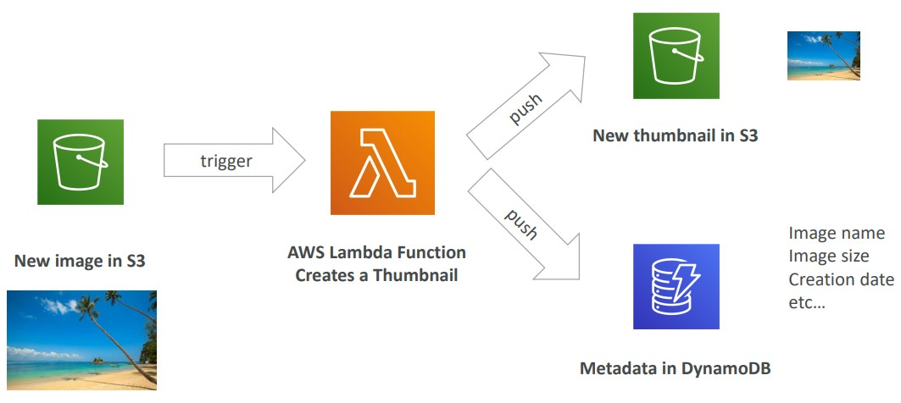
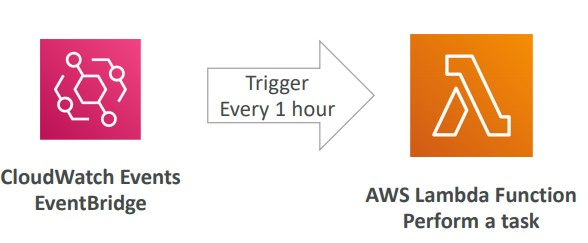
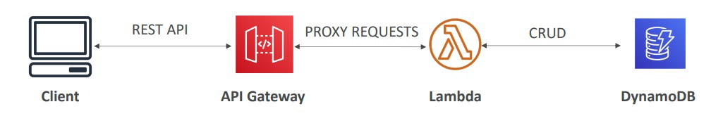

# Serverless

Serverless is a new paradigm in which the developers don’t have to manage servers anymore, it is just deploy and not need to worry about where it is.

Initially, serverless was pioneered by AWS with AWS Lambda, but now Serverless is the concept of fully managed services.

**Important**: Serverless does not mean that there are no servers! They exists but you don't have to worry about anything about them (no manage, provision or even see where are they)

## AWS Serverless Services

AWS have multiple serverless services such as:

- S3
- DynamoDB
- Amazon Aurora
- Amazon Athena
- Fargate
- AWS Lambdas

Read more [here](https://medium.com/awesome-cloud/aws-serverless-services-and-serverless-computing-in-aws-a1298ace0e3c)

## AWS Lambdas

AWS Lambdas are serverless functions executions.
Comparing to an EC2 instances: In EC2 instance we have virtual serves in the cloud, they are limited by RAM and CPU and they keep running continuously. When Scaling it means to add more compute power or more servers.

When we are talking about AWS Lambdas we don't have servers to manage, we just have functions!

- Functions executions
- Limited by time (made to short executions, max 15 minutes)
- Run on demand
- Scaling automatically

AWS Lambdas has multiples benefits:

- Integrated with the AWS Services
- Event driven: Functions are invoked when an specific event happens. They are reactive.
  - Lambda can be configured to execute code in response to events, such as changes to Amazon S3 buckets, updates to an Amazon DynamoDB table, or custom events generated by your applications or devices.
- Preprocessing: Lambda can be used to run preprocessing scripts to filter, sort or transform data before sending it to downstream applications/services.
- Integrated with many programming languages (JS/NodeJS, Java, Python, Ruby, etc.)
- Integrated with cloud watch to monitoring
- Easy to get more resources per functions
- Increase RAM also increase CPU and network.

Lambdas can also run containers with **Lambda Container Image**, but they need to be created with the exactly specifications AWS Lambdas needs (must implement the Lambda Runtime API). It is not very common the use, the best case for using container are with ECS or Fargate.

Lambdas use cases:

- Thumbnails: Receive an image into S3 (this will trigger a lambda) and the lambda will create a small version of the image to store again into S3 and will store the metadata of the image into dynamoDB.

- CRON Jobs: Schedule to run a script (with Cloud Watch Event Bridge). This will trigger the lambda every one hour to perform a task.

**Pricing**:

- Invocations
  - Free tier first 1.000.000 of lambdas invocations
  - $ 0.20 per 1 million of requests (after free tier)
- Compute Time/Duration
  - 400.000 GB/Seconds of compute time per month
    - if the function consume 1GB of RAM, you can use it for 400.000 seconds
    - if the function consume 128MB of RAM, you can use it for 3.200.000 seconds
  - After that you pay $1.00 for 600.000 GB/Seconds
- More pricing [examples](https://aws.amazon.com/pt/lambda/pricing/)

## Amazon API Gateway

Amazon API Gateway is serverless HTTP API, a fully managed service for developers to easily create, publish, maintain, monitor and secure APIs.

With API gateway we can allow external request on services that are not exposed directly. API Gateway will proxy a request into a service with all the needed security and scale.

- Fully Scalable and Serverless
- Supports REST APIs and Websocket APIs
- Supports security, authentication, API Keys, monitoring
- Can be configured to send data directly to Amazon Kinesis Data Stream
- Can call AWS Lambda functions to create a front-door for a serverless app.

API gateway example:
A client create a item in your website, your website saves it on dynamo with this structure:

Your site calls api gateways through your Rest API, then api gateway will proxy the request to the Lambda function and this lambda will insert the register into dynamoDB.

## AWS Batch

This [AWS Batch](../other-services/README.md) is serverless if is running with Fargate

## Summary

- Lambda is Serverless, Function as a Service, seamless scaling, reactive and can runs functions up to 15 minutes
- In lambda we are billed by Invocations and by Time running x RAM
- API Gateway: expose Lambda functions and other AWS services as HTTP API
- AWS Batch: Is serverless when running with Fargate
