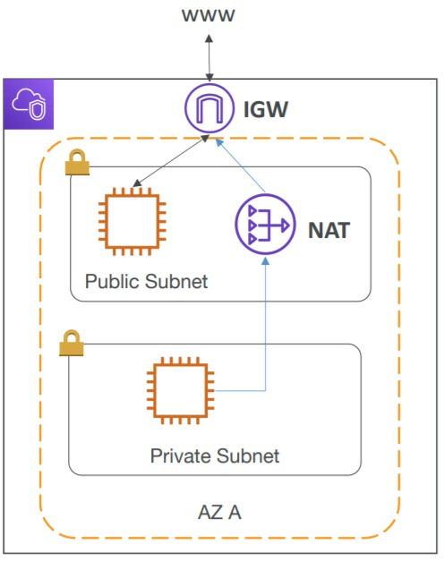
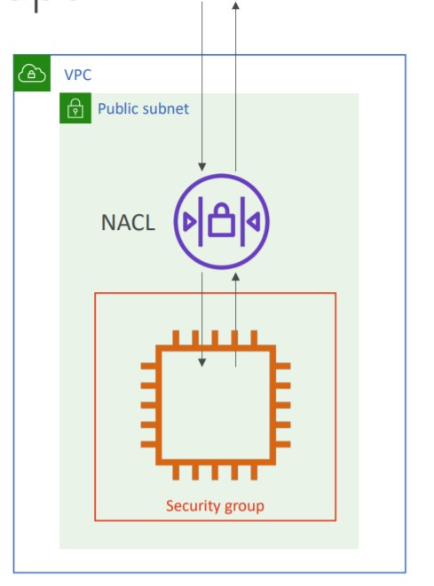
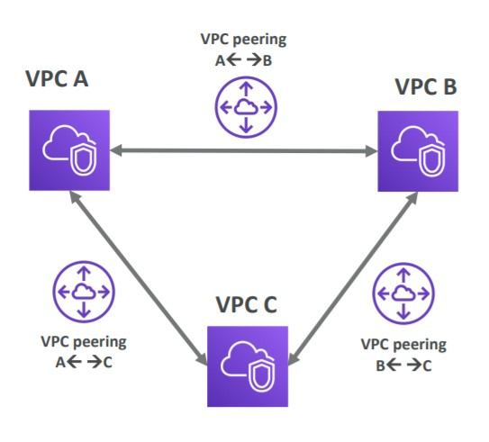
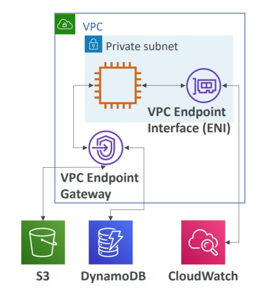
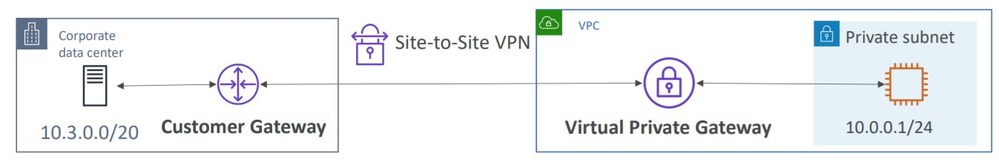
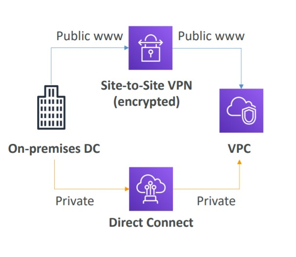
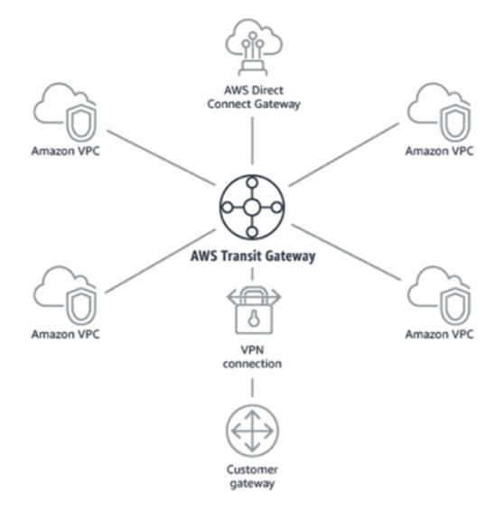

# 🔐 Virtual Private Cloud - VPC

We need to understand the main concepts of the resources of VPC

- [VPC](#vpc)
- [Subnets](#subnets)
- [Internet Gateway](#internet-gateway)
- [NAT Gateway](#nat-gateway)
- [Network ACL (NACL)](#network-acl)
- [Security Groups](#security-groups)
- [VPC Flow Logs](#vpc-flow-logs)
- [VPC Peering](#vpc-peering)
- [VPC Endpoints](#vpc-endpoints)
- [Site to Site VPN](#site-to-site-vpn) (vpn and goes to public internet)
- [Direct Connect](#direct-connect) (vpn and goes to private internet)
- [Transit Gateway](#transit-gateway)
- [Summary](#summary)

## VPC

VPC stands to Virtual Private Cloud and it is a private network to deploy your resources (regional resource). A VPC is linked to specific region, so we can have multiple VPC.

Inside of VPC we have Subnets and CIDR Ranges (allowed IPs)

Sample VPC example:

- We have the AWS Cloud, and AWS Has regions, inside that region we create a VPC. Inside the VPC we create the CIDR ranges to define the allowed IPs and the subnets.
- Our VPC can reach one or more AZs, so we have the subnets, each subnet inside an AZ. Inside Each Subnet, we have Public and Private subnets.

## Subnets

Subnets are partition of our network and is associated to an Availability Zone

- **Public Subnet**: Is a subnet accessible for the internet (we can put, for example, an EC2 Instance). It requires an internet gateway.
- **Private Subnet**: Is a subnet not accessible for the internet (we can put, for example, a database). Our private subnet can have access to the internet by using the NAT Gateway.

To define access to the internet and communication between subnets, we use route tables.

## Internet Gateway

Inside each subnet we can have EC2 instances, For this instances be accessible to the internet, we need to use the Internet Gateway. The internet gateway create a way to our Subnet connect to the internet.

The public subnet will have a route to the internet gateway that is communicating with the internet. As soon we have the internet gateway and a route to it, that makes the subnet a **public subnet**

## NAT Gateway

Works with the **Private Subnet**. By default private subnet does not have access to the internet and cannot be accessed through the internet as well. But if we need to access the internet (for updates to softwares, or something similar) we can use the NAT Gateway.

NAT Gateway is a AWS-Managed service to allow private subnet access the internet while remaining private.

The NAT Gateway need to be created inside the Public Subnet and we create a Route from our Private Subnet to this NAT Gateway and it will be able to get internet connectivity.

### Using Internet and NAT Gateways

Following the same example of sample VPC:

- Inside each subnet we can have EC2 instances, and to allow the public subnet we create the Internet Gateway and create the route to it, and it goes to the internet.
- Inside the private subnet, by default we do not have access to the internet, so to get the access (to update a software into EC2), we need to create a NAT Gateway inside the Public Subnet and create a Route to this NAT Gateway. The NAT Gateway will communicate with Internet Gateway and the internet gateway will perform the access.

## Network ACL

When we are inside the Subnet we have a protection called Network ACL (NACL or Network Access Level). NACL is a firewall (Subnet Level) which controls traffic from and to subnet.

- NACL can have ALLOW and DENY rules
- It is attached at the Subnet Level
- The rules include only IP Addresses

## Security Groups

Security Groups are Firewall specific firewall that controls traffic to and from an ENI (Elastic Network Interface) and/or EC2 Instances.

- Can have only ALLOW rules
- Rules include IP Addresses and other security groups
- Control of inbound network (from outside to inside the instance)
- Control of outbound network (from instance to outside) - by default, all traffic outbound (from our instance to the rest of the world) is allowed.

## NACL vs Security Groups

In the next image we can see NACL as the first protection layer, at the subnet level, checking every entry on the subnet and if allowed proxies to the next level.

In the next image we can see Security Groups as the second layer of protection, checking if the authorized ip can access the instance, because, we can have cases when an IP is allowed into the subnet, but not into the instance.

The main differences are

Security Group: Operates at instance level, support only allow rules, is stateful (return traffic is automatically allowed, regardless any rules)

NACL: Operates at the subnet level, allow and deny rules, is stateless (return traffic must be explicitly allowed by the rules)

for more details [visit amazon page](https://docs.aws.amazon.com/vpc/latest/userguide/VPC_Security.html)

## VPC Flow Logs

VPC Flow logs captures all logs from all network interfaces, so we have:

- VPC Flow logs
- Subnet Flow logs
- Elastic Network Interface Flow logs
- It also captures network information from AWS managed interfaces into the services: Load Balancers, ElastiCache, RDS, Aurora, etc.

With this logs we can monitor and troubleshoot connectivity issues such as: Subnet to the internet, subnet to subnet, internet to subnet.

We can export our logs to S3 Bucket and/or CloudWatch Logs as well.

## VPC Peering

With VPC Peering we can connect two VPCs, privately using AWS Network and make them behave as if they are in the same network.

- This must not overlap CIDR (IP ranges)
- VPC peering is not transitive, this means if we have 3 VPCs, A, B and C, Then we create a VPC peering from A to B, And we create another VPC peering from B to C

  - the connection between A and C is not in the same network, because A and C does not have the peering between them, if we want to connect these two as well, we need to create the VPC peering following the bellow example.

  

## VPC Endpoints

Usually when we connect our services we use the public internet, but we have private subnets, there is no reason to make them communicate between the public internet. For example, an EC2 instance inside a private subnet needs to communicate with S3 or Dynamo. We can use the internal AWS network. For this we need to create an VPC Endpoint.

VPC Endpoints allows us to connect to AWS services using a private network instead of the public. We have two types of Endpoints. This gives you enhanced security and
lower latency to access AWS services.

**Gateway**: Dynamo and S3
**Interface** All others AWS services

  

## Site to Site VPN

Site to Site VPN connects On-Premise servers to our VPC into AWS. The connection is automatically encrypted, but this Site to Site VPN goes over the **public internet**.

We have to configure our VPC with a Virtual Private Gateway (VGW) and our On-Premise server with a Customer Gateway (CGW), then the site to Site VPN will communicate through them,

## Direct Connect

Establish a physical connection between on-premises and AWS as well, but this one is through a **private internet connection**. To do so, we need a physical connection between our server and a AWS partner that provides direct connect. (it is more expansive and takes up to a month to be ready).

- Private, secure and faster
- Expansive

## Transit Gateway

Our Topologies can became very complicated through time, for this we have the transit gateway.

With Transit Gateway we can connect thousands of VPC and on-premises networks together using a central hub to manage it all. This one use a star model (hub-and-spoke).

- One single gateway can peering, multiples connections to multiple VPCs.
- Works with Direct Connect Gateway, VPNs

## Summary

[UP](#-virtual-private-cloud---vpc)
